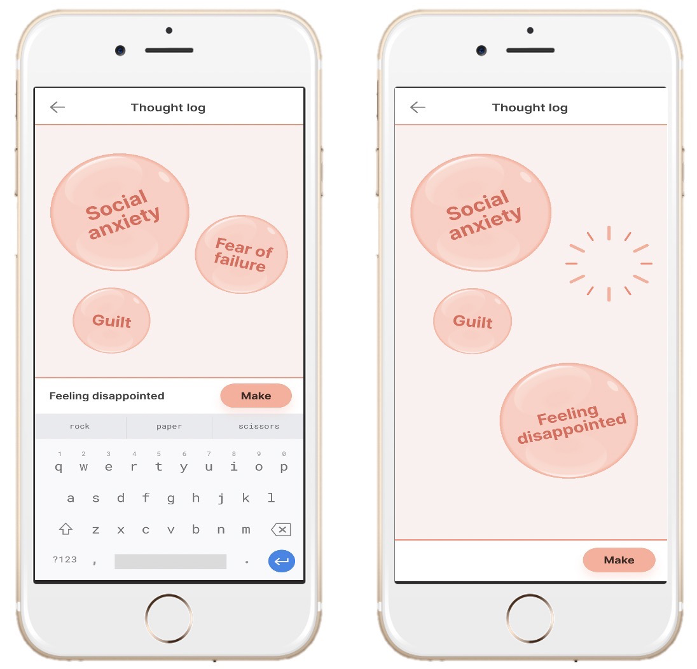

# M - Manage

The manage tab includes a variety of activities for various necessities. Some serve as relaxation exercises, while others involve meditations. Others include journaling and future manage activities will include medication trackers and goal setting. As LAMP develops, more and more manage activities can be expected to be added! As a user, you can also request for the researchers running your study to create individualized manage activities (i.e. having a breathing activity to a specific sound or music clip that you find relaxing).

All activities are available through the Manage tab. See below is an outline of the activities currently available or coming soon as well as relevant images of what they may look like.

**Journal**

*Record thoughts, write lists, and make notes. Journal entries are date and time stamped so previous entries can be recalled and read at any time.*

**Guided Meditation**

*Watch a soothing video to refocus energy and attention. Add an audio recording to customize the sound.*

**Scratch Card**

*Select an image to “uncover” by sliding finger over screen until the image is revealed.*

**Medication Tracker (Coming Soon)**

*Enter medication information in a calendar to receive daily reminders, track intake, and ensure prescriptions are refilled in time.*

**Goal Setter (Coming Soon)**

*Enter a goal, small or big, and opt in/out of customized related reminders. The Goal Setter also lets users mark goals as complete and keeps track of completed goals.*

**Thought Log (Coming Soon)**

*Offload negative thoughts or feelings by writing them down. Thoughts appear as bubbles that are popped and disappear afterwards.*

**Hope Box (Coming Soon)**

*Collect and save favorite images and quotes to an album. The Hope Box is a digital scrapbook of positive moments.*

**Safety Plan (Coming Soon)**

*Work with trusted peers or health care team to identify personal signals of anxiety, sadness, or unease and record coping mechanisms.*