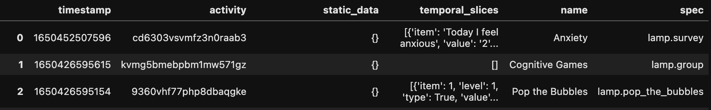

# Database functions

**Warning: Directly interacting with the database can carry some risk. Please read the documentation carefully.**

These functions provide a way to directly interact with a LAMP MongoDB database and add some functionality that is not currently present in the LAMP API, such as restoring deleted activities or participants. Deleting a patient or activity through the mindLAMP dashboard does not actually erase their data from a server. Rather, it applies the 'delete' FLAG to them at a database level. As such, these functions include safeguards that should prevent unintended consequences, but directly interacting with the database can carry some risk, so please read the documentation for these functions carefully before using them. Please report any issues to community.lamp.digital. 

Please note: if you are using an older version of LAMP, e.g. one using CouchDB, these functions may not work.

## `utils.db.change_parent`
Change a LAMP element's parent - e.g. move a participant from one study to another, a study from a researcher to another, or an activity from study to study.

#### Args

- `target`: the target's LAMP id
- `original_parent`: the LAMP id of the original parent of the target
- `target_parent`: the LAMP id of the parent the target should be moved to
- `db`: the database this will happen in (usually 'LAMP')
- `client_url`: a valid mongodb URL w/ login info (one of this or `client` is required, but not both)
- `client`: a valid pymongo client

#### Example
```markdown
import cortex
MONGO_URL = "mongodb://[username:password@]host1[:port1][,...hostN[:portN]][/[defaultauthdb][?options]]"
cortex.utils.db.change_parent('U0591253803','dynp0g0530xkahnzh0xc','ef0b54h281vfmhc0515d',client_url=MONGO_URL)
```
Result
```
U0591253803 updated. Moved participant from study Second Study - (dynp0g0530xkahnzh0xc) to study LAMP Testing (Internal - Luke) - (ef0b54h281vfmhc0515d)
```

## `utils.db.get_survey_names`
Get the survey names and specs for all ActivityEvents for a participant. Use the database to get deleted survey ids as well.

#### Args

- `participant_id`: (string) the participant id.
- `db`: (string, default: 'LAMP') the database.
- `client_url`: (string) a valid mongodb URL with login info.
- `client`: (object) a valid pymongo client

#### Returns
A dataframe containing the ActivityEvent data for this participant with two additional columns: "name" and "spec".

#### Example

```markdown
YOUR_MONGO_URL = "mongodb://[username:password@]host1[:port1][,...hostN[:portN]][/[defaultauthdb][?options]]"
utils.db.get_survey_names("U1234567890", client_url=YOUR_MONGO_URL)
```
Output:


## `utils.db.list_deleted_activities`
Returns a list of dictionaries, each reflecting a deleted activity, with an `id` and `name` key.
#### Args

- `study_id`: the study to examine
- `db`: the database this will happen in (usually 'LAMP')
- `client_url`: a valid mongodb URL w/ login info
- `client`: a valid pymongo client

#### Example
```markdown
import cortex
MONGO_URL = "mongodb://[username:password@]host1[:port1][,...hostN[:portN]][/[defaultauthdb][?options]]"
cortex.utils.db.list_deleted_activities('dynp0g0530xkahnzh0xc',client_url=MONGO_URL)
```
Result
```
[{'id': 'qa0k8arrv8cx1brp724d', 'name': 'Jewels A testing'},
 {'id': 'fgqyjzspc92n2nwb8d7d', 'name': 'Test Survey'}]
```

## `utils.db.list_deleted_participants`
Returns a list of dictionaries, each reflecting a deleted participant, with an `id` key.
#### Args

- `study_id`: the study to examine
- `db`: the database this will happen in (usually 'LAMP')
- `client_url`: a valid mongodb URL w/ login info
- `client`: a valid pymongo client

#### Example
```markdown
import cortex
MONGO_URL = "mongodb://[username:password@]host1[:port1][,...hostN[:portN]][/[defaultauthdb][?options]]"
print(LAMP.Study.all_by_researcher('ffmz65mn1gtav5fq3bhq')['data'])

cortex.utils.db.list_deleted_participants('ef0b54h281vfmhc0515d',client_url=MONGO_URL)
```
Result
```
[{'id': 'ef0b54h281vfmhc0515d', 'name': 'LAMP Testing (Internal - Luke)'}, {'id': 'dynp0g0530xkahnzh0xc', 'name': 'Second Study'}]
[{'id': 'U4942710066'}]
```

## `utils.db.restore_activities`
Restores activities given one or more activity ids
#### Args

- `activity_id`: string or list of the LAMP IDs of the activity(s) to restore
- `db`: the database this will happen in (usually 'LAMP')
- `client_url`: a valid mongodb URL w/ login info
- `client`: a valid pymongo client
- `restore_tags`: Whether to restore any tags created on a activity

#### Example
```markdown
import cortex
MONGO_URL = "mongodb://[username:password@]host1[:port1][,...hostN[:portN]][/[defaultauthdb][?options]]"
deleted = [x['id'] for x in cortex.utils.db.list_deleted_activities('dynp0g0530xkahnzh0xc',client_url=MONGO_URL)]

cortex.utils.db.restore_activities(deleted,client_url=MONGO_URL)
```
Result
```
Restoring qa0k8arrv8cx1brp724d...
Restoring fgqyjzspc92n2nwb8d7d...
```


## `utils.db.restore_participant`
Restores participants given one or more participant ids
#### Args

- `participant_id`: string or list of the LAMP IDs of the participant(s) to restore
- `db`: the database this will happen in (usually 'LAMP')
- `client_url`: a valid mongodb URL w/ login info
- `client`: a valid pymongo client
- `restore_tags`: Whether to restore any tags created on a activity

#### Example
```markdown
import cortex
MONGO_URL = "mongodb://[username:password@]host1[:port1][,...hostN[:portN]][/[defaultauthdb][?options]]"
cortex.utils.db.restore_participant(['U4942710066'],client_url=MONGO_URL)
```
Result
```
Restoring U4942710066...
```

## `utils.db.restore_activities_manually`
Prompts the user to enter a list of activities to undelete them

#### Args

- `study_id`: the study_id to restore activities too
- `db`: the database this will happen in (usually 'LAMP')
- `client_url`: a valid mongodb URL w/ login info
- `client`: a valid pymongo client

#### Example
```markdown
import cortex
MONGO_URL = "mongodb://[username:password@]host1[:port1][,...hostN[:portN]][/[defaultauthdb][?options]]"
print(LAMP.Study.all_by_researcher('ffmz65mn1gtav5fq3bhq')['data'])
cortex.utils.db.restore_activities_manually('dynp0g0530xkahnzh0xc',client_url=MONGO_URL)
```
Result
```
[{'id': 'ef0b54h281vfmhc0515d', 'name': 'LAMP Testing (Internal - Luke)'}, {'id': 'dynp0g0530xkahnzh0xc', 'name': 'Second Study'}]

The following activities are deleted
0:Jewels A testing:qa0k8arrv8cx1brp724d
1:Jewels B Testing:4at12eky0manz92bvhbj
2:Test Survey:fgqyjzspc92n2nwb8d7d
3:Scratch Card:8z9vcgewqt1j9vknm48d
Please input, comma-seperated, the numbers of the activity you would like to restore. (e.g. 1,4)
 1,3
All done. As of now:
The following activities are deleted
0:Jewels A testing:qa0k8arrv8cx1brp724d
1:Test Survey:fgqyjzspc92n2nwb8d7d
```
