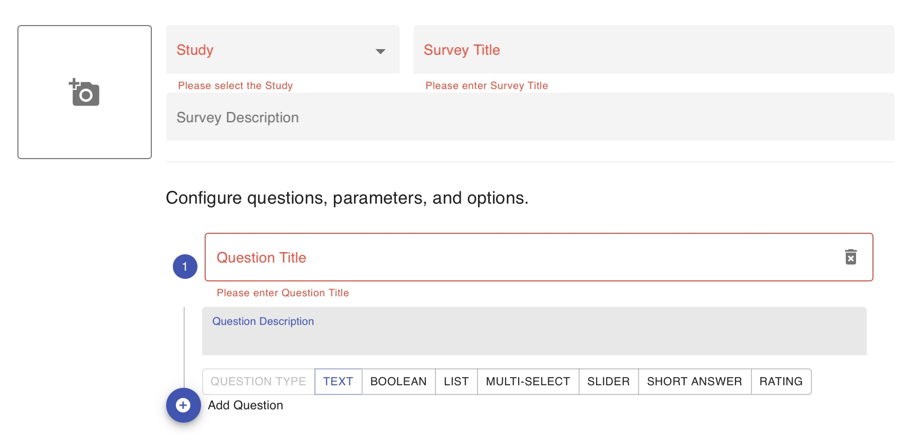

# Create and Customize Surveys

<iframe width="560" height="315" src="https://www.youtube.com/embed/0VkPQBwqLTc" title="YouTube video player" frameborder="0" allow="accelerometer; autoplay; clipboard-write; encrypted-media; gyroscope; picture-in-picture" allowfullscreen></iframe>

*How to Create a Survey from the Patient Profile*

1. Log in to the dashboard and navigate to the Activities tab.
2. Click the `[+ Add]` button at the top right of the list and select _Survey Instrument_.
3. Select the study you wish to add the survey to.
4. Title your survey.
5. Press the blue `(+)` icon at the bottom of the list to create a new question. To go back and edit a question, press its title or question number. 
6.You can add description content to each question or option choice that can assist clinicians or patients in their selections. If such the description content field is left empty, it will not be displayed when a question or option choice is presented.
7. Please double check and ensure you have no typos or errors when saving the new survey. Once you press the `[Save]` button, you will be returned to the screen displaying the list of Activities in your clinic or study, now with the newly added survey. 

