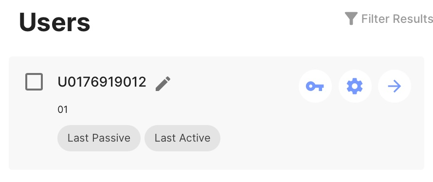
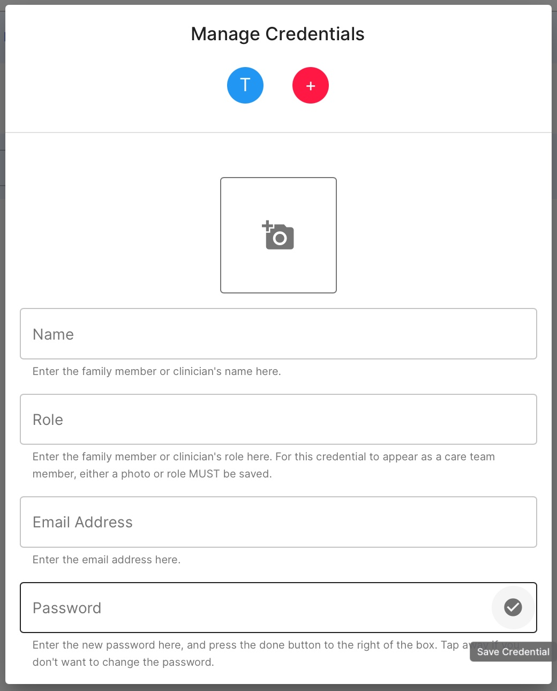
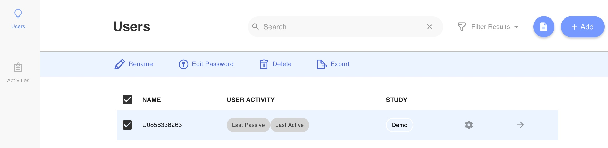
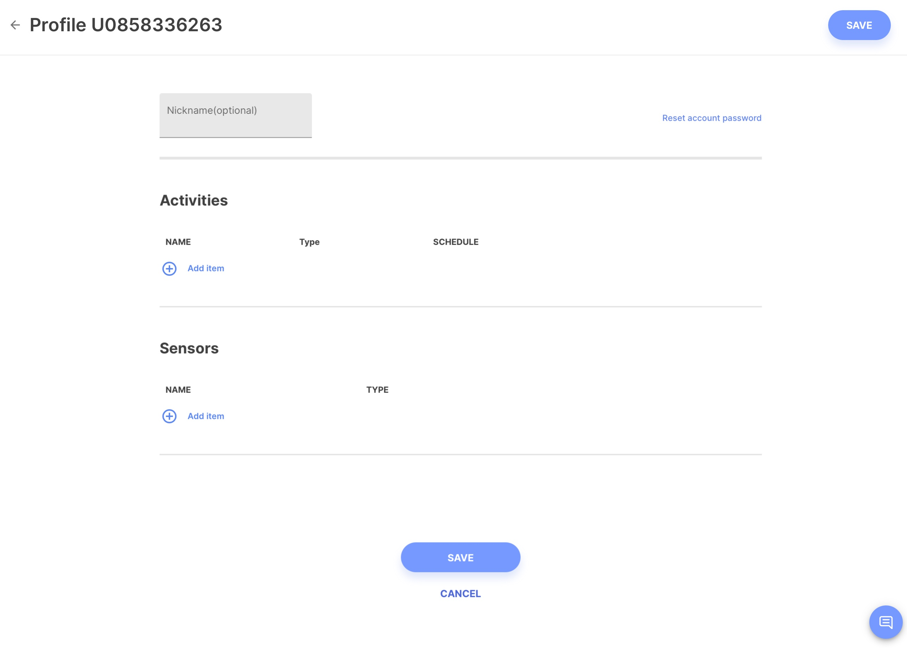

# Reset a Client's Credentials

<iframe width="560" height="315" src="https://www.youtube.com/embed/MTFwfsP4_9E" title="YouTube video player" frameborder="0" allow="accelerometer; autoplay; clipboard-write; encrypted-media; gyroscope; picture-in-picture" allowfullscreen></iframe>

## Reset Password from the Users tab

1. Log into the app and click on the "Users" tab.
2. Select the key next to the patient whose credentials you wish to change.
3. Select **Edit Password.**
4. Select the credential you wish to change and click **Reset Password.**
5. Enter your new password and select the circled check mark to save it.

## Reset Password from the Patient Profile

1. Log into the app and click on the "Users" tab.
2. Select one or more patients/participants by tapping the checkboxes at the left of their row. 
3. Click the gear icon.
4. Rename, reset password, modify activities or sensors, or send a message to the patient.
5. Click "Save."

