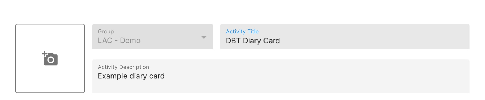

# Create a DBT Diary Card

<iframe width="560" height="315" src="https://www.youtube.com/embed/iQqMgR4nh2o" title="YouTube video player" frameborder="0" allow="accelerometer; autoplay; clipboard-write; encrypted-media; gyroscope; picture-in-picture" allowfullscreen></iframe>

1. Log in to the dashboard and navigate to the Activities tab.
2. Click the `[+ Add]` button at the top right of the list.
3. Select DBT Diary Card.

4. Your blank DBT Diary Card is ready to be customized.

