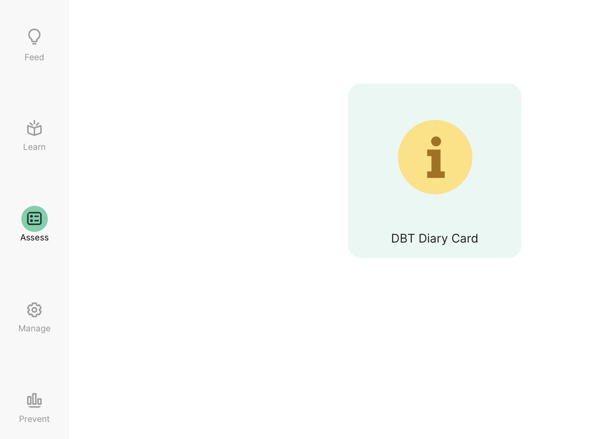

# Open the DBT Diary Card

<iframe width="560" height="315" src="https://www.youtube.com/embed/vqHqJJKHjso" title="YouTube video player" frameborder="0" allow="accelerometer; autoplay; clipboard-write; encrypted-media; gyroscope; picture-in-picture" allowfullscreen></iframe>

1. Log into the mindLAMP app or dashboard at dashboard.lamp.digital
2. Navigate to the Assess tab.

3. Select "DBT Diary Card" and click "Start Survey."

4. Your life worth living goal will be on the next screen.

