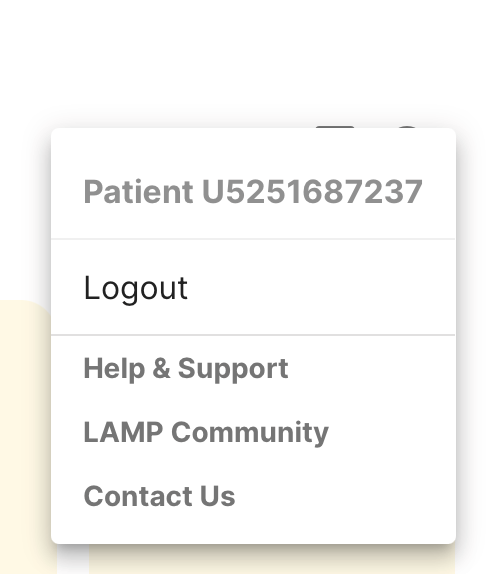

# Troubleshooting

In case your app is running into issues or you have questions regarding setting up, see this section to see if the solutions listed help! If you are still in need of further assistance, please file a report through our bug reporting form [here](https://docs.google.com/forms/d/e/1FAIpQLSdyt4olypT86pN9GLoueuawR_XUJwlDLo_HhSpIGTZ2Q7sn2g/viewform?usp=dialog).

You can also access these links from within the app after logging in and clicking the person icon in the top right corner. Clicking on 'Help and Support' will take you to this documentation page. The 'Contact Us' button will allow you to email us in case you are encountering a unique issue that was unable to be solved after viewing the documentation. See the image of where to click to access these links below.

## For Users

## Redownloading

Many issues occur that might be difficult to reproduce on our end or with other users. A common solution is to attempt uninstalling and the redownloading the app.

## Logging out and logging back in

If you go to the top right corner, click on the person icon, which will allow you to access helpful links to contact us as well as logout. Attempt logging out and logging in to see if an issue you are encountering is resolved.

## Clear data (Android)

For Android users, please go to settings, then apps & notifications. Proceed to click on mindLAMP, then storage & cache, and clear cache to clean data. Sometimes this can help and it will clear stored data on your phone, allowing LAMP to run better. This does not affect data that has already been collected and uploaded, so there is no worry of losing past data.

## Getting Logged out of the app

Sometimes, the app may log you out on its own. If this is the case, please try to give us as detailed of response as to when this happened and what other activities you may have been doing at the time you noticed the logout. We are currently investigating this issue, but because of the complexity of people having various phones, scenarios when logged out, and activities on their account, it will be a work in progress. If you experience any issues or have any feedback regarding this issue, please contact as at team@digitalpsych.org

## App Won't Load

If the app won't load there are two strategies. First, verify the strength of the wifi network you are using, as well as your cell Service. Sometimes the app buffering is simply a result of a poor connection. If there is not an issue with your device connectivity, you can always access the app through [the online dashboard](https://dashboard.lamp.digital/#/).

<head>
  <meta name="google-site-verification" content="MDFm8izKofwRdAnUbqg2muDPnSlHISr1EVApzHUI-Z4" />
</head>
