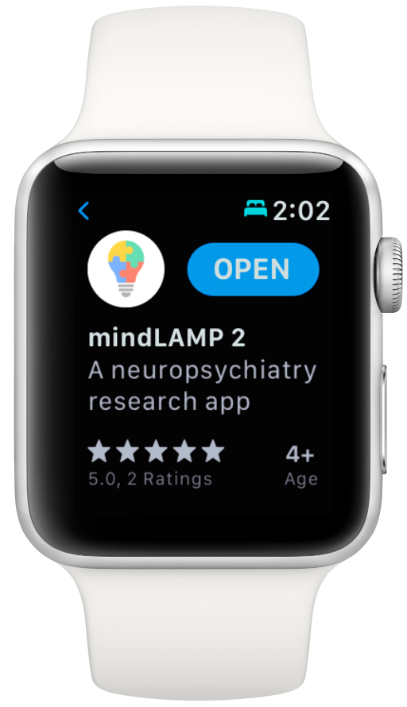

# General Availability of mindLAMP 2

## Features 

### Brand new user experience

- The new **Feed** tab will assist patients/participants with a heads-up of what needs to be completed each day, as well as what's already been completed in the past.
- The bright new user interface is approachable, friendly, and easy to use! You'll find the **Learn**, **Assess**, **Manage**, and **Prevent** tabs familiar, but now simplified and better organized.
- Management of studies and clinics is now simplified with a visual makeover that you can use in the browser dashboard or on-the-go when logged in as a clinician in the mobile app.

### New activities and interventions

- We've ported over some classics such as **Surveys** or the beloved **Jewels** game from mindLAMP 1, so you won't miss those.
- We've also added brand new activities such as **Tips** for customizable articles, **Breathe** for meditation and breathing exercises, **Journal** for a digital journal and thoughts tracker, and several more!
- **Conversations** now allow you to communicate with study participants or patients in the clinic. *(This is a completely optional feature that is disabled by default. Please see the user guide for more details.)*

### Visual data dashboard

- The new app experience also allows customizing how you want to see and work with data, located in the **Prevent** tab of the app.
- We have more planned for data visualization — stay tuned! ✨

### Wearables support

- mindLAMP 2 introduces support for the Apple Watch and Google wearOS watches (Fossil, Skagen, TicWatch, and others), and you can download these apps independently of the mobile apps.
- Because the screen sizes are typically too small for complex interaction, the wearable apps are limited to only passive sensor collection.

Please note that we're currently investigating an issue that significantly impacts the sensor collection frequency of device motion on iOS and Apple Watch devices.

## Improvements

### Push notifications

- While mindLAMP 1 supported local notifications to remind patients/participants to take surveys or play cognitive games, it was not always reliable.
- We've upgraded our infrastructure to support directly sending notifications to devices from the cloud, ensuring that everyone receives activities on schedule.
- You'll also be able to track when a notification was received by a device and the time interval between when it was received and when the activity (such as a daily survey) was opened.

### Database improvements

- Data scientists and researchers will now be able to use our powerful API across the [R](https://github.com/BIDMCDigitalPsychiatry/LAMP-r), [Python](https://github.com/BIDMCDigitalPsychiatry/LAMP-python), [Javascript](https://github.com/BIDMCDigitalPsychiatry/LAMP-js), [Swift](https://github.com/BIDMCDigitalPsychiatry/LAMP-swift), and [Kotlin](https://github.com/BIDMCDigitalPsychiatry/LAMP-kotlin) programming languages.
- Security and performance improvements make it simpler to share data with others using Credentials and download data quickly using our Event-based API.
- It's now possible for organizations to deploy the LAMP Platform on Amazon Web Services, Microsoft Azure, or on-premise quickly and effectively. For more information, check out [Deploy & Develop LAMP](https://docs.lamp.digital/deploy_prereqs).

## Bug Fixes

- Resolved several **Survey** issues, including questions not being displayed correctly, and data not being uploaded in the correct format.
- Resolved an issue where the data dashboard (in the **Prevent** tab) was not displaying the correct graphs or last activity text.
- Resolved an issue where being logged in already on the mobile app during a system upgrade caused the app to crash to a white screen.
- Resolved an issue where data from mindLAMP 1 was being saved but was not visible in the mindLAMP 2 user interface.
