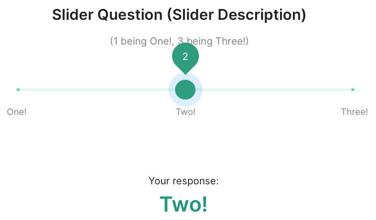
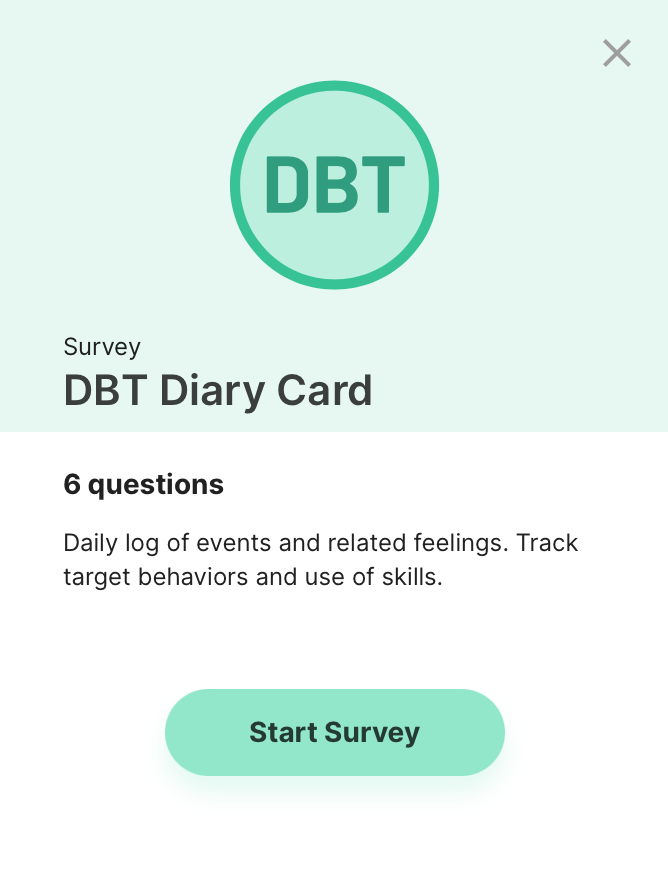
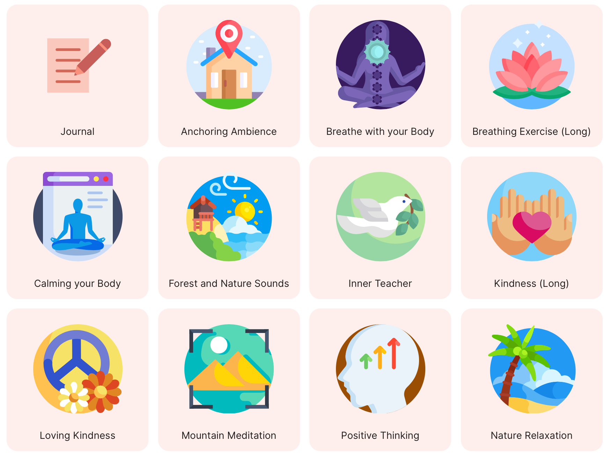

# Improvements

### Survey Slider Options & Description

- Customize the slider question type with as many or as few stops, and now add descriptions for each stop along the slider that will show below the slider for when a patient makes a selection.

- Survey and other activities now support custom descriptions and icons.

### Upload Guided Meditation Audio

- Breathe now supports uploading custom mp3 files for guided meditation, as well as using other mp3 files that are publicly available on the internet.

# Bug Fixes

- Resolved an issue where the descriptions of activities/surveys would show the text `(10 minutes)` erroneously regardless of survey length or expected activity duration.
- Resolved an issue where devices running Android 10 had inconsistent app behavior, including crashing or opening to a white screen.
- Resolved an issue where opening the Manage tab would cause the app to crash if there were no Manage activities enabled for a patient.
- Resolved several areas where push notifications were inconsistent, either sending no notification or many (~50) duplicate notifications to logged in devices.
- Resolved an issue where logging out of one account and into another account caused the device to erroneously continue receive notifications for the previous account.
- Resolved an issue where the user interface was very slow when managing more than ten studies.

Please note that we are currently investigating an issue regarding inconsistent data collection from HealthKit (such as step count) on Apple iOS devices when paired to an Apple Watch, when compared to the Apple Health app.
