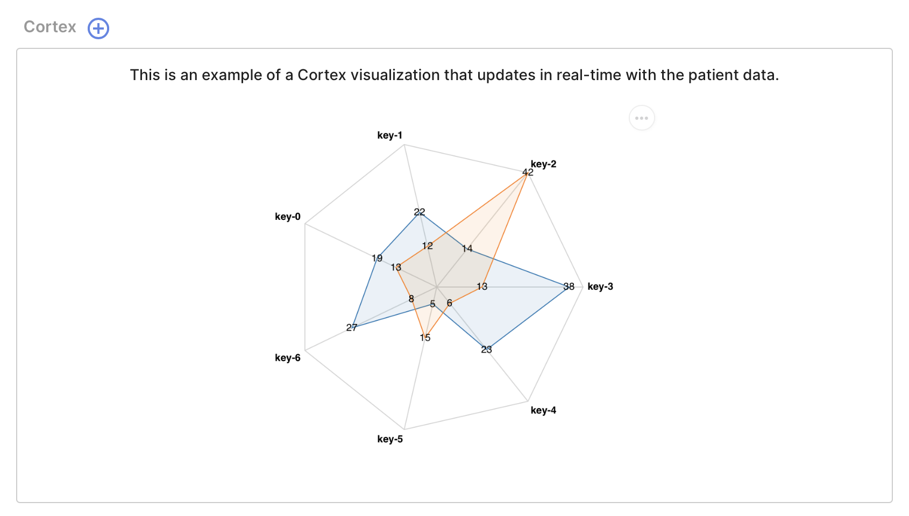
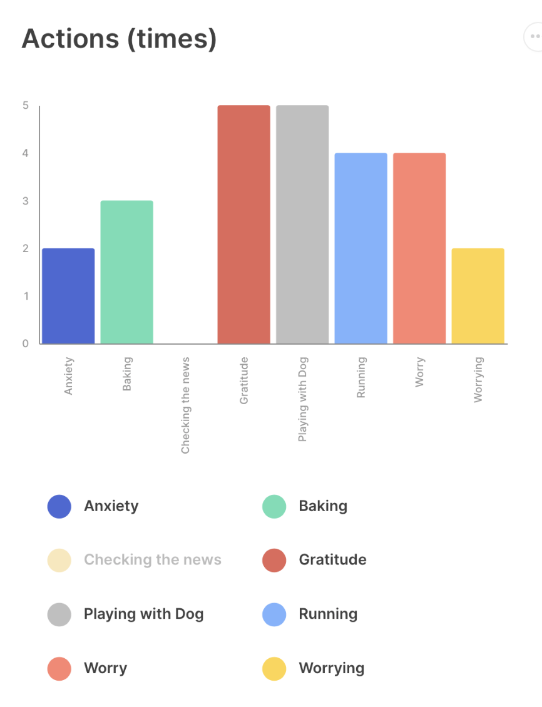
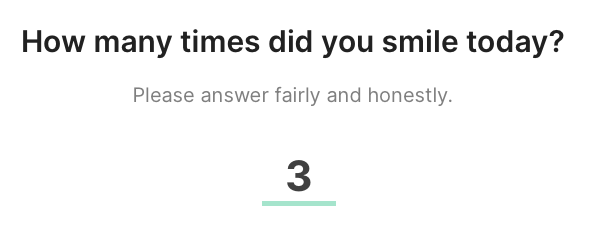
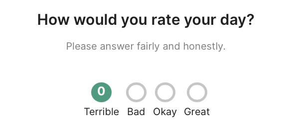
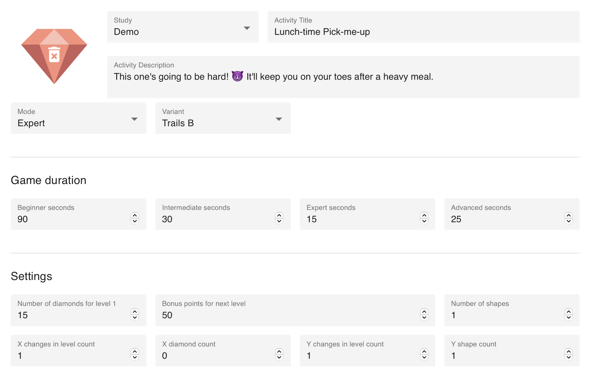
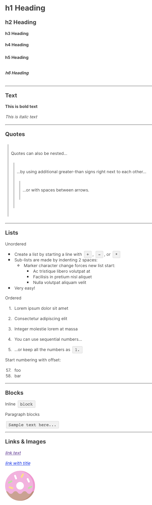

# Features 

### Cortex & Enhanced Visualizations

- We've added support for displaying real-time visualizations generated by the Cortex data analysis pipeline in both the app and management console.
    - We've optimized and streamlined the Prevent tab of the app

- We've added support for user-specified dynamic Vega charts in both the app and management console.
    - This feature is currently limited to the DBT Diary Card activity, but will soon be available for other activities.

# Improvements

### Localization & Internationalization

- Added an "empty tab" message and optimized interface text.
- Updated support for Hindi (`hi-IN`).
- Updated support for Spanish (`es-ES`).

### Activities & Surveys

- Added the `SHORT ANSWER` question type with description text.

- Added the `RATING SCALE` question type with description text.

- Added custom icon support for surveys and activity groups.
- Added automatic question settings validation for certain question types.
- Updated Jewels settings to support multiple modes (`beginner`, `intermediate`, `advanced`, `expert`) and variants (`trails_a`, `trails_b`).

- Added support for **Markdown-formatted text** in Tips (coming soon to other activity types, including surveys).
    - *Currently does not support Table formatting.*

# Bug Fixes

- Resolved an issue in the Breathe activity where the duration of the exercise did not correctly match the length of the audio, if one was uploaded or specified.
- Resolved an issue where adding a vector image (SVG) as a custom activity icon caused the icon to be erroneously compressed and pixelated.
- Resolved an issue with the Activity and Participant tabs of the management console displaying information slowly and in the wrong or random order.
