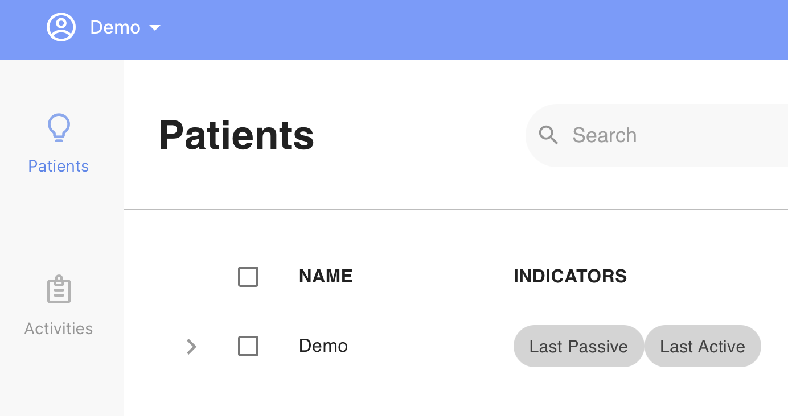
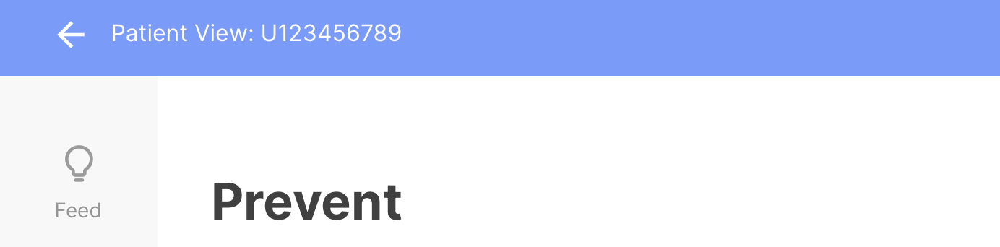
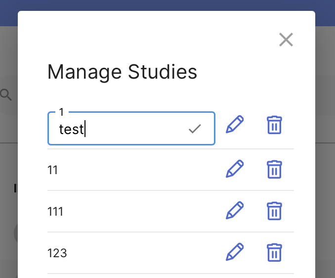

# Features 

### App Toolbar

- We've added a new toolbar at the top of the screen that helps you keep track of where you are in the app.
    - Viewing a patient when logged in as a clinician now has a gentle border around the app to remind you of which patient you're viewing, along with a helpful back button to return to the clinician view.

### Study Management

- We've added a studies management panel for researchers to better keep track of their studies, rename, or delete them.

### Real-time Event Subscription API

- We've added a powerful new (pre-release) real-time event subscription API for the upcoming logic/automations features that work closely with the Cortex data analysis pipeline.
    - Information on this API will be added to the documentation in the coming weeks, and the API endpoints are currently subject to change.

# Improvements

### Miscellaneous

- Added support for displaying custom Activity Groups in the Assess tab along with the Feed tab.
- Improved HealthKit and Google Fit sensor (i.e. step count) data collection fidelity; this change will be rolling out over the next week for iOS and Android.
- Improved visualization of DBT Diary Card data in the Prevent tab, including dynamic charts and patients' free responses.

# Bug Fixes

- Resolved a **significant** issue where some patients were unable to log in on iOS or Android with valid credentials due to server login latency.
- Resolved an issue where certain survey question text was not displaying for specific surveys.
- Resolved an issue where the message entry field for the Conversations UI cut off the message being typed by the user.
- Resolved an issue where survey slider question types sometimes showed incorrect option ranges.
- Resolved an issue where the Feed tab did not display schedule indicators correctly on days with scheduled activities.
- Resolved an issue where the "Last Active" and "Data Quality" (renamed "Last Passive") indicators were misleading and presented inaccurate information.
- Resolved an issue where after editing an activity for one study, activities from other studies would temporarily disappear from the Activity tab.
- Resolved an issue where push notifications on iOS and Android would not open to the specific activity's UI, instead showing a blank screen.
- Resolved an issue where sensor data collection would be erroneously paused or data cache would be cleared on certain Android 11 devices.
