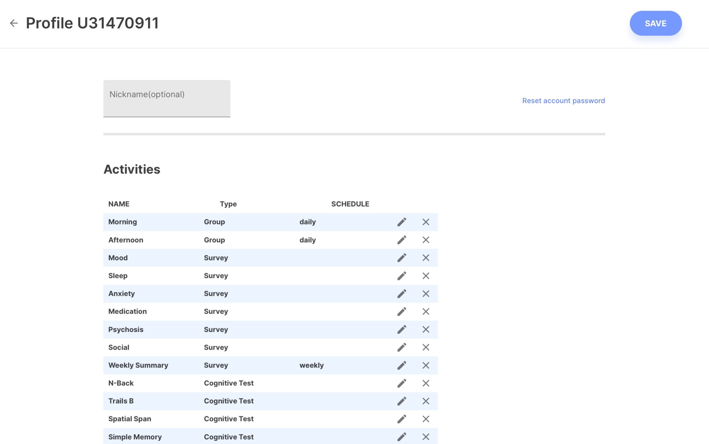
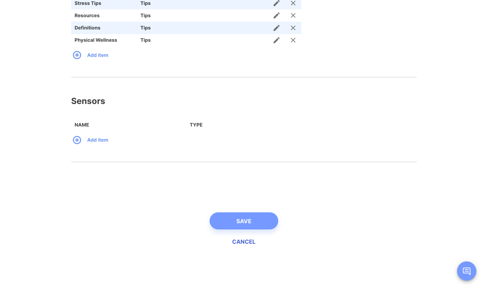
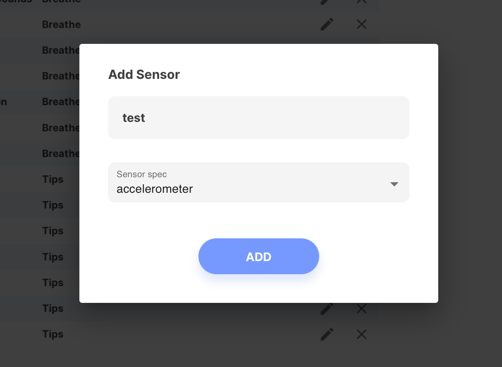
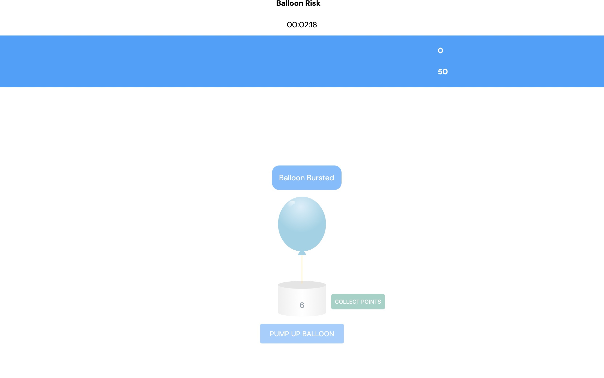

# Patient Profile & New Cognitive Tests

## Features 

### Patient Profile UI

- The new Patient profile interface allows quick and easy management of activities, sensors, and conversations in one place.
- You are now able to add, remove, and configure specific sensors for data collection across studies. (Support for this feature requires the upcoming smartphone and wearable app release.)

### Pop The Bubbles & Balloon Risk

- The new "Pop The Bubbles" and "Balloon Risk" cognitive test activities are available for configuration and usage (in specific installations only; consult your system administrator).

## Improvements

### **Improved Native Apps**

- Updated and refactored the iOS and Android apps for higher performance and support for new enhanced features.
    - mindLAMP now requires a minimum version of iOS 14 or watchOS 6.
    - This update will be rolling out in the coming weeks once approved by Apple and Google.
- Updated push notifications to collect metadata about notifications and user interactions as a new sensor type.

### **Improved Native Apps**

- Updated graphing code to be higher performance and restored Step Count graphs.
- Updated error boundaries to display errors to the user instead of crashing to an unhelpful blank screen, and added a version number.

### Hardened Security Requirements

- Hardened security requirements for enterprise deployments will be rolling out in the coming weeks.
    - Clinicians will need to request their system administrator to be added to a clinic/study and system administrators may generate a password of sufficient complexity as required by organizational policies.
    - Patients and study participants will need to request their clinician or research coordinators to reset their password or add additional care team members.

## Bug Fixes

- Resolved minor labeling and functionality issues with the DBT Diary Card activity.
- Resolved an issue where the backend message queue would not accept large payloads and inadvertently crash the API Server.
- Resolved an issue where Breathe exercises did not record duration spent correctly.
- Resolved issues in rare cases with embedded activities (i.e. Jewels) not receiving the correct language code for translations support at runtime.
- Resolved an issue where Activity Groups appeared in the Prevent tab incorrectly.
- Resolved an issue where tapping a notification could lead to a blank page instead of an embedded activity.
- Resolved an issue where loading patients' data could erroneously take twice as long as expected.
- We are aware of an issue with scrolling being temporarily locked on Safari browsers when viewing the Patient or Activity tabs in the dashboard; a temporary workaround is to resize the browser window, after which scrolling will resume normally.
- We are aware of an issue leading to slower than expected performance and speed when using the Patient tab of the dashboard across all browsers; a resolution for this issue is in progress.
