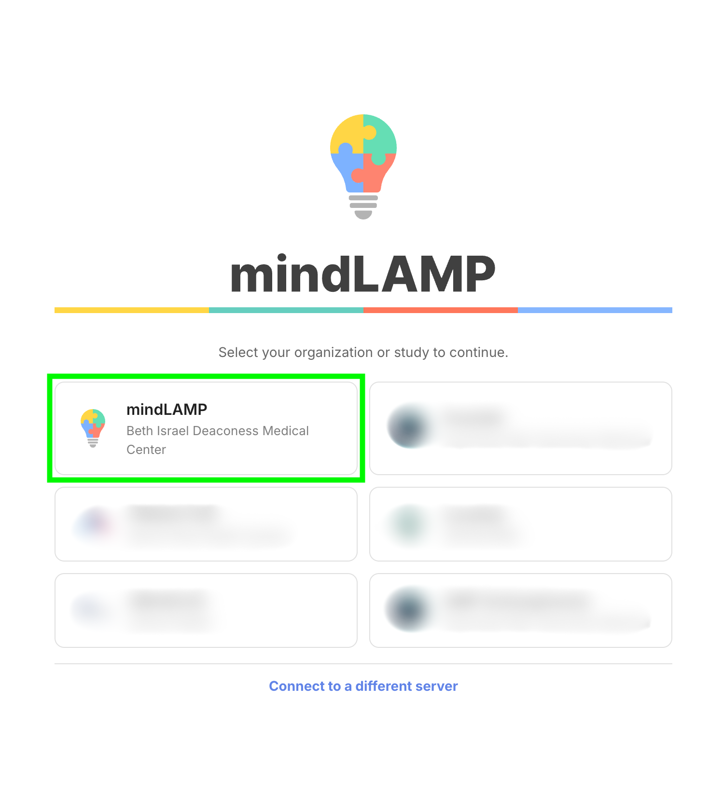

This is **Phase 1** of the [mindLAMP Authentication Upgrade](/blog/authentication-upgrade). On **Wednesday, July 29**, we're updating the LAMP Dashboard and JavaScript SDK, a first step ahead of the larger security upgrade coming later this summer.

<!-- truncate -->

**The changes are fully backward-compatible.** Passive data collection will be unaffected, and no one will be logged out. The one visible change is at sign-in: instead of entering a server address, you'll select your server with a button.

- **Researchers** will log in as usual, choosing their server with a button.
- **Participants** will not be logged out by this update, so nothing changes for them at release. They'll see the new server-selection step the next time they sign in for any reason: a new participant on first login, or an existing participant after reinstalling the app, logging out, or signing in on a new device.

## Find your setup

At sign-in, you'll choose your organization or study from a set of cards:

### BIDMC-hosted server teams

*(You don't run your own server, so you typically leave the server address blank when logging in.)*

Researchers and first-time participants will connect using the **mindLAMP / BIDMC** button (highlighted above).

### Self-hosted teams

*(You host your own server and database.)*

Teams with a sign-in card will connect by selecting their card. If you don't have a card, or would rather not use one, choose **Connect to a different server** and enter your server address manually, as before.

We've contacted the teams that already have a card directly. If you run your own server, did not hear from us, and think you need a card, email mindlamp@bidmc.harvard.edu. To change the name, logo, or host organization on an existing card, let us know by **Tuesday, July 28**.

## What's next

This is the first step. The core security upgrade rolls out later this summer: session-based authentication, two-factor/OAuth for staff, and API keys for LAMP-py. For the full picture, who's affected, and how to prepare, see [The mindLAMP Authentication Upgrade](/blog/authentication-upgrade). We'll notify all teams directly before anything changes, so no action is needed now.

**Self-hosted teams:** all client updates (dashboard, mobile apps, SDKs) remain compatible with currently released server versions, so no action is required.

## Questions?

Questions or problems? Email mindlamp@bidmc.harvard.edu.
