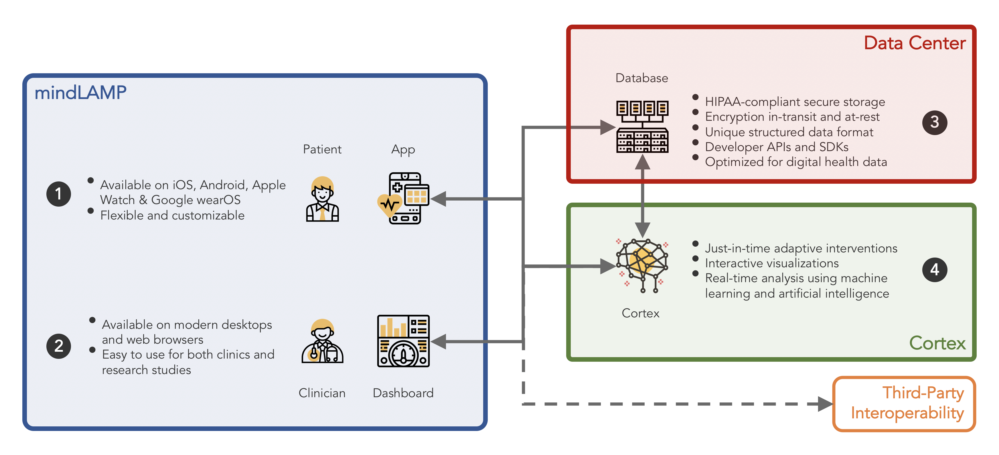
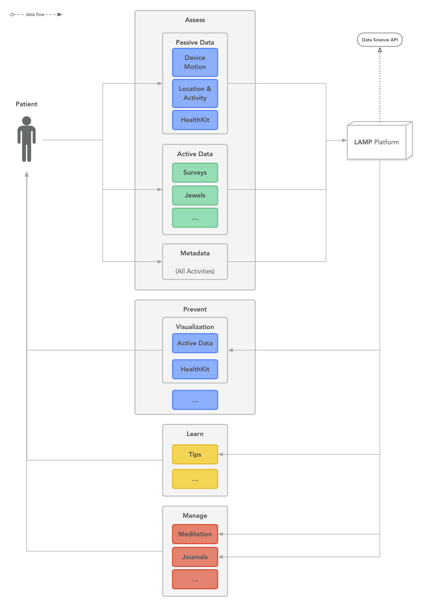

# MindLAMP Platform

<iframe width="560" height="315" src="https://www.youtube.com/embed/wnFml3qrLHI?si=fPTF3D_mCg4NdIpg" title="YouTube video player" frameborder="0" allow="accelerometer; autoplay; clipboard-write; encrypted-media; gyroscope; picture-in-picture; web-share" referrerpolicy="strict-origin-when-cross-origin" allowfullscreen></iframe>

**MindLAMP** (Learn, Assess, Manage, Portal) is a measurement-based care platform designed for neuropsychiatric research and digitally enabled clinics. Its four integrated components automate workflows— from data capture on the patient’s device to near-real-time insights for clinicians and researchers—simplifying both study execution and routine clinical care. Indexed in the World Health Organization’s Digital Health Atlas, MindLAMP is used worldwide by academic research groups and community clinics alike, including at major Harvard Medical School teaching hospitals.

### Who Uses MindLAMP?

**Patients & Participants**

Individuals taking part in research studies or receiving digitally enabled care. They can complete customized activities and share passive sensor data, all in service of tracking and improving their mental health.

**Clinicians & Researchers**

Professionals who design and run studies or manage patient care. They can configure and schedule custom activities for participant groups, monitor patient progress via interactive visualizations, and integrate MindLAMP data into their decision-making and research pipelines.

**Administrators**

System administrators who deploy and maintain the MindLAMP backend. They hold the “admin keys,” create initial Clinician/Researcher accounts, and ensure secure, compliant operation of the platform.

### How It Works

The MindLAMP platform is built around four integrated components:

**① App**

The MindLAMP2 App empowers participants to take an active role in their care by completing surveys, playing cognitive games, accessing helpful tips and resources, and engaging in meditation and breathing exercises. When configured, it unobtrusively gathers passive sensor data—accelerometer, GPS, pedometer, screen usage and more—in the background, as well as metadata about app use, such as how long each survey question takes to answer or which tips the user finds most valuable. All active and passive data streams are securely uploaded to an organization-owned server, enabling near-real-time monitoring and longitudinal tracking. 

**② Dashboard**

Clinicians and researchers use the Dashboard to design, customize, and schedule activities for their participants, sending push notifications and messages as needed. A fully functional Data Portal provides comprehensive, downloadable views of all patient and participant data, which can be shared securely with clinicians, family members, or trusted collaborators.

**③ Database**

The Database securely and chronologically indexes the data through the LAMP Protocol for programming and data science. It informs custom data analysis code in real-time that new patient data has arrived. Researchers can better build reusable tools, analysis pipelines, and conduct reproducible science, knowing that others around the globe using the LAMP Platform can easily work with their data or replicate their unique study.

**④ Cortex**

The Cortex data analysis pipeline is designed to easily hook into the Database and extract important and clinically useful secondary data features, such as sedentary behavior, time spent at home, device/screen usage, sleep estimates, and much more, from the terabytes of raw data. It can trigger custom just-in-time adaptive interventions and produce useful interactive visualizations viewable by patients and clinicians.

### Diagram of the LAMP Platform

<head>
  <meta name="google-site-verification" content="MDFm8izKofwRdAnUbqg2muDPnSlHISr1EVApzHUI-Z4" />
</head>
