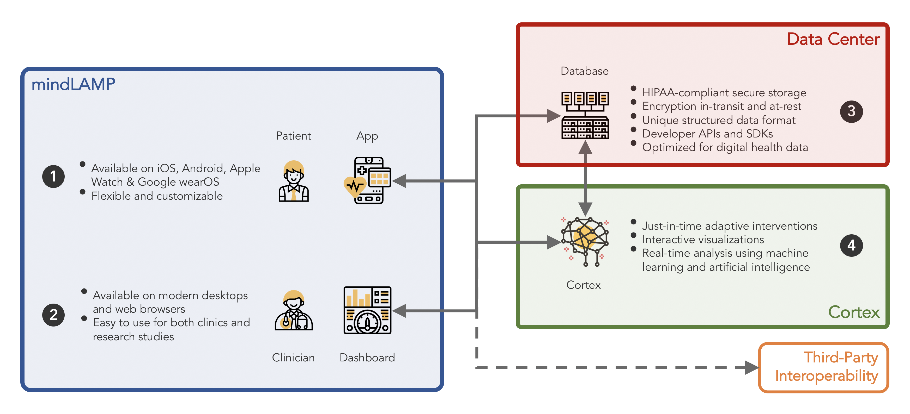

import Link from '@docusaurus/Link';
import Tabs from '@theme/Tabs';
import TabItem from '@theme/TabItem';

# MindLAMP

## A Digital Platform for Behavioral Research & Care

MindLAMP is an **open-source platform** that enables teams to study, adapt, and support behavioral health in ways that are scientifically rigorous and immediately useful in practice. It is designed to support **rich measurement**, **flexible delivery**, and **reciprocal engagement** all within one ecosystem, allowing for transformative advancements in digital research and care.

---

## Addressing Challenges in Research & Care

Traditional research and care face three persistent challenges, for which MindLAMP is solution:

<Tabs groupId="challenge" defaultValue="measurement" values={[
  {label: 'Measurement', value: 'measurement'},
  {label: 'Flexibility', value: 'flexibility'},
  {label: 'Engagement', value: 'engagement'},
]}>
  <TabItem value="measurement">
    

      

        The Challenge
        <h3 className="margin-top--xs">Measurement Gaps</h3>
      

      

        

          Most research and care rely on brief clinic visits, recall-based surveys, or other intermittent assessments. These approaches capture snapshots, but miss the subtle, day-to-day fluctuations in experience and behavior that matter most. Without continuous or ecological data, much of the lived reality of mental health remains unseen.
        

      

    

    

      

        MindLAMP as the Solution
        <h3 className="margin-top--xs">Rich Measurement</h3>
      

      

        

          MindLAMP enables <strong>digital phenotyping</strong>: real-world, real-time measurement that integrates <strong>passive data</strong> (background signals that reflect patterns of mobility, activity, context) with <strong>active data</strong> (participant-initiated tasks and surveys).
        

        

          Within active data, <strong>EMA</strong> delivers short, timely prompts; the platform captures responses plus metadata (timestamps, completion times) via its analytics layer. Together, passive and active streams provide a more complete, lived-experience view than clinic snapshots alone.
        

        

          <Link to="/docs/05-using/07-sensors.md">Explore LAMP Sensors →</Link> 
          <Link to="/docs/06-start_here/06-activities/09-activities.md">Explore LAMP Activities →</Link>
        

      

    

  </TabItem>

  <TabItem value="flexibility">
    

      

        The Challenge
        <h3 className="margin-top--xs">Flexibility Gaps</h3>
      

      

        

          Digital tools tend to be rigid, with limited options to customize what content is delivered, when it is scheduled, or how it adapts to individual needs.
        

      

    

    

      

        MindLAMP as the Solution
        <h3 className="margin-top--xs">Flexible Delivery</h3>
      

      

        

          mindLAMP extends care and research to the smartphone. The <strong>App</strong> gives participants a place to engage wherever they are; the <strong>Dashboard</strong> lets coordinators, researchers, and clinicians configure protocols, tasks can be scheduled, customized, and iterated to match protocols. The LAMP Protocol supports custom integrations, while Cortex enables raw-to-feature pipelines and adaptive logic. Flexibility ensures that the same platform can support projects ranging from simple reminders to complex, personalized digital phenotyping studies.
        

        

          For multi-site work, protocols can be standardized for consistency and adapted locally as needed—scalable without losing flexibility.
        

        

          <Link to="/docs/LAMP-protocol">Explore LAMP Protocol Documentation →</Link> 
          <Link to="/docs/09-data_science/06-cortex/02-what_is_cortex.md">Explore Cortex Documentation →</Link>
        

      

    

  </TabItem>

  <TabItem value="engagement">
    

      

        The Challenge
        <h3 className="margin-top--xs">Engagement Gaps</h3>
      

      

        

          Between visits or study sessions, connections can weaken. Teams may lack timely data to guide decisions; participants may not see how their contributions matter or receive meaningful feedback.
        

      

    

    

      

        MindLAMP as the Solution
        <h3 className="margin-top--xs">Reciprocal Engagement</h3>
      

      

        

          Engagement in mindLAMP is two-way — participants and teams both gain value. For participants — Easy access on their phones, timely notifications, messaging with coordinators, and feedback through visualizations in the Portal. For teams — Dashboards and the Data Portal provide structured views, let coordinators monitor progress, and allow clinicians/researchers to adapt protocols responsively. This reciprocity builds trust and adherence: participants see benefit beyond data entry, and teams get the real-time information they need.
        

        

          <Link to="https://dashboard.lamp.digital/#/researcher/researcher1/users/">Demo the Dashboard as a Researcher→</Link> 
          <Link to="https://dashboard.lamp.digital/#/participant/U123456789/portal">Demo the App as a Participant→</Link>
        

      

    

  </TabItem>
</Tabs>

---

## Platform Components

mindLAMP is built around four core components. Together they form a complete platform, but each can also be used independently depending on the needs of a study or clinical program.

  

    

      

        <h3 className="margin-bottom--xs">The App</h3>
        <small>For Participants</small>
      

      

        

          A participant-facing tool for surveys, cognitive tasks, wellness activities, and — when enabled —
          passive data collection in the background. Available on iOS and Android; customizable per project.
        

        
<Link to="/docs/05-using/01-app.md">Learn how to use the App →</Link>

      

    

  

  

    

      

        <h3 className="margin-bottom--xs">The Dashboard</h3>
        <small>For Coordinators</small>
      

      

        

          A web-based tool for Researchers & Clinicians to configure their project implementations,
          manage participants, and review incoming data with structured views of activity and outcomes.
        

        
<Link to="/docs/06-start_here/01-overview.md.md">Learn how to use the Dashboard →</Link>

      

    

  

  

    

      

        <h3 className="margin-bottom--xs">The Database</h3>
        <small>For Administrators</small>
      

      

        

          Securely organizes all collected information using the <strong>LAMP Protocol</strong>, ensuring
          reproducibility and extensibility. Foundation for programmatic access and custom tools.
        

        
<Link to="/docs/08-develop/01-intro.md">Learn how to use the Database →</Link>

      

    

  

  

    

      

        <h3 className="margin-bottom--xs">Cortex</h3>
        <small>For Data Analysts</small>
      

      

        

          Data processing pipeline that transforms raw inputs into meaningful features and visualizations,
          enabling researchers and clinicians to interpret complex digital signals.
        

        
<Link to="/docs/09-data_science/06-cortex/02-what_is_cortex.md">Learn how to use Cortex →</Link>

      

    

  

---

## Proof & Community

mindLAMP is built and sustained through collaboration. Researchers, clinicians, patients, and developers form a community with the shared goal of using digital tools to advance both science and care.

Most teams implement mindLAMP through <strong>LAMP CORE</strong>, the service we provide to support research and clinical programs. CORE requires a business agreement and includes hosting, support, and consultation. This ensures that implementations are reliable, secure, and aligned with scientific and clinical goals.

  <Link to="/docs/02-quick_links/01-interest.md">Join LAMP CORE →</Link>

Because mindLAMP is open source, teams may also adapt the code independently. Projects that take this path should still cite mindLAMP and let us know about their work. Independent implementations, however, are responsible for their own hosting, maintenance, and support.

  <Link to="https://github.com/BIDMCDigitalPsychiatry">View mindLAMP on GitHub →</Link>

This balance — open and shareable, yet guided through CORE — has allowed mindLAMP to expand globally while staying rooted in community needs. Patients and participants engage with mindLAMP only through these research and clinical programs, using the App as part of their care or study involvement. This structure ensures that the platform evolves in ways that are scientifically rigorous, clinically relevant, and responsive to the people who use it. To see how this works in practice, explore our <strong>case studies</strong>, which describe how mindLAMP has been implemented across research and clinical settings.

<Link to="/docs/02-quick_links/05-users.md">Read Case Studies →</Link>

<head>
  <meta name="google-site-verification" content="MDFm8izKofwRdAnUbqg2muDPnSlHISr1EVApzHUI-Z4" />
</head>
