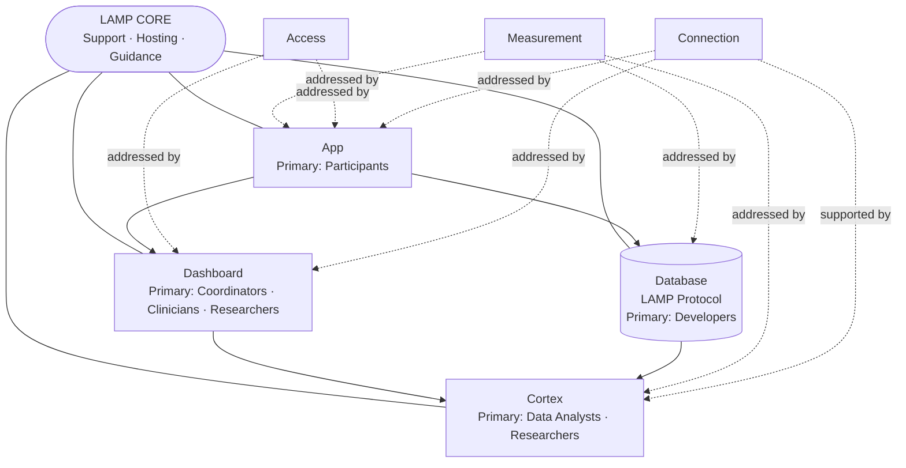

import Link from '@docusaurus/Link';

# mindLAMP

## A Digital Platform for Brain and Behavioral Health

mindLAMP is an **open-source platform** designed to improve how brain and behavioral health is measured, understood, and supported. It brings together research and clinical care in a single, flexible framework. By combining digital data, mobile tools, and collaborative design, mindLAMP enables approaches that are both scientifically rigorous and immediately useful in practice.

---

## Platform Components

mindLAMP is built around four core components. Together they form a complete platform, but each can also be used independently depending on the needs of a study or clinical program.

<div className="row margin-top--md">
  <div className="col col--6">
    <div className="card">
      <div className="card__header">
        <h3 className="margin-bottom--xs">The App</h3>
        <small>For Participants</small>
      </div>
      <div className="card__body">
        <p>
          A participant-facing tool for surveys, cognitive tasks, wellness activities, and — when enabled —
          passive data collection in the background. Available on iOS and Android; customizable per project.
        </p>
        <p><Link to="/docs/app/using-app">Learn how to use the App →</Link></p>
      </div>
    </div>
  </div>

  <div className="col col--6">
    <div className="card">
      <div className="card__header">
        <h3 className="margin-bottom--xs">The Dashboard</h3>
        <small>For Coordinators & Researchers</small>
      </div>
      <div className="card__body">
        <p>
          A web-based tool for coordinators to configure their research or clinicial implementations,
          manage participants, and review incoming data with structured views of activity and outcomes.
        </p>
        <p><Link to="/docs/dashboard/using-dashboard">Learn how to use the Dashboard →</Link></p>
      </div>
    </div>
  </div>
</div>

<div className="row margin-top--md">
  <div className="col col--6">
    <div className="card">
      <div className="card__header">
        <h3 className="margin-bottom--xs">The Database</h3>
        <small>For Developers</small>
      </div>
      <div className="card__body">
        <p>
          Securely organizes all collected information using the <strong>LAMP Protocol</strong>, ensuring
          reproducibility and extensibility. Foundation for programmatic access and custom tools.
        </p>
        <p><Link to="/docs/developing-lamp">Read about Developing with LAMP →</Link></p>
      </div>
    </div>
  </div>

  <div className="col col--6">
    <div className="card">
      <div className="card__header">
        <h3 className="margin-bottom--xs">Cortex</h3>
        <small>For Data Analysts</small>
      </div>
      <div className="card__body">
        <p>
          Data processing pipeline that transforms raw inputs into meaningful features and visualizations,
          enabling researchers and clinicians to interpret complex digital signals.
        </p>
        <p><Link to="/docs/cortex-api">Explore Cortex &amp; API →</Link></p>
      </div>
    </div>
  </div>
</div>
---

## Challenges & Responses

<div className="margin-top--lg">

  {/* === Measurement === */}
  <div className="row margin-bottom--lg">
    <div className="col col--6">
      <div className="card">
        <div className="card__header"><h3 className="margin-bottom--xs">Measurement</h3><small>What’s hard today</small></div>
        <div className="card__body">
          <p>
            Interviews, questionnaires, and brief visits are valuable—but they are <em>snapshots</em>. They are infrequent, rely on recall, and often miss the day-to-day dynamics that matter most for outcomes in mental health, cognition, and neurology.
          </p>
        </div>
      </div>
    </div>
    <div className="col col--6">
      <div className="card">
        <div className="card__header"><h3 className="margin-bottom--xs">How mindLAMP responds</h3><small>Continuous, ecologically valid data</small></div>
        <div className="card__body">
          <p>
            mindLAMP enables <strong>digital phenotyping</strong>—real-world, real-time measurement that integrates <strong>passive data</strong> (background signals from devices that reflect patterns of mobility, activity, and context) with <strong>active data</strong> (participant-initiated tasks and surveys).
          </p>
          <p>
            Within active data, <strong>Ecological Momentary Assessment (EMA)</strong> delivers short, timely prompts; the platform records responses and metadata (timestamps, completion times) via its analytics layer. Together, passive and active streams provide a more complete, lived-experience view than clinic snapshots alone.
          </p>
          <p className="margin-top--sm">
            <Link to="/docs/sensors">Explore LAMP Sensors →</Link><br/>
            <Link to="/docs/activities">Learn about LAMP Activities (incl. EMA) →</Link>
          </p>
        </div>
      </div>
    </div>
  </div>

  {/* === Access to Care === */}
  <div className="row margin-bottom--lg">
    <div className="col col--6">
      <div className="card">
        <div className="card__header"><h3 className="margin-bottom--xs">Access to Care</h3><small>What’s hard today</small></div>
        <div className="card__body">
          <p>
            Many people face provider shortages, waitlists, costs, stigma, and geographic barriers. Even when care is available, it’s often limited to brief, infrequent encounters with little ongoing monitoring or support between visits.
          </p>
        </div>
      </div>
    </div>
    <div className="col col--6">
      <div className="card">
        <div className="card__header"><h3 className="margin-bottom--xs">How mindLAMP responds</h3><small>Care beyond the visit</small></div>
        <div className="card__body">
          <p>
            mindLAMP extends care and research to the smartphone. The <strong>App</strong> gives participants a place to engage with surveys, cognitive tasks, and wellness tools wherever they are. The <strong>Dashboard</strong> lets coordinators, researchers, and clinicians configure protocols and review data in near real time, enabling responsive adjustments between appointments.
          </p>
          <p>
            For multi-site work, protocols can be standardized for consistency and adapted locally when needed—making implementations scalable without losing flexibility.
          </p>
          <p className="margin-top--sm">
            <Link to="/docs/app/using-app">How to use the App →</Link><br/>
            <Link to="/docs/dashboard/using-dashboard">How to use the Dashboard →</Link>
          </p>
        </div>
      </div>
    </div>
  </div>

  {/* === Connection === */}
  <div className="row">
    <div className="col col--6">
      <div className="card">
        <div className="card__header"><h3 className="margin-bottom--xs">Connection</h3><small>What’s hard today</small></div>
        <div className="card__body">
          <p>
            Between visits or study sessions, connections can weaken. Teams may lack timely data to guide decisions; participants may not see how their contributions matter or receive meaningful feedback.
          </p>
        </div>
      </div>
    </div>
    <div className="col col--6">
      <div className="card">
        <div className="card__header"><h3 className="margin-bottom--xs">How mindLAMP responds</h3><small>A shared data environment</small></div>
        <div className="card__body">
          <p>
            The App and Dashboard form two sides of the same environment: participants contribute and learn from their data; teams interpret, visualize, and act on it. Optional messaging and just-in-time prompts close the loop so participants are active contributors rather than passive data sources.
          </p>
          <p>
            Under the hood, the <strong>Database</strong> (via the LAMP Protocol) provides reliable structure and access, and <strong>Cortex</strong> turns raw signals into features and visualizations that are easier to reason about.
          </p>
          <p className="margin-top--sm">
            <Link to="/docs/developing-lamp">Developing with LAMP (Database) →</Link><br/>
            <Link to="/docs/cortex-api">Cortex &amp; API →</Link><br/>
            <Link to="/docs/case-studies">See this in practice (Case Studies) →</Link>
          </p>
        </div>
      </div>
    </div>
  </div>

</div>

---

## Proof & Community

mindLAMP is built and sustained through collaboration. Researchers, clinicians, patients, and developers form a community with the shared goal of using digital tools to advance both science and care.

Most teams implement mindLAMP through <strong>LAMP CORE</strong>, the service we provide to support research and clinical programs. CORE requires a business agreement and includes hosting, support, and consultation. This ensures that implementations are reliable, secure, and aligned with scientific and clinical goals.

Because mindLAMP is open source, teams may also adapt the code independently. Projects that take this path should still cite mindLAMP and let us know about their work. Independent implementations, however, are responsible for their own hosting, maintenance, and support.

This balance — open and shareable, yet guided through CORE — has allowed mindLAMP to expand globally while staying rooted in community needs. Patients and participants engage with mindLAMP only through these research and clinical programs, using the App as part of their care or study involvement. This structure ensures that the platform evolves in ways that are scientifically rigorous, clinically relevant, and responsive to the people who use it.

<p className="margin-top--sm">
  <Link to="/docs/core">Join LAMP CORE →</Link><br/>
  <Link to="https://github.com/BIDMCDigitalPsychiatry">View mindLAMP on GitHub →</Link>
</p>

To see how this works in practice, explore our <strong>case studies</strong>, which describe how mindLAMP has been implemented across research and clinical settings.

<Link to="/docs/case-studies">Read Case Studies →</Link>

---

## Demo

<div className="video-responsive" style={{position:'relative', paddingBottom:'56.25%', height:0, overflow:'hidden', borderRadius:12}}>
  <iframe
    src="https://www.youtube.com/embed/wnFml3qrLHI?si=fPTF3D_mCg4NdIpg"
    title="YouTube video player"
    frameBorder="0"
    allow="accelerometer; autoplay; clipboard-write; encrypted-media; gyroscope; picture-in-picture; web-share"
    referrerPolicy="strict-origin-when-cross-origin"
    allowFullScreen
    style={{position:'absolute', top:0, left:0, width:'100%', height:'100%'}}
  />
</div>

```mermaid
flowchart TB
  %% LAYER 1: CHALLENGES
  subgraph L1[Challenges]
    M[Measurement\n(infrequent, biased snapshots)\n— Researchers · Analysts]
    A[Access to Care\n(costs, waitlists, geography, stigma)\n— Clinicians · Coordinators · Participants]
    C[Connection\n(weak feedback between visits)\n— Everyone]
  end

  %% LAYER 2: PLATFORM COMPONENTS (tools)
  subgraph L2[Platform Components]
    APP[App]
    DASH[Dashboard]
    DB[(Database\nLAMP Protocol)]
    CTX[Cortex\n(features & visuals)]
  end

  %% LAYER 3: DATA STREAMS (concepts)
  subgraph L3[Data Streams]
    PASS[Passive Data\n(background signals)]
    ACT[Active Data\n(tasks, surveys, cognition)]
    EMA[EMA\n(real-time prompts)\n(Active subtype)]
  end

  %% LAYER 4: OUTCOMES
  subgraph L4[Outcomes]
    O1[Continuous Measurement]
    O2[Expanded Access]
    O3[Strengthened Connection]
  end

  %% MAPPINGS: Challenges → Components
  M --> APP
  M --> DB
  M --> CTX

  A --> APP
  A --> DASH

  C --> APP
  C --> DASH
  C --> CTX
  C --> DB

  %% Components → Data Streams
  APP --> PASS
  APP --> ACT
  ACT --> EMA
  DB --- PASS
  DB --- ACT
  CTX --> O1

  %% Data Streams → Outcomes
  PASS --> O1
  ACT --> O1
  EMA --> O1

  %% Components → Outcomes (access/connection)
  APP --> O2
  DASH --> O2
  DASH --> O3
  CTX --> O3
  DB --> O3

  %% Helpful doc links (as labels)
  click APP "/docs/app/using-app" "How to use the App"
  click DASH "/docs/dashboard/using-dashboard" "How to use the Dashboard"
  click DB "/docs/developing-lamp" "Developing with LAMP"
  click CTX "/docs/cortex-api" "Cortex & API"
```





```mermaid
flowchart LR
  subgraph P[Participants (via App)]
    AP[Engage with App\nActive: surveys, tasks, EMA\nPassive: background signals]
  end

  subgraph D[Data Backbone]
    DB[(Database\nLAMP Protocol\nsecure, structured)]
    CTX[Cortex\nfeatures · visuals · triggers]
  end

  subgraph T[Teams (via Dashboard)]
    DH[Dashboard\nCoordinators · Clinicians · Researchers]
  end

  %% forward flow
  AP -- Active & Passive Data --> DB
  DB --> CTX
  CTX --> DH

  %% feedback loop
  DH -- insights · protocol changes · messages --> AP
  CTX -- just-in-time prompts --> AP

  %% docs links
  click AP "/docs/app/using-app" "How to use the App"
  click DH "/docs/dashboard/using-dashboard" "How to use the Dashboard"
  click DB "/docs/developing-lamp" "Developing with LAMP"
  click CTX "/docs/cortex-api" "Cortex & API"
```