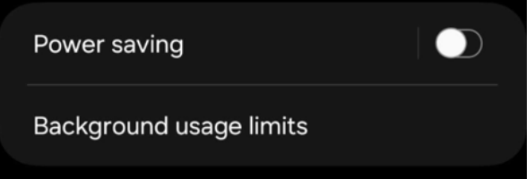

# Download & Set Up mindLAMP

mindLAMP is available on iOS, Android, and the web. The mobile apps support passive sensor data collection and push notifications; the web version is best for dashboard access and does not collect passive data.

## iOS

1. [Download mindLAMP 2 from the App Store](https://apps.apple.com/us/app/mindlamp/id1495947054) and open the app.

   
2. [Sign in](sign-in) with your credentials.

   

3. The app will ask for permissions specific to the sensors your study is configured to collect. **Allow all** permissions when prompted. For the HealthKit prompt, select **Turn On All**.

   

   
iOS permission reference

   | Permission | Enables |
   |---|---|
   | Location (Always) with Precise Location | GPS data collection. Must be "Always", not "While Using". |
   | Motion & Fitness | Accelerometer, pedometer, and activity recognition |
   | Notifications | Push notification delivery of scheduled activities |
   | Bluetooth | Nearby device detection |
   | Microphone | Voice recording activities |
   | Speech Recognition | Speech-to-text features in voice activities |
   | HealthKit | Health data (steps, heart rate, sleep, workouts, and other HealthKit-sourced metrics) |
   | Background App Refresh | Continuous background data collection |

   

   

   You will also be prompted to enable sensor collection for research. Tap **Settings** when you see the "Research Sensor & Usage Data Permission Required" prompt, then enable **Sensor & Usage Data Collection** in Settings > Privacy > Research Sensor & Usage Data.

   

   

4. In Settings > Battery, disable **Low Power Mode**.

   

5. Open the Settings app and find "mindLAMP 2". Verify the following:
   - Location is set to **Always** with **Precise Location** enabled.
   - **Motion & Fitness** is enabled.
   - **Notifications** are allowed.
   - **Background App Refresh** is enabled.
   - **Cellular Data** is enabled (if applicable).

   

### Apple Watch

1. Pair your Apple Watch with your iPhone using the Watch app.
2. Download the mindLAMP 2 app from the App Store **on the Watch**.
3. Open the app and [sign in](sign-in) **on the Watch** with your credentials.

## Android

Before using the app, install [Health Connect](https://play.google.com/store/apps/details?id=com.google.android.apps.healthdata) (or [Google Fit](https://play.google.com/store/apps/details?id=com.google.android.apps.fitness) on older devices). Health Connect is required for health data integration and also enables data from Fitbit and other wearables to flow to mindLAMP through your phone.

1. [Download mindLAMP 2 from the Play Store](https://play.google.com/store/apps/details?id=digital.lamp.mindlamp) and open the app.

   {/* TODO: Screenshot of mindLAMP 2 in the Play Store */}
2. [Sign in](sign-in) with your credentials.
3. The app will ask for permissions specific to the sensors your study is configured to collect. **Allow all** permissions when prompted.

   

   
Android permission reference

   | Permission | Enables |
   |---|---|
   | Location (Allow all the time) | GPS data collection |
   | Physical Activity | Accelerometer and activity recognition |
   | Notifications | Push notification delivery |
   | Bluetooth | Nearby device detection |
   | Microphone | Voice recording activities |
   | Phone State | Telephony (call/text) metadata |
   | Nearby WiFi Devices | WiFi device detection |
   | Health Connect | Health platform data (steps, heart rate, sleep) |
   | Battery optimization exemption | Uninterrupted background collection |

   

4. After signing in and viewing the Feed tab, leave the app and verify:
   - In Settings > Apps > mindLAMP 2 > Permissions > Location, select **Allow all the time**.
   - In Settings > Apps > mindLAMP 2 > Battery, select **Don't optimize** (unrestricted).
   - In Settings > Battery, disable **Battery Saver** (Power saving) and any automatic schedules. Make sure mindLAMP is not listed under **Background usage limits**.

   

   - Health Connect permissions are granted for all requested data types.

### WearOS

1. Pair a WearOS-based watch (Samsung Galaxy Watch 4+, Fossil, TicWatch, Motorola, Huawei) using the Wear app.
2. Download mindLAMP 2 from the Play Store **on the watch**.
3. Open the app and [sign in](sign-in) **on the watch** with your credentials.

## Web

Access mindLAMP in a desktop browser at [dashboard.lamp.digital](https://dashboard.lamp.digital).

The web version provides full access to the dashboard and activities but does **not** support:
- Passive sensor data collection
- Push notifications
- Background data collection

For full passive data collection, use the mobile app.

