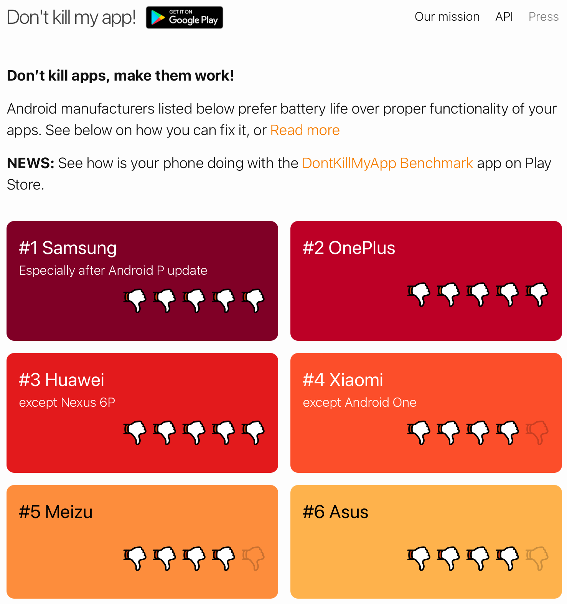

# Download mindLAMP

[→ If you'd like to access mindLAMP in a compatible desktop browser, tap here instead.](https://dashboard.lamp.digital)

## iOS

→ **Requires iOS 14 (and Apple Health).**

1. [**Download the mindLAMP app from the App Store.**](https://apps.apple.com/us/app/mindlamp/id1495947054)
2. Open it and sign into the patient’s account. 
3. **Agree to all permissions dialogs that prompt the user.**

    **GPS COLLECTION PERMISSION MUST SET TO "ALWAYS" TO COLLECT HIGH FREQUENCY SENSOR DATA.**

4. Once signed in and viewing the Feed tab, leave the app.
5. Open the Settings app and scroll down to or search for the “mindLAMP 2” item.
    - Enable "Motion & Fitness", "Background App Refresh", and "Cellular Data".
    - Open the Location tab and ensure “Always” is selected and "Precise Location" is enabled.
    - Open the Notifications tab toggle "Allow Notifications".
6. Go back to the main Settings page and click into Battery. **Instruct the patient to NEVER enable Low Power Mode.**

### Apple Watch

→ **Requires WatchOS 6.**

1. Ensure the Apple Watch has been paired with the iPhone using the Watch app. [**See how to do so here**](https://support.apple.com/guide/watch/set-up-and-pair-your-apple-watch-with-iphone-apdde4d6f98e/watchos)
2. Download the mindLAMP app from the App Store **separately on the Watch**.
3. Open the app and sign into the patient’s account **on the Watch.**

### Troubleshooting

- [ ]  Is low power mode turned off?
- [ ]  Is airplane mode turned off?
- [ ]  Is the device consistently connected to WiFi?
- [ ]  Does the device have a SIM card? (Is it connected to Cellular data?)
- [ ]  Is the device powered on at all times of the day?
- [ ]  Are all permissions granted for mindLAMP in the Settings app?

### Beta

If you'd like to test the beta version of the app, please follow the instructions below.

1. [Download the TestFlight app on your iOS device.](https://apps.apple.com/us/app/testflight/id899247664)
2. [Enroll in the TestFlight beta for mindLAMP.](https://testflight.apple.com/join/TSpdLc6U)

## Android

→ **Requires Android 8 (and Google Fit).**

1. [Download the Google Fit app from the Play Store.](https://play.google.com/store/apps/details?id=com.google.android.apps.fitness)
2. Sign into Google Fit using a Google account.
3. [**Download the mindLAMP app from the Play Store.**](https://play.google.com/store/apps/details?id=digital.lamp.mindlamp) 
4. Open it and sign into the patient’s account. 
5. **Agree to all permissions dialogs that prompt the user.**

    **EVERY SINGLE PERMISSION MUST BE ACCEPTED OTHERWISE NO SENSOR DATA WILL BE COLLECTED.**

6. Once signed in and viewing the Feed tab, leave the app. 
7. Open the Settings app and select the “Apps & notifications” page.
8. From the list of apps, locate mindLAMP and tap on it in the list.
9. Tap on Battery → tap on “Battery optimization”.
10. Tap on Not optimized and change it to All apps.
11. Locate mindLAMP in this list and tap on it to open a dialog.
12. In this dialog, select “Don’t optimize” and return to the app’s page.
13. Tap on Permissions → Location → select “Always Allow”.
14. Return to the Settings app and open the “Battery” page. 
15. Disable “Battery saver”/“Low power mode” and any of its automatic schedules.
16. **Instruct the patient to never enter battery saver mode.**

### Google Wear

→ **Requires Wear 2.**

1. Ensure that the watch is **NOT** a Samsung Galaxy branded Watch (incompatible).
2. Locate the Wear app or install it from the Play Store.
3. Ensure the Wear watch (i.e. brands: Fossil, Ticwatch, Motorola, Huawei) is paired to the Android device using the Wear app. 
4. On the Wear device, open the Play Store and download mindLAMP **on the watch**.
5. Open the app and sign into the patient’s account **on the Wear watch.**

### Troubleshooting

- [ ]  Is battery saver mode and all automatic schedules disabled?
- [ ]  Is airplane mode turned off?
- [ ]  Is the device consistently connected to WiFi?
- [ ]  Does the device have a SIM card? (Is it connected to Cellular data?)
- [ ]  Is the device powered on at all times of the day?
- [ ]  Are the required permissions (above) granted correctly in the Settings app?

 Some Android manufacturers make it difficult for mindLAMP to collect data in the background.

Read more at [https://dontkillmyapp.com](https://dontkillmyapp.com/)

> **UPDATE 2021:** Despite Android team's promise to enforce OEMs to be transparent about non-standard app killing, in Android 11 **Samsung has introduced a new severe (default ON) restriction**. Apps can no longer hold wake lock in foreground services. This breaks many use-cases, for instance **health apps are now unable to gather sensoric data for their users**.

**For best results when using the mindLAMP app on Samsung, OnePlus, Huawei, and Xiaomi devices, please visit the Don't Kill My App website and follow the recommendations listed.** 

The mindLAMP smartphone and wearable apps apply all best practices to ensure that data is collected as robustly as possible, but there are some cases where you may need to intervene and configure your device correctly.

### Beta

If you'd like to test the beta version of the app, please follow the instructions below.

1. [Enroll in the Play Store beta for mindLAMP.](https://play.google.com/apps/testing/digital.lamp.mindlamp)

---

The Division of Digital Psychiatry **continuously maintains** the mindLAMP app for app store regulatory compliance through frequent updates and correspondence with Apple and Google.
