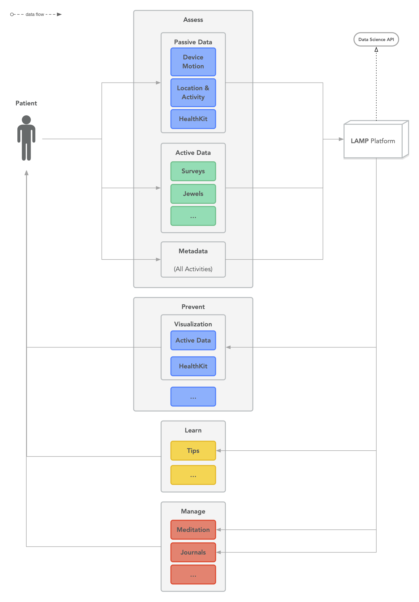

# How does LAMP Platform Work?

LAMP stands for Learn, Assess, Manage, Portal. It is a measurement based care platform designed for both research and clinical use. The core components are the app and the dashboard.

**Researchers** have read and write access to one or multiple studies with each study containing at least one **Participant.**

**Clinician** is synonymous with *Researcher* and **Patient** is synonymous with *Participant*.

**System Administrators** are the people who deploy your LAMP backend; they have the admin keys and will create the initial Researcher/Clinician account.

### The App

The mindLAMP2 app collects multiple, customizable data streams from a user and offers activities that encourage mindfulness and self-reflection. The app captures both **passive** and **active** **data,** offers surveys that measure and stabilize symptoms, and features games that assess cognition. **Active data** includes information collected when the individual is using the app. **Passive data** includes information collected in the background even if the user is not using the app. Surveys, activities, tips, etc. are customizable and able to be grouped. For example, participants in the same research study can be grouped so they receive the same set of activities and surveys.

### The Dashboard

The dashboard aggregates, analyzes, and displays data collected from the smartphone app. Dashboard information can be shared with clinicians, family members, and trusted peers. It allows clinicians, researchers, and patients to visualize data that is collected and aid in treatment and/or research.

Please note that LAMP requires at least Android 7 minimum and soon will require iOS 14 minimum to run on a smartphone.

### Diagram of the LAMP Platform

