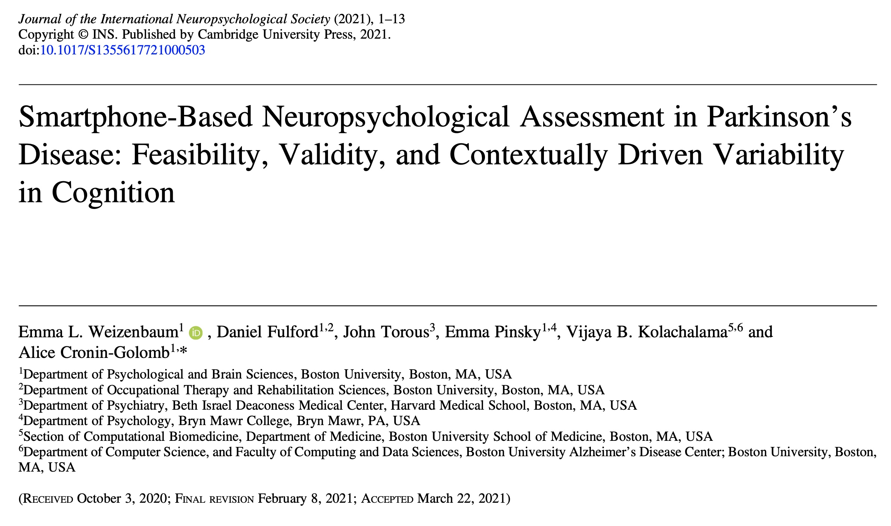
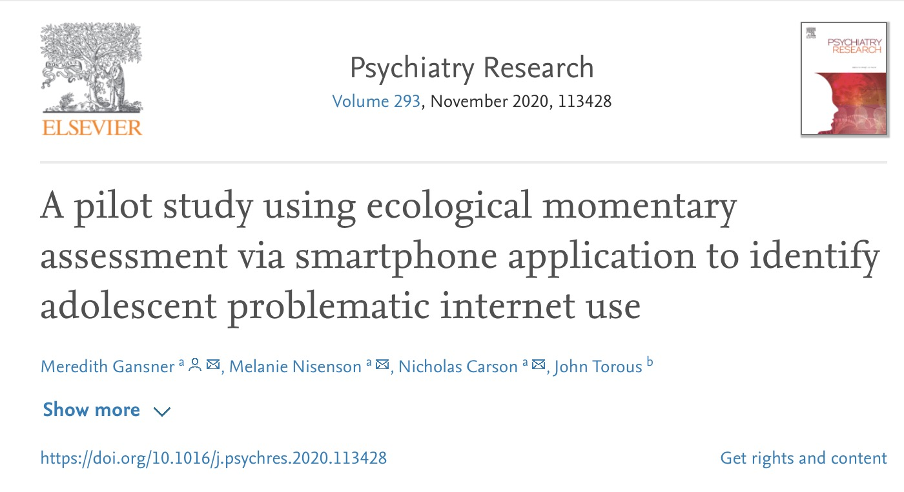
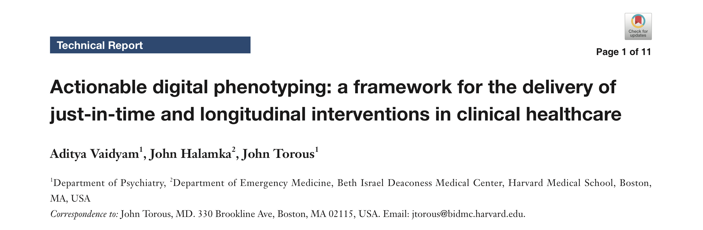
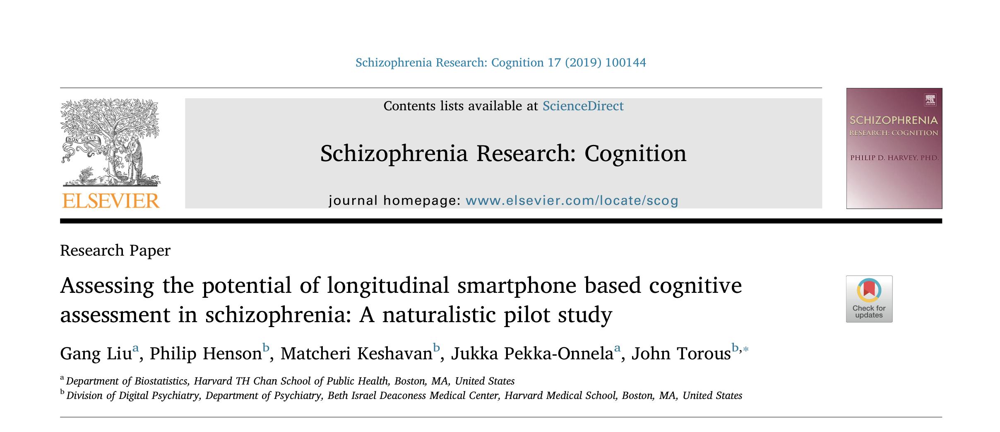
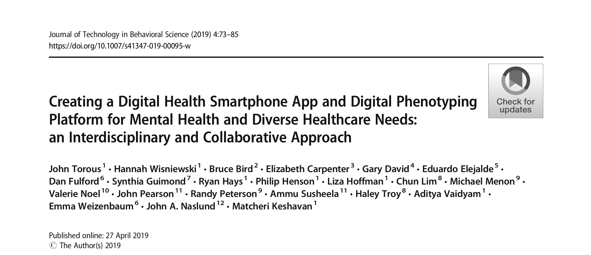
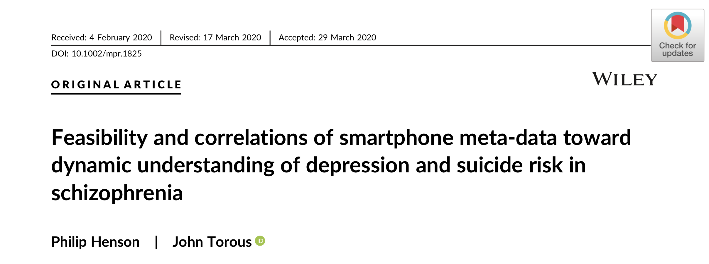
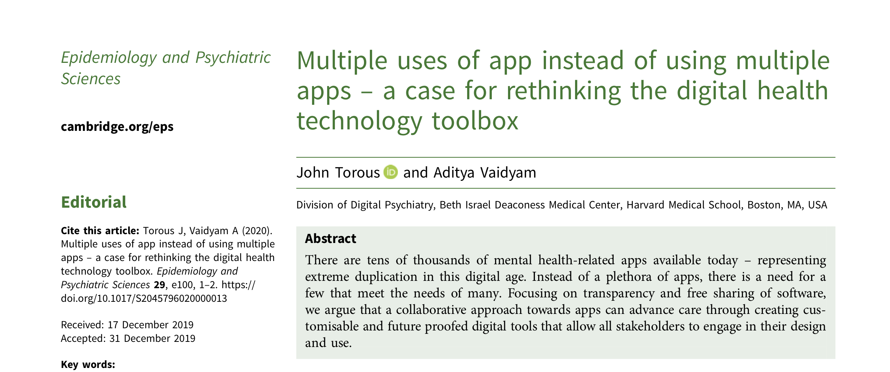
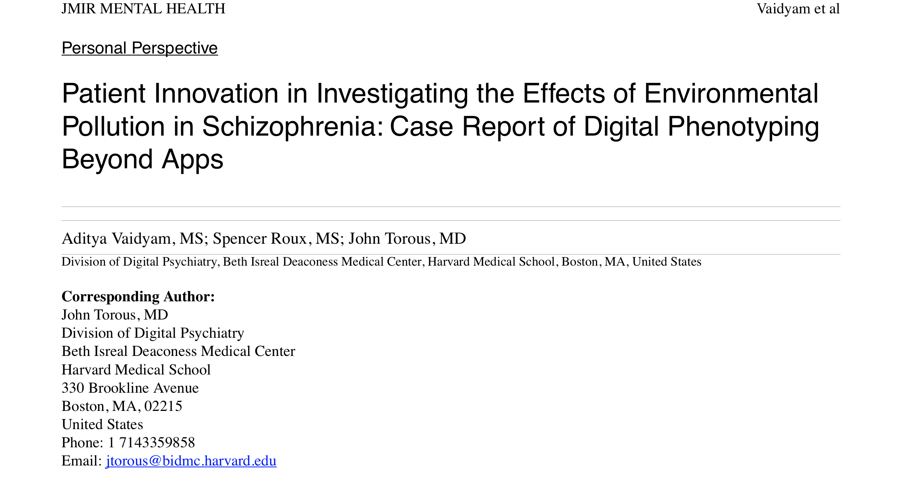
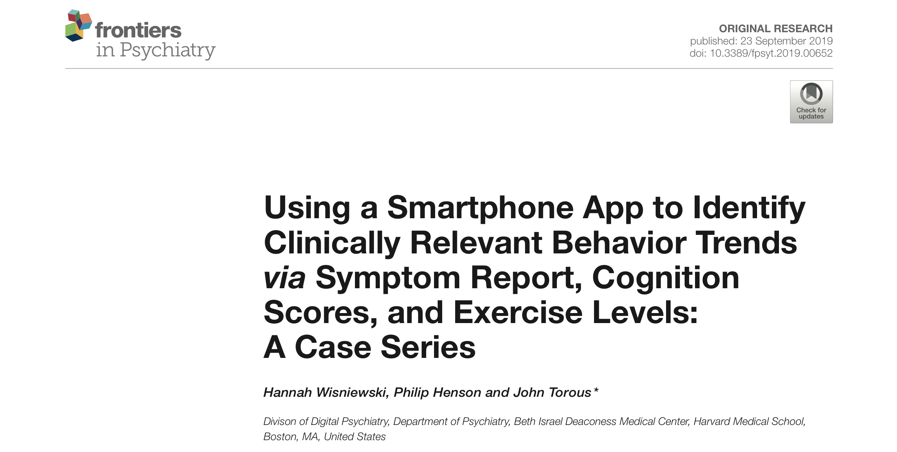

# Publications with LAMP
 
:::note Citing the LAMP Platform

If you use the LAMP Platform in your projects or publications, please cite the latest release at the time of publication using the DOI below. (This image will automatically always display only the latest version's DOI.)

[](https://zenodo.org/badge/latestdoi/311382406)

:::

### Smartphone-Based Neuropsychological Assessment in Parkinson’s Disease: Feasibility, Validity, and Contextually Driven Variability in Cognition

[](assets/Weizenbaum%20smartphone%20cognition%20PD%20JINS%20May%202021.pdf)

```
Weizenbaum, E., Fulford, D., Torous, J., Pinsky, E., Kolachalama, V., & Cronin-Golomb, A. (2021). Smartphone-Based Neuropsychological Assessment in Parkinson’s Disease: Feasibility, Validity, and Contextually Driven Variability in Cognition. Journal of the International Neuropsychological Society, 1-13. doi:10.1017/S1355617721000503
```

### A pilot study using ecological momentary assessment via smartphone application to identify adolescent problematic internet use

[](assets/1-s2.0-S0165178120310313-main.pdf)

```
Gansner, M., Nisenson, M., Carson, N., & Torous, J. (2020). A pilot study using ecological momentary assessment via smartphone application to identify adolescent problematic internet use. Psychiatry Research, 293, 113428.
```

### Actionable digital phenotyping: a framework for the delivery of just-in-time and longitudinal interventions in clinical healthcare

[](assets/mh-05-2019.07.04.pdf)

```
Vaidyam A, Halamka J, Torous J. Actionable digital phenotyping: a framework for the delivery of just-in-time and longitudinal interventions in clinical healthcare. Mhealth. 2019;5:25. Published 2019 Aug 12. doi:10.21037/mhealth.2019.07.04
```

### Assessing the potential of longitudinal smartphone based cognitive assessment in schizophrenia: A naturalistic pilot study

[](assets/1-s2.0-S2215001319300101-main.pdf)

```
Gang Liu, Philip Henson, Matcheri Keshavan, Jukka Pekka-Onnela, John Torous, Assessing the potential of longitudinal smartphone based cognitive assessment in schizophrenia: A naturalistic pilot study, Schizophrenia Research: Cognition, Volume 17, 2019, 100144, ISSN 2215-0013, https://doi.org/10.1016/j.scog.2019.100144.
```

### Creating a Digital Health Smartphone App and Digital Phenotyping Platform for Mental Health and Diverse Healthcare Needs: an Interdisciplinary and Collaborative Approach

[](assets/Torous2019_Article_CreatingADigitalHealthSmartpho.pdf)

```
Torous, J., Wisniewski, H., Bird, B. et al. Creating a Digital Health Smartphone App and Digital Phenotyping Platform for Mental Health and Diverse Healthcare Needs: an Interdisciplinary and Collaborative Approach. J. technol. behav. sci. 4, 73–85 (2019). https://doi.org/10.1007/s41347-019-00095-w
```

### Feasibility and correlations of smartphone meta‐data toward dynamic understanding of depression and suicide risk in schizophrenia

[](assets/mpr.1825.pdf)

```
Henson, P, Torous, J. Feasibility and correlations of smartphone meta‐data toward dynamic understanding of depression and suicide risk in schizophrenia. Int J Methods Psychiatr Res. 2020; 29:e1825. https://doi.org/10.1002/mpr.1825
```

### Multiple uses of an app instead of using multiple apps – a case for rethinking the digital health technology toolbox

[](assets/multiple_uses_of_app_instead_of_using_multiple_apps_a_case_for_rethinking_the_digital_health_technology_toolbox.pdf)

```
Torous, J., & Vaidyam, A. (2020). Multiple uses of app instead of using multiple apps – a case for rethinking the digital health technology toolbox. Epidemiology and Psychiatric Sciences, 29, E100. doi:10.1017/S2045796020000013
```

### Patient Innovation in Investigating the Effects of Environmental Pollution in Schizophrenia: Case Report of Digital Phenotyping Beyond Apps

[](assets/pdf.pdf)

```
Vaidyam A, Roux S, Torous J. Patient Innovation in Investigating the Effects of Environmental Pollution in Schizophrenia: Case Report of Digital Phenotyping Beyond Apps. JMIR Ment Health 2020;7(8):e19778
```

### Using a Smartphone App to Identify Clinically Relevant Behavior Trends via Symptom Report, Cognition Scores, and Exercise Levels: A Case Series

[](assets/fpsyt-10-00652.pdf)

```
Wisniewski Hannah, Henson Philip, Torous John. Using a Smartphone App to Identify Clinically Relevant Behavior Trends via Symptom Report, Cognition Scores, and Exercise Levels: A Case Series. Frontiers in Psychiatry. 10-2019-652. doi:10.3389/fpsyt.2019.00652
```
