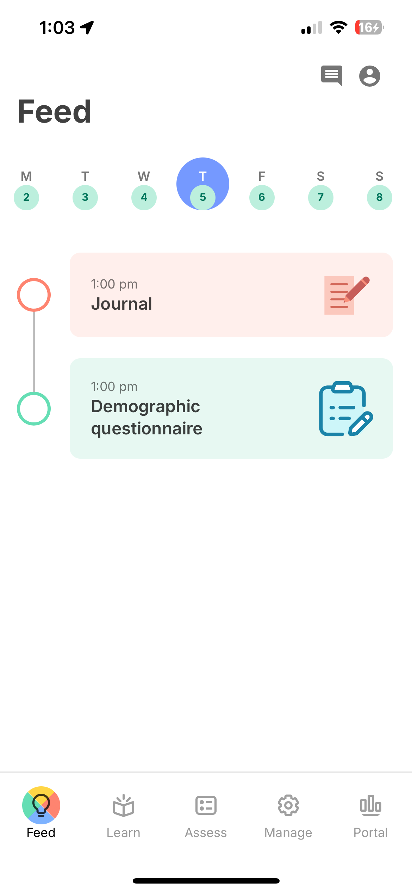
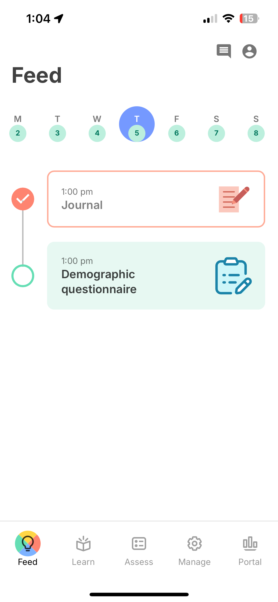
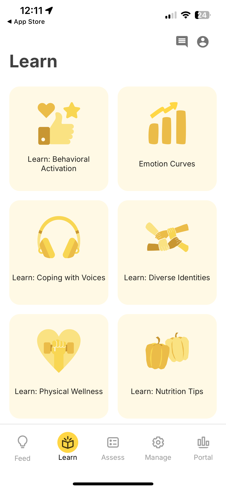
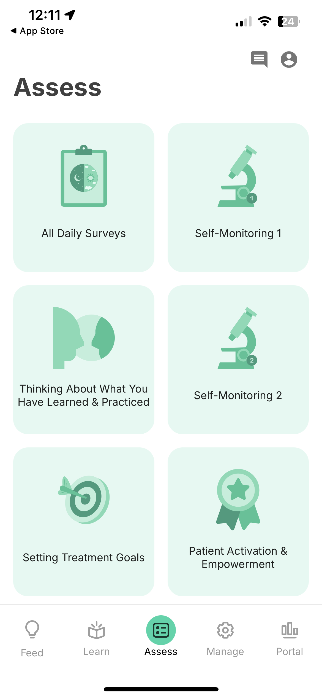
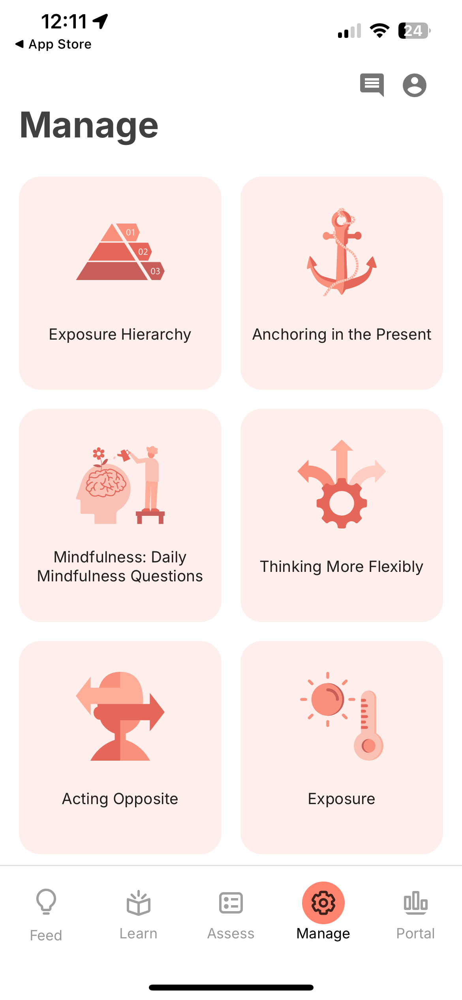

# Activity Usage

This page covers how participants interact with activities across the mindLAMP app.

## How Activities Appear

### Feed Tab

Scheduled activities appear in the [Feed tab](/app/app-tabs/feed) as tappable cards. The Feed shows activities that are currently available based on their schedule. See [Scheduling](/dashboard/scheduling) for how schedule types affect when activities become clickable.

| | |
|---|---|
|  |  |
| **Scheduled activities** in the Feed | **Completed activities** in the Feed |

### Learn, Assess, and Manage Tabs

Activities are organized into three content tabs based on their type:

- **Learn** — Educational content (Tips)
- **Assess** — Surveys, cognitive games, voice recordings, and other assessments
- **Manage** — Self-management tools (Breathe, Journal)

Activities on these tabs are always accessible regardless of schedule. See [Learn, Assess & Manage](/app/app-tabs/learn-assess-manage) for details on each tab.

| | | |
|---|---|---|
|  |  |  |
| **Learn** | **Assess** | **Manage** |

### Notifications

When an activity is scheduled, participants receive push notifications at the scheduled time. Notifications are delivered server-side via APNs (iOS) and FCM (Android), so they are received even if the app is not running. See [Scheduling](/dashboard/scheduling) for notification configuration.

## Completion Flow

When a participant completes an activity:

1. The response is submitted to the server as an `ActivityEvent`.
2. If streak tracking is enabled, a popup may appear showing the participant's consecutive-day streak.
3. The activity is marked as completed in the Feed for that schedule period.

  
  
<strong>Streak popup</strong> — Shown after completing an activity, displaying the participant's consecutive-day streak

## Mid-Activity Behavior

Progress is **auto-saved locally** after every question or action. If a participant closes the app or navigates away mid-activity:

- **On return:** A dialog asks whether to **resume where they left off** or **start over**.
- **If they resume:** All previously answered questions are restored and they can continue.
- **If they never return:** The local data is eventually cleared by the browser. No record of the attempt exists on the server.

**No partial responses are sent to the server.** Only fully completed and submitted activities create an `ActivityEvent` in the LAMP API. If a participant abandons an activity, researchers will see no data for that attempt.

## Offline Behavior

Activities can be completed while the device is offline. Responses are cached locally and synced to the server when connectivity is restored.
