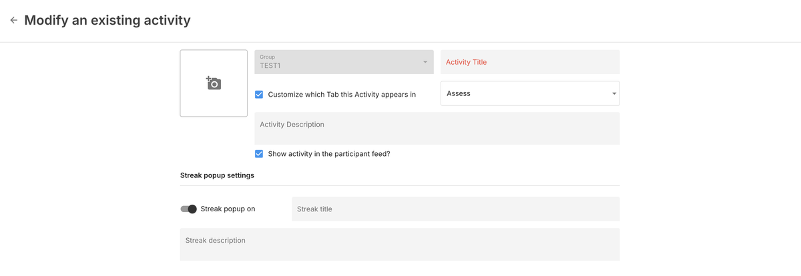
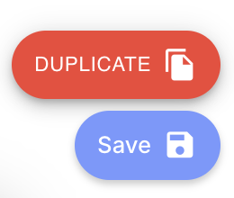

# Activity Configuration

This page covers configuration options that apply to all activity types. For activity-specific settings, see the individual activity pages in the [Activity Reference](/activities/reference/surveys).

## Common Settings

All activity types share a set of configuration options, managed through the [Activities tab](/dashboard/activities-tab) in the dashboard.

Click on any activity to open its settings:

- **Title** — The name displayed to participants.
- **Tab placement** — Which app tab the activity appears in (Assess, Learn, Manage, or Portal). Can be customized per activity.
- **Description** — Optional text shown to participants before they begin.
- **Feed visibility** — Whether the activity appears in the Feed tab when scheduled.
- **Icon** — Custom icon (PNG, SVG, or JPEG, under 1 MB).
- **Streak popup** — When enabled, shows a popup when a participant completes activities on consecutive days, encouraging continued engagement.

## Activity Groups

See [Activity Groups](/activities/reference/activity-groups) for creating, configuring, and scheduling activity bundles.

## Import and Export

Activities can be exported as JSON files and imported into other studies or sites, making it easy to share configurations and ensure consistency across deployments.

### Exporting

1. Navigate to the **Activities** tab in the dashboard.
2. Select one or more activities by checking their boxes.
3. Press **Export** at the top of the list.

4. A JSON file will be downloaded containing the full activity configuration.

### Importing

1. Navigate to the Activities tab.
2. Click **+ Add**, then select the import icon (cloud with arrow).

3. Select the group you wish to import into.
4. Drag or select the JSON file. An error will be displayed if the file is invalid.
5. Tap **Import**. The activities will be copied into the selected group.

### Duplicating Activities

To create a modified version of an existing activity:

1. Navigate to the Activities tab.
2. Click on the activity you wish to modify.
3. Change the title.
4. Make your desired changes.
5. Click **Duplicate** (not Save).

This creates a new activity with the changes, preserving the original. Duplicating is the recommended approach when you need a variation of an existing activity — it avoids changing the original and maintains data integrity.

### Bulk Operations

Multiple activities can be selected and exported at once. This is useful for sharing an entire study's activity configuration.

### Use Cases for Sharing

- Share survey instruments between research sites for reproducibility.
- Synchronize assessment configurations across multiple clinics.
- Provide exported activity files as supplemental material when publishing research.
