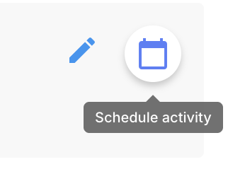
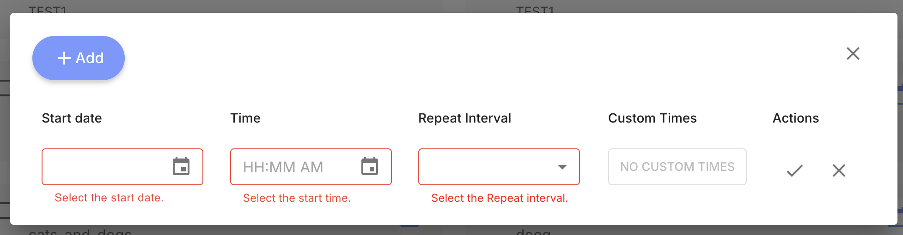
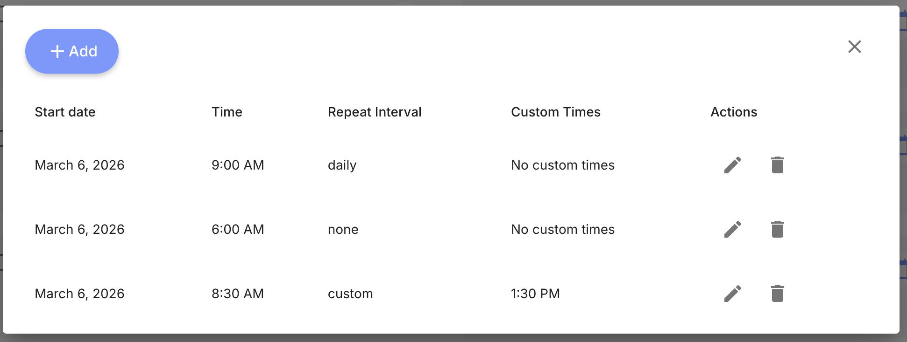

# Scheduling Activities

Activity schedules determine when participants receive activities and notifications.

## Creating a Schedule

1. Navigate to the [Activities tab](/dashboard/activities-tab).
2. Click the **calendar icon** on the activity you want to schedule.

3. Click **+ Add** to add a new schedule entry.

4. Configure the schedule:
   - **Start Date** — When the schedule begins.
   - **Time** — What time of day the activity is delivered.
   - **Repeat Interval** — How often the activity repeats (`daily`, `weekly`, `biweekly`, `triweekly`, `monthly`, `custom`, or `none` for a one-time delivery).
   - **Custom Times** — When using `custom` repeat interval, specify additional delivery times.
5. Click the check mark to save.

An activity can have multiple schedule entries. Each entry appears as a row with edit and delete actions:

## How Scheduling Works

When an activity is scheduled:

1. At the configured time, a **push notification** is sent to the participant's device.
2. The activity appears as a card in the [Feed tab](/app/app-tabs/feed).
3. The participant taps the card to complete the activity.

For details on how scheduled activities appear in the app and when they become clickable, see the [Feed tab documentation](/app/app-tabs/feed#activity-clickability).

## Multiple Schedules

A single activity can have multiple schedules. For example, a mood survey could be scheduled at 9 AM and 6 PM daily.

## Notification Delivery

Push notifications are delivered by the server via APNs (iOS) and FCM (Android), so they are received regardless of whether the app is open, backgrounded, or closed.

Push notifications require:
- The participant has notification permissions enabled.
- The participant is logged in so the server has a valid device token.

If a notification cannot be delivered (e.g., device is offline), the activity still appears in the Feed when the participant next opens the app.
