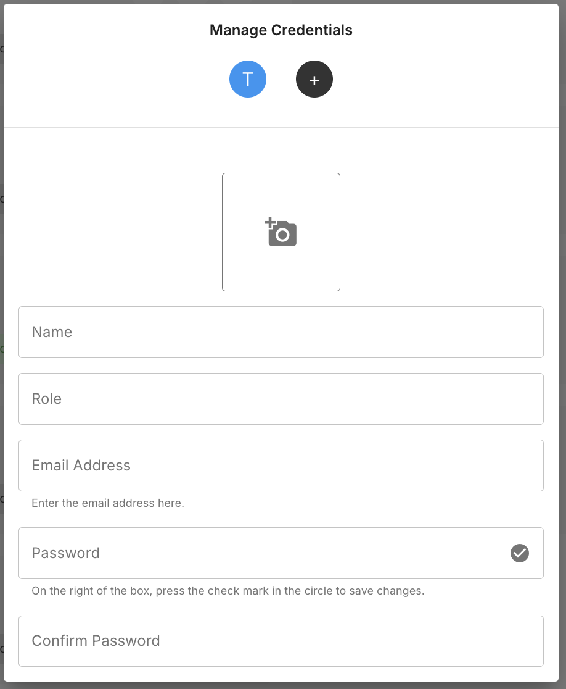
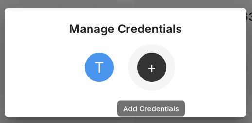
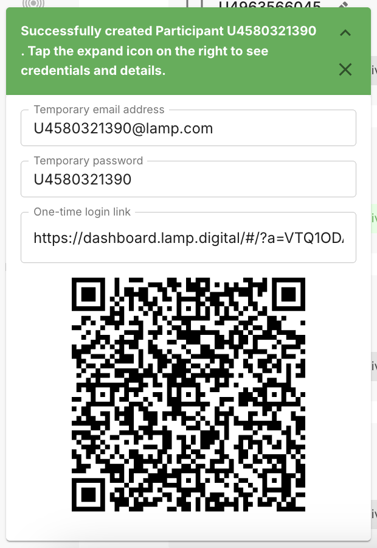
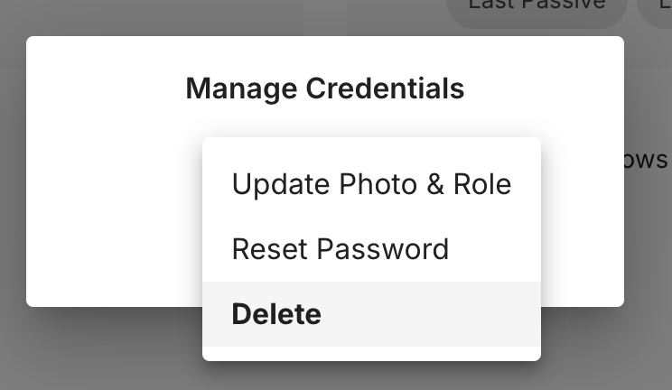
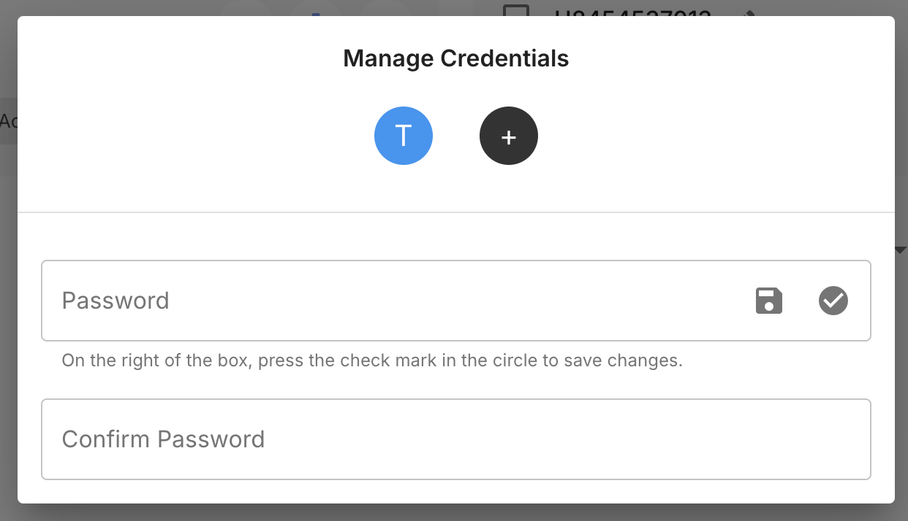

# Credential Management

Credentials control access to mindLAMP. Managing credentials is essential for participant onboarding, staff access, and account security. The workflow for managing credentials is the same for all user types.

## Credential Hierarchy

mindLAMP uses three credential levels:

- **Server Administrator** — Full access to all groups, participants, and configuration.
- **User Administrator / Practice Lead** — Access to manage users and activities within their scope. Optional roles include **investigator** (read-only data access) and **message_coordinator** (messaging permissions).
- **Participant** — Access to their own app experience only.

## Accessing Manage Credentials

From the [Users tab](/dashboard/users-tab), click the **key icon** on any user's card to open the Manage Credentials dialog.

Existing credentials appear as icons at the top. Click **(+)** to add a new credential:

## Auto-Generated Credentials

When a new participant is [created from the Users tab](/dashboard/users-tab#creating-participants), the system generates temporary credentials automatically — a temporary email address, password, one-time login link, and QR code.

## Creating a Credential

1. Click the key icon on the user's card to open Manage Credentials.
2. Click **(+)** and enter: **Name**, **Email Address**, and **Password**. The Image and Role fields can be left blank.
3. Click the check mark to save.

The email address does not need to be a real email — it functions as a login identifier. However, it must be unique across all credentials on the server. The Name field of the first credential is always set to "Temporary Login."

## Sharing Login via QR Code

After saving a credential, a QR code appears that can be shared with the user for easy login.

## Credential Actions

Click the key icon to open Manage Credentials, then tap an existing credential icon to reveal the action menu:

- **Update Photo & Role** — Change the credential's profile photo and role.
- **Reset Password** — Enter a new password and confirm it, then tap the check mark to save.
- **Delete** — Remove the credential. This removes access but does not delete any data.

**Do not** reset the password of the credential you are currently logged in with, as this may lock you out.

## Changing a Login Email

To change a login email, create a new credential with the desired email and then delete the old credential.

## Security Notes

- All credentials are case-sensitive.
- Use unique email addresses across all credentials.
- If locked out, contact your system administrator.
