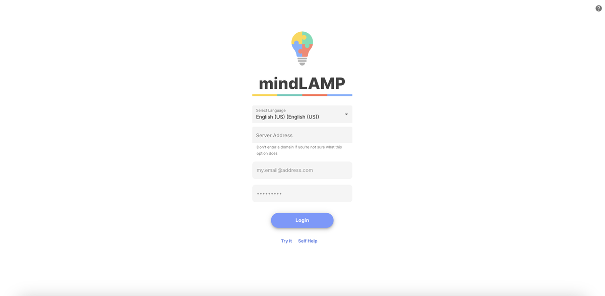

import {DocCard, DocCardGrid} from '@site/src/components/DocCard';

# The Dashboard

> For a high-level overview of monitoring and configuration, see [Monitor Engagement](/capabilities/monitor) and [Customize & Scale](/capabilities/configure).

The dashboard is the web-based management interface for mindLAMP, used by researchers, clinicians, and administrators to configure studies, manage participants, and review data. It is accessed at [dashboard.lamp.digital](https://dashboard.lamp.digital) or at a custom server URL for self-hosted deployments.

## Dashboard Tabs

The dashboard is organized into four main tabs, plus a data portal for querying:

<DocCardGrid>
  <DocCard id="dashboard/tabs/users-tab" />
  <DocCard id="dashboard/tabs/activities-tab" />
  <DocCard id="dashboard/tabs/sensors-tab" />
  <DocCard id="dashboard/tabs/groups-tab" />
  <DocCard id="dashboard/tabs/data-portal" />
</DocCardGrid>

## Additional Features

<DocCardGrid>
  <DocCard id="dashboard/scheduling" />
  <DocCard id="dashboard/credentials" />
  <DocCard id="dashboard/messaging" />
</DocCardGrid>
