# Users Tab

The Users tab displays all participants across all groups under the logged-in researcher account. It is the primary interface for managing participants and monitoring their status.

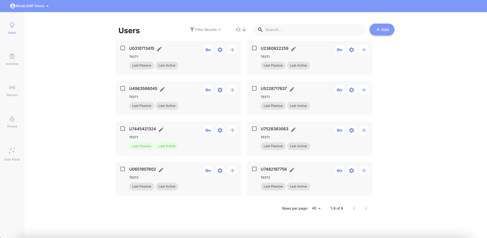

## Participant Cards

Each participant is displayed as a card with the following information:

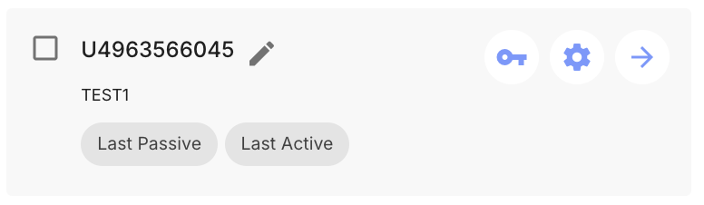

### Name and Alias

Each card shows a de-identified identifier (typically starting with "U" followed by random digits). Click the **pencil icon** next to the name to add or change an alias. Aliases are only visible to the researcher/clinician — not to the participant or in exported data.

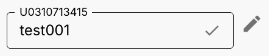

### Data Collection Status

Each card has two color-coded buttons — **Last Passive** and **Last Active** — that indicate data recency at a glance:

- **Green** — Data collected within the last 2 days.
- **Yellow** — Data collected within the last week.
- **Red** — Data collected within the last month.
- **Gray** — No data collected in over 30 days, or none has ever been collected.

Hover over **Last Active** to see the exact login timestamp, device model, and app version.

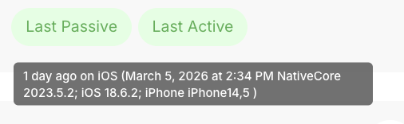

Hover over **Last Passive** to see which sensors last reported and how recently.

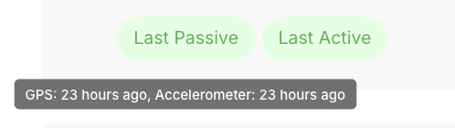

### Group

The group the participant belongs to is displayed on the card.

## Filtering and Searching

Use the search bar to find specific participants. Use the **Filter Results** dropdown to reveal group bubbles, then click a group to filter participants by group.

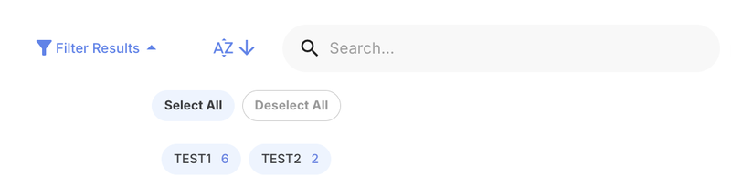

## Per-Participant Actions

Each participant card has three icon buttons:

- **Key icon** — [Manage credentials](/dashboard/credentials) (username and password).
- **Gear icon** — Open the [participant profile](#participant-profile).
- **Arrow icon** — Navigate to the participant's data view.

Select a participant by checking the box next to their name to reveal the **Delete** action, which permanently removes the participant. **All associated data is irrecoverable.**

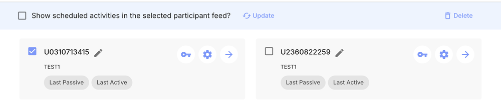

## Creating Participants

1. Click the **+ Add** button at the top right.

2. Select **Add a user**.
3. Choose the group to add the participant to and click **Save**.

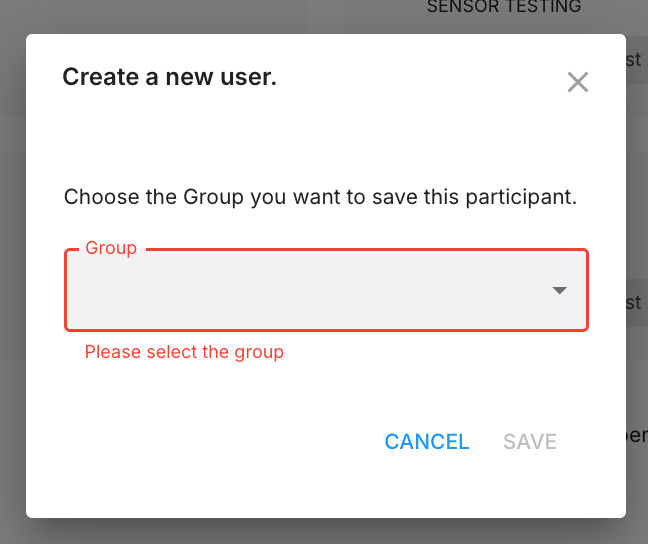

The system generates temporary credentials automatically. See [Credential Management](/dashboard/credentials#auto-generated-credentials) for details on the generated credentials, QR codes, and how to set up proper login credentials.

## Participant Profile

Click the gear icon on a participant card to open their profile page.

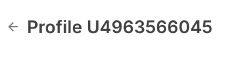

From this page you can set the participant's nickname (alias), reset their [credentials](/dashboard/credentials), and manage their group's study configuration. All changes made here apply at the [group level](/dashboard/groups-tab#group-structure).

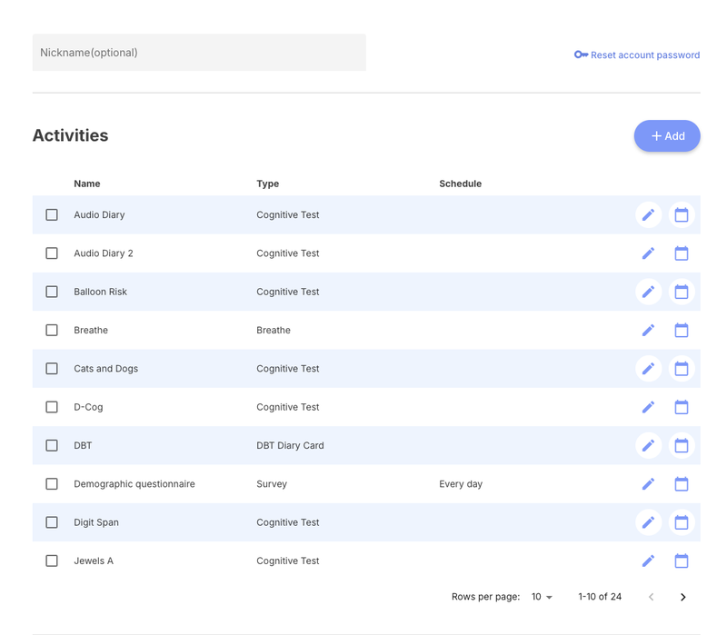

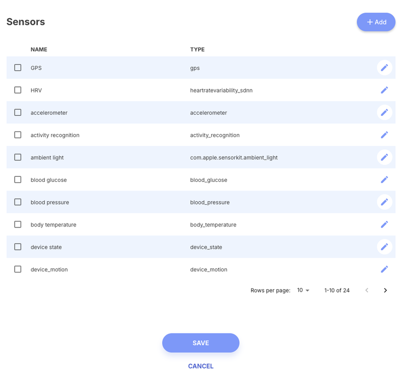

The profile provides the same activity and sensor management as the dedicated [Activities](/dashboard/activities-tab) and [Sensors](/dashboard/sensors-tab) tabs, scoped to this participant's group. Use the floating message button at the bottom right to [send a message](/dashboard/messaging) to this participant.
