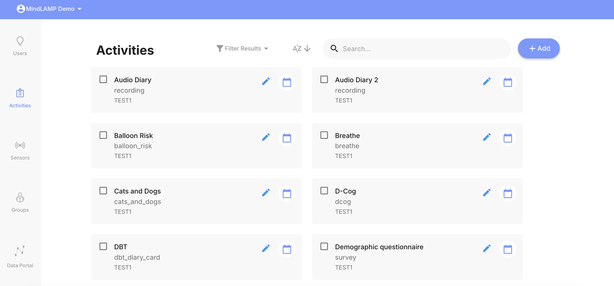
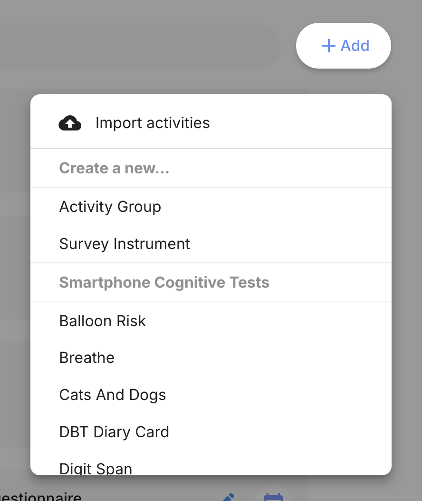
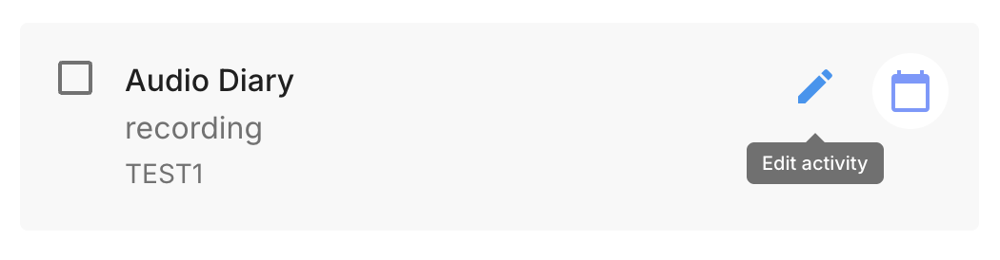
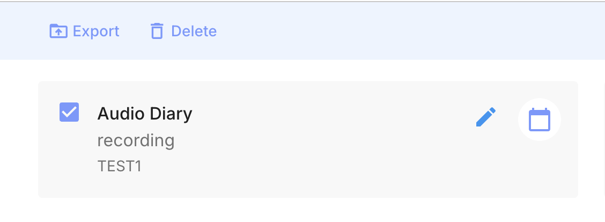

# Activities Tab

The Activities tab is where researchers and clinicians create, configure, and manage all activities for their study or clinical program.

## Activity List

The Activities tab displays all activities in the current scope with:

- **Name** — The activity title.
- **Type** — Whether the activity is a tip, survey, cognitive test, manage activity, or activity group.
- **Group** — Which group the activity belongs to.

Use the search bar and group filter to find specific activities.

## Creating Activities

Click **+ Add** to create a new activity. The menu is organized into sections:

**Create a new...**
- **Survey Instrument** — Configurable questionnaires (see [Surveys](/activities/reference/surveys)).
- **Activity Group** — Bundle multiple activities together (see [Activity Groups](/activities/reference/activity-groups)).

**Cognitive Tests & Activities**
- **Cognitive games** — Standardized games covering executive functioning, memory, attention, language processing, spatial reasoning, processing speed, social cognition, and decision-making (see [Cognitive Games](/activities/reference#assess)).
- **Tips** — Educational content for the Learn tab (see [Tips](/activities/reference/tips)).
- **Breathe** — Guided breathing exercises (see [Breathe](/activities/reference/breathe)).
- **Journal** — Free-form journaling (see [Journal](/activities/reference/journal)).
- **DBT Diary Card** — Dialectical Behavior Therapy diary card (see [DBT Diary Card](/activities/reference/dbt-diary-card)).
- **Voice Recording** — Audio recording activities (see [Voice Recording](/activities/reference/voice-recording)).

**Import**
- Upload a previously exported activity JSON file.

## Editing Activities

Click the pencil icon on an activity card to edit its configuration. Common options include title, description, icon, tab placement, and activity-specific settings. See [Activity Configuration](/activities/configuration) for the full list of common settings and details on each option.

## Scheduling

Click the calendar icon on an activity card to configure its schedule. See [Scheduling](/dashboard/scheduling) for the full workflow and options.

## Import and Export

Select an activity by checking its box to reveal **Export** and **Delete** actions. Activities can be exported and imported as JSON files. See [Import and Export](/activities/configuration) for the full workflow.

