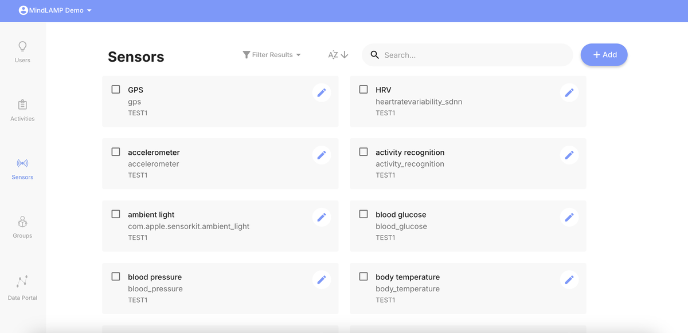
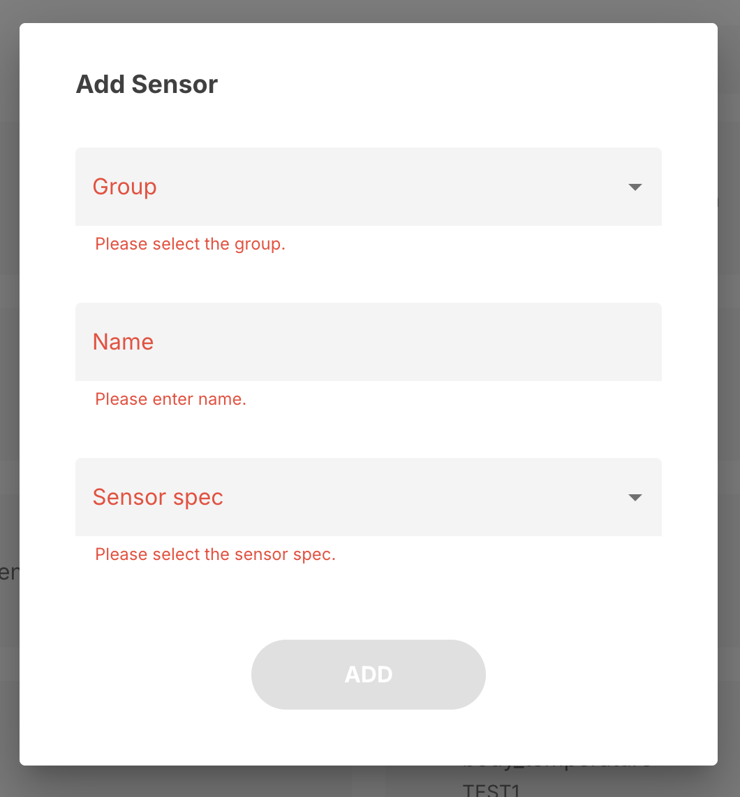
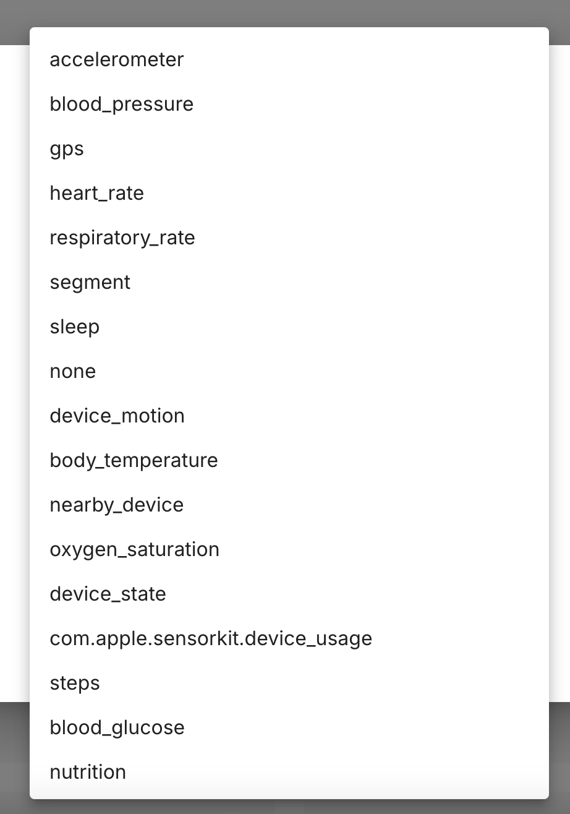
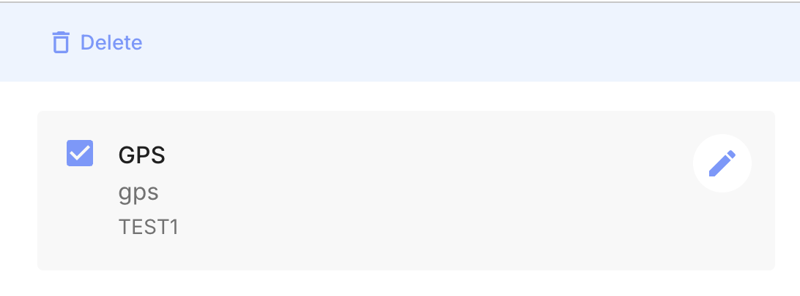

# Sensors Tab

The Sensors tab allows researchers and clinicians to configure which passive sensors are active for their study groups.

## Adding a Sensor

1. Navigate to the **Sensors** tab.
2. Click the blue **+ Add** button.
3. Select the group you want to add the sensor to.
4. Name your sensor (e.g., "GPS", "Accelerometer").
5. Select the sensor spec from the dropdown (e.g., `lamp.gps`, `lamp.accelerometer`).
6. Click **Add** to save.

The Sensor spec dropdown lists all available sensor types:

## Available Sensors

Sensors added through this tab correspond to the device sensors and health data types available on participants' devices. See [Sensors & Passive Data](/sensors-data) for the complete list of available sensor specs and their data fields.

## Sensor List

Each sensor entry shows:

- **Name** — The display name you assigned.
- **Group** — Which group the sensor belongs to.

## Sampling Rates

Sampling rates (how frequently a sensor collects data) are configurable but are set through the API rather than the dashboard UI. See [Sensor Configuration](/sensors-data/configuration#default-sampling-rates) for default rates, maximum values, and guidance on balancing sampling frequency with battery impact.

## Deleting a Sensor

Select a sensor by checking its box to reveal the **Delete** action. This stops data collection for that sensor type across the group. Previously collected data is not deleted.

