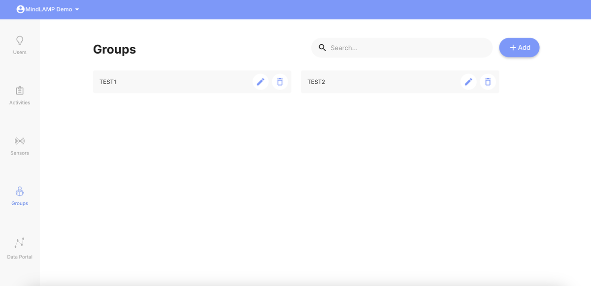
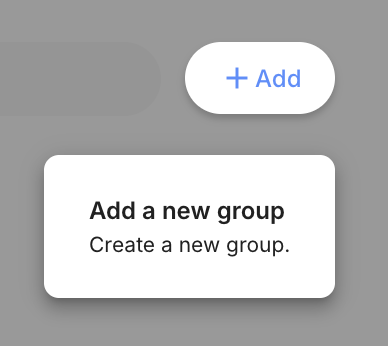
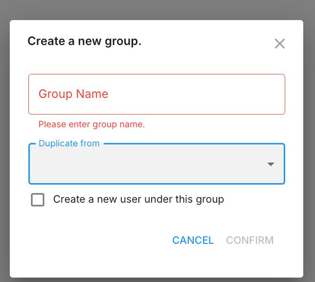
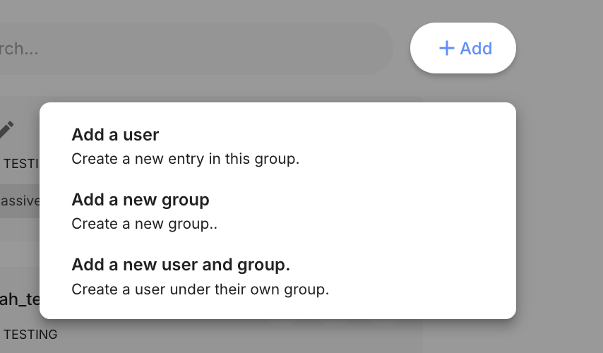
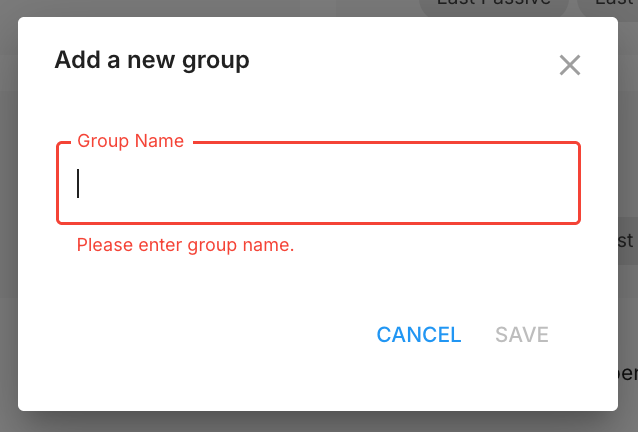
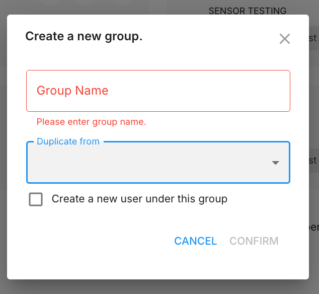

# Groups Tab

Groups (also referred to as "Studies" in some contexts) organize participants, activities, and sensors together. The Groups tab provides tools for creating and managing these organizational units.

## Creating a Group

Groups can be created from two places:

**From the Groups tab:**
1. Click the **+ Add** button and select **Add a new group**.

2. Enter a group name.
3. Optionally select an existing group from the **Duplicate from** dropdown to copy its activities and sensors.
4. Optionally check **Create a new user under this group** to add an initial participant.
5. Click **Confirm**.

**From the Users tab:**
1. Click the **+ Add** button.

2. Select **Add a new group** for a simple group (name only):

3. Or select **Add a new user and group** to access the full creation dialog with the **Duplicate from** option and automatic user creation:

## Duplicating a Group

When creating a new group (from either the Groups tab or the Users tab's "Add a new user and group" option), select an existing group from the **Duplicate from** dropdown. The new group inherits:

- **Activities** — All activity configurations from the source group.
- **Sensors** — All sensor configurations from the source group.

Participants are **not** copied. The new group starts with no participants unless you check the "Create a new user under this group" option.

This is useful when setting up multiple arms of a study with similar configurations.

## Group Structure

Each group contains:

- **Participants** — The users enrolled in the group.
- **Activities** — The surveys, games, and other activities configured for the group.
- **Sensors** — The passive data collection configuration for the group.
- **Schedules** — Activity schedules that apply to all participants in the group.

All configurations — activities, sensors, and schedules — are set at the group level and apply uniformly to every participant in that group. To provide different configurations to different participants, place them in different groups.

## Naming Conventions

Use descriptive names that help identify the group's purpose (e.g., "Control Group", "Intervention Arm A", "Clinic - Springfield"). Avoid using personally identifying information in group names.

## Managing Groups

From the Groups tab, you can:

- View all groups and their participant counts.
- Navigate into a group to manage its participants, activities, and sensors.
- Rename or delete groups.

Deleting a group will remove all participants and their data within that group. **This action is irreversible.**
