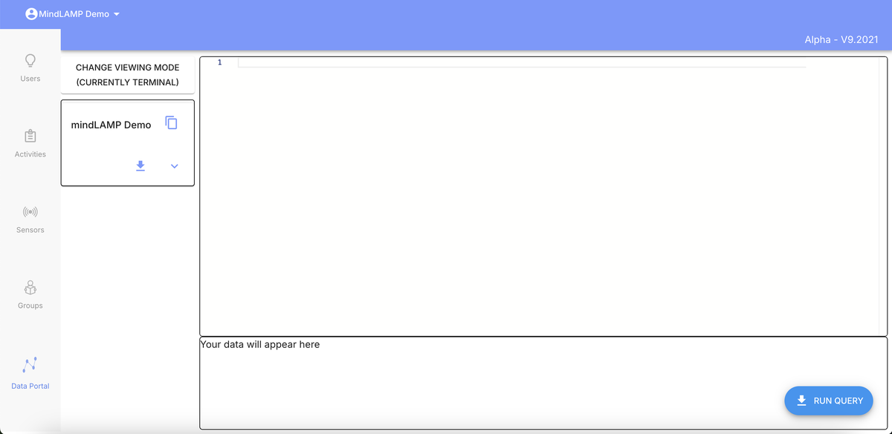
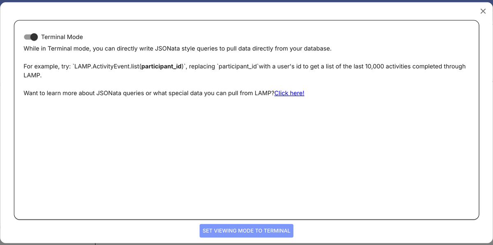
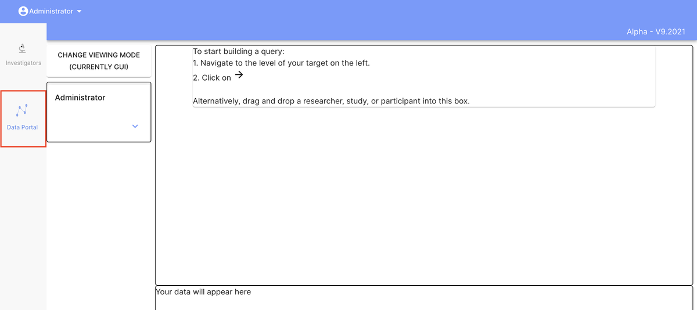
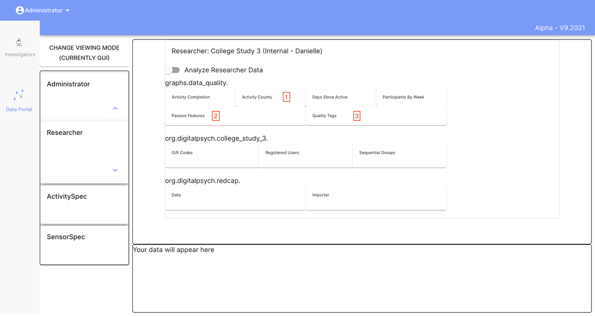

# Data Portal

The Data Portal provides a browser-based interface for querying and exploring data stored on the mindLAMP server.

## Modes

The Data Portal offers two interaction modes:

- **Terminal** — A command-line interface for writing JSONata-style queries directly. Useful for advanced users who want precise control over data retrieval.

Click "Change Viewing Mode" to switch modes. The Terminal mode selector explains JSONata queries and links to documentation:

- **GUI** — A graphical interface for browsing and filtering data without writing code. Navigate to your target level in the left panel, then click the arrow icon or drag and drop a researcher, study, or participant.

Expanding the navigation and selecting a researcher reveals available tags, data quality graphs, and other pre-rendered visualizations:

## Limitations

The Data Portal UI is an older feature that has not been actively updated. For more robust data access, consider these alternatives:

- **Per-participant monitoring** through the dashboard's Users tab and Portal view.
- **Python SDK** (`pip install LAMP-core`) for scripted data retrieval and analysis.
- **Cortex** (`pip install lamp-cortex`) for automated feature computation and visualization.
- **Direct API access** for programmatic data retrieval.

## When to Use the Data Portal

The Data Portal remains useful for quick, ad-hoc queries and for users who need to inspect raw data without setting up a programming environment. For systematic data analysis or automated workflows, the Python SDK and Cortex are recommended.
