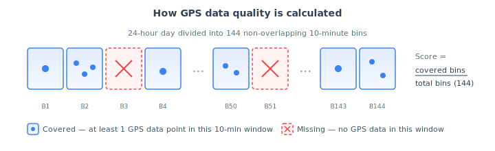
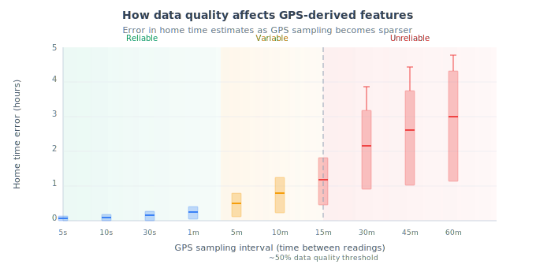

# Sensor Usage

This page covers how sensor data is collected, quality monitoring, and troubleshooting.

## Two Types of Data

### Background (Passive) Data

Collected automatically by the device without participant action. Includes GPS location, accelerometer readings, device state, step counts, and health platform data. Runs continuously when the app is installed and permissions are granted.

### Participant-Generated (Active) Data

Collected through direct participant interaction — survey responses, cognitive game scores, journal entries, voice recordings. Active data is produced when participants complete [activities](/activities).

## Data Collection Workflow

1. **Configuration** — Researchers configure which sensors are active through the [Sensors tab](/dashboard/sensors-tab).
2. **Permissions** — Participants grant device permissions during setup (see [Download & Setup](/app/getting-started/download)).
3. **Collection** — The app collects sensor data in the background continuously.
4. **Caching** — Data is stored locally on the device, enabling offline collection.
5. **Sync** — Data is transmitted to the mindLAMP server when a network connection is available.
6. **Privacy** — Data is transmitted securely. Access is controlled through the API's credential system.

## Background Collection

For details on how background collection works, offline behavior, and battery considerations, see [Background Collection](/app/getting-started/background-collection).

## Data Quality Monitoring

### Dashboard Indicators

The [Users tab](/dashboard/users-tab) in the dashboard shows color-coded data quality indicators for each participant (green, yellow, red, gray) based on how recently passive data was collected. See [Users Tab — Data Collection Status](/dashboard/users-tab#data-collection-status) for the full threshold definitions.

### Cortex Data Quality Metrics

The [Cortex](/developer/cortex) library provides quantitative data quality features:

[`data_quality`](/developer/cortex/features/secondary-features#data-quality) — Measures data availability as a percentage within configurable time bins. Specify the sensor and `bin_size` in milliseconds to compute the fraction of each bin containing at least one data point.

```python
import cortex

result = cortex.run(
    "U1234567890",
    features=["data_quality"],
    feature_params={
        "data_quality": {
            "feature": "gps",
            "bin_size": 3600000  # 1-hour bins
        }
    },
    start=start_time,
    end=end_time
)
```

### How Data Quality Is Calculated

The Cortex `data_quality` feature divides a time window into fixed-size bins and measures the proportion of bins that contain at least one data point. It supports two sensors, each with a different default bin size:

| Sensor | Default bin size | Rationale |
|--------|-----------------|-----------|
| GPS | 10 minutes (600,000 ms) | OS throttling limits actual background GPS delivery to ~0.1 Hz, so 10-minute bins measure whether *any* data arrived in each window |
| Accelerometer | 1 second (1,000 ms) | Accelerometer data is delivered at higher rates (~5 Hz configured), so 1-second bins are appropriate |

The `bin_size` parameter can be overridden to any value in milliseconds. A score of 1.0 means every bin had data; 0.0 means none did.

### GPS Data Quality in Detail

GPS data quality is the most studied metric because many behavioral features (home time, entropy, trip distance) depend on it. Using the default 10-minute bins, each day is divided into 144 non-overlapping windows:



*Adapted from Calvert et al. (2026), Figure 1.*

#### Interpreting GPS Data Quality Scores

| Score | Interpretation |
|-------|---------------|
| &gt;0.80 | Good — GPS-derived features (home time, entropy, trip distance) are reliable |
| 0.50–0.80 | Acceptable — features are usable but may have increased variability |
| &lt;0.50 | Poor — GPS-derived features become unreliable. Home time estimates can be off by 2–4 hours, and feature correlations become unstable |
| 0.00 | No data — complete sensing failure or device incompatibility |

*Thresholds based on Calvert et al. (2026).*

#### Impact on Derived Features

As GPS sampling becomes sparser, derived behavioral features like home time become increasingly inaccurate:



*Adapted from Calvert et al. (2026), Figure 9.*

At sampling intervals of 30 minutes or more (corresponding to data quality below ~0.50), home time is consistently underestimated by 2–4 hours with high variability (Calvert et al., 2026). This is why maintaining data quality above 0.50 is critical for any analysis using GPS-derived features.

### Key Factors Affecting Data Quality

- **App interaction frequency** — Passive data quality is strongly correlated with how often participants open the app (Spearman's r = 0.94 between active and passive data quality; Calvert et al., 2026). Modern operating systems (iOS 15+, Android 12+) restrict background processes for apps not regularly used. Daily app interaction — such as completing a survey — helps keep the app in active status and prevents OS suspension of background data collection.
- **Data quality degrades within ~3 days** without app interaction, as background processes are progressively throttled by the operating system (Currey & Torous, 2023).
- **Low Power Mode** is the most common resolvable cause of poor data quality. In a large mindLAMP study (n = 373), the majority of data quality issues were resolved by simply disabling Low Power Mode or charging the device (Calvert et al., 2026).

## Troubleshooting

:::tip Quick Check
Before investigating data quality issues:
1. **Permissions** — Verify all required permissions are granted (Location "Always", Motion & Fitness, Health data).
2. **Battery optimization** — Confirm mindLAMP is exempt from battery saver / Low Power Mode.
3. **App status** — Check that the app has not been force-quit or uninstalled.
4. **Connectivity** — Ensure the device has WiFi or cellular data for syncing.
:::

### Common Causes

| Issue | Likely Cause | Solution |
|---|---|---|
| No data at all | Permissions not granted | Check [Download & Setup](/app/getting-started/download) |
| Intermittent gaps | App force-quit or battery optimization | Ensure mindLAMP is exempt from battery optimization |
| Reduced frequency | Low Power Mode active | Disable Low Power / Battery Saver |
| Data stops after a few days | OS restricted background processes | Follow device-specific guidance at [dontkillmyapp.com](https://dontkillmyapp.com/) |

### iOS

- Are all relevant permissions granted for mindLAMP 2 in the Settings app?
- Is Low Power Mode turned off?
- Is Airplane Mode turned off?
- Is the device connected to WiFi or cellular data?
- Is the device powered on at all times?
- Has the app been force-quit by swiping it away?

### Android

- Is Battery Saver mode disabled (including automatic schedules)?
- Is Airplane Mode turned off?
- Are all relevant permissions granted?
- Is the device connected to WiFi or cellular data?

Some Android manufacturers aggressively restrict background processes. For Samsung, OnePlus, Huawei, and Xiaomi devices, visit [Don't Kill My App](https://dontkillmyapp.com/) for device-specific recommendations.

## Battery Impact

Higher sampling rates produce more data but consume more battery. The default configured rates are 5 Hz for the accelerometer and 1 Hz for GPS. In practice, mobile operating systems throttle background GPS delivery — the effective rate is often significantly lower than 1 Hz, particularly when the app is not in the foreground. Rates can be adjusted via the API.

## References

- Calvert, E., Currey, D., Henson, P., & Torous, J. (2026). Evaluating the impact of data quality on digital phenotyping features from smartphone sensor data. *Scientific Reports*.
- Currey, D., & Torous, J. (2023). Digital phenotyping data quality: the impact of smartphone operating systems. *JMIR mHealth and uHealth*.
