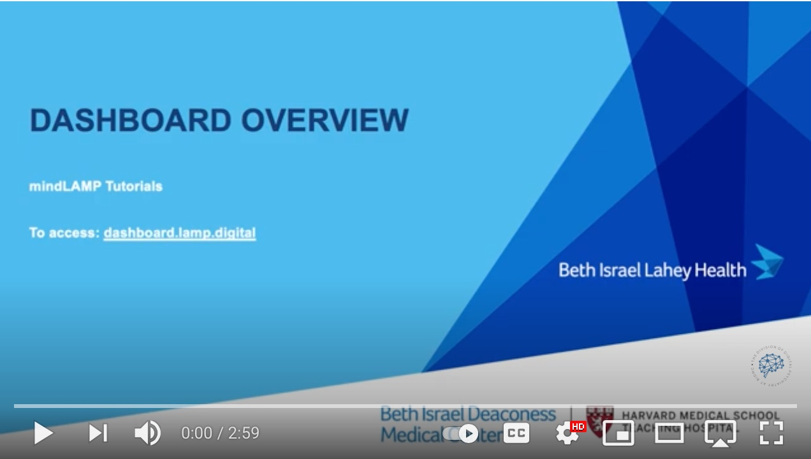

# How does the mindLAMP app work?

# How does the LAMP dashboard work?

# What can I customize to my study or clinic?

## Learn
You can customize tips in Learn and by uploading custom content including images, videos, text, etc.

## Assess
You are able to create custom surveys and  use surveys from the Division of Digital Psychiatry's survey instrument library. You are also able to customize already existing cognitive tests such as Jewels by specifying the number of jewels and time limit.

## Manage
You can customize existing activities in Manage such as Breathe by uploading your own audio files. 

## Prevent
You can use the existing visualizations in Prevent with the option to program new ones as well. You are also able to hide any visualizations from patients or participants.

# Sensors
You can toggle different types of sensors like heart rate or gps on and off. It is possible to toggle all sensors to be off.

# Studies and Groups
You can customize different studies and groups with sensors, activities, and tips. See **Users vs Activities vs Sensors vs Studies Tab** for more information about studies and groups.

