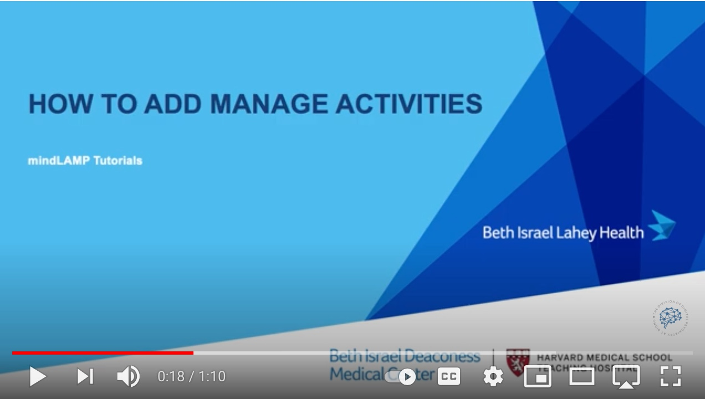
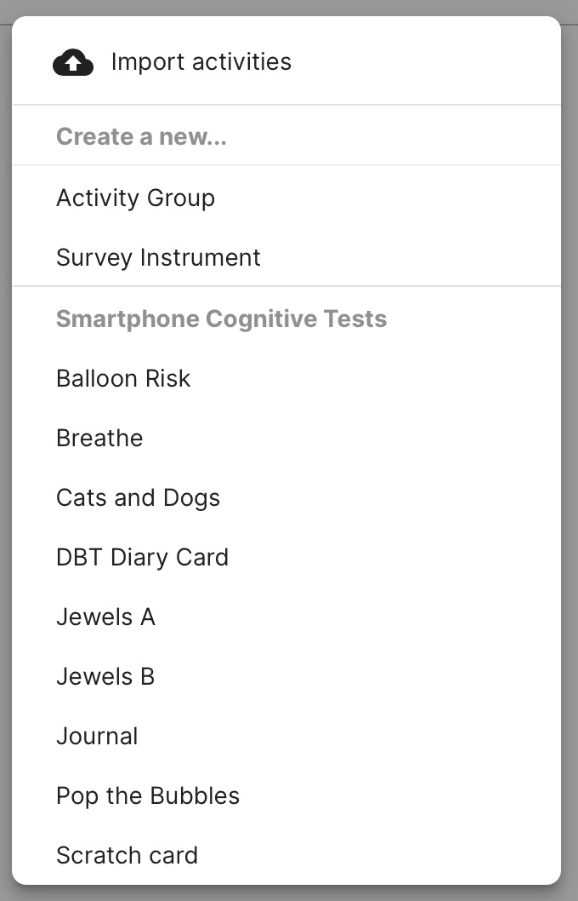

# Create and Customize Activities

*How to add an Assess cognitive test from the Patient Profile*

*How to add a Manage activity from the Patient Profile*

If you would like to create your own custom activity, you can do so by writing it in html/javascript. There is no required structure or framework; as long as it is in html/javascript it will work with LAMP.

Survey instruments and other Activities in the LAMP Platform afford you automatic version control. In other software or when managing “paper & pencil” data, it is typically difficult, if not impossible, to track changes to survey questions or survey responses when administered with a patient. 

### Create a New Activity for the Assess and Manage tabs

1. Log in to the dashboard and navigate to the Activities tab.
2. Click the `[+ Add]` button at the top right of the list to begin. If you would like to edit an existing activity, simply tap on its row in the list instead.
3. Select a cognitive test to add an activity that will show up in the Manage tab.
4. Select "tips" to create tip or resource for a patient to show up in the Learn tab.
5. If you would like to create a group of activities, click Activity Group.

Note, you can add surveys and activities to an activity group. This group of activities can then be scheduled like a survey or other activities.
