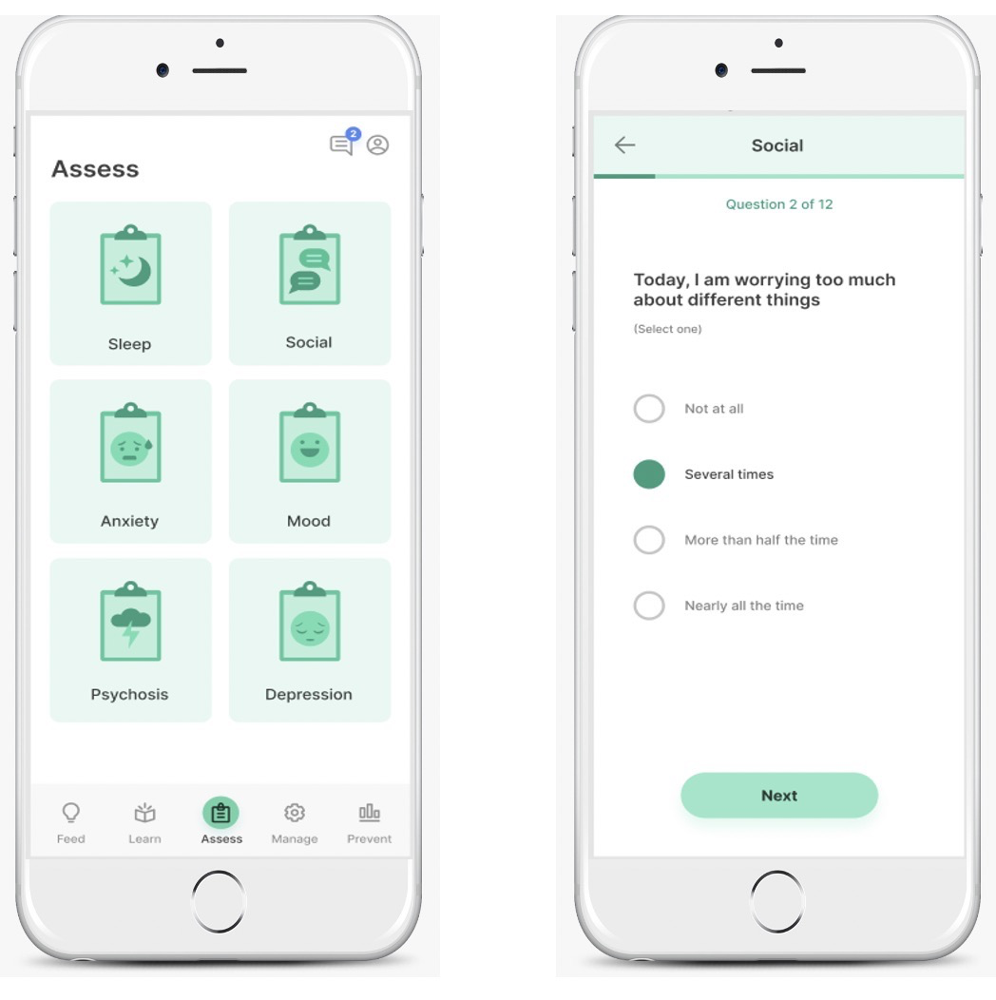
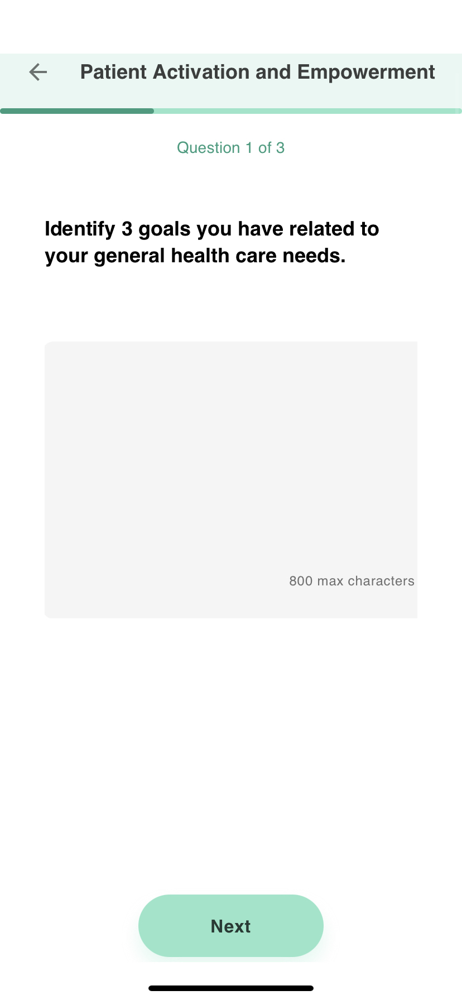
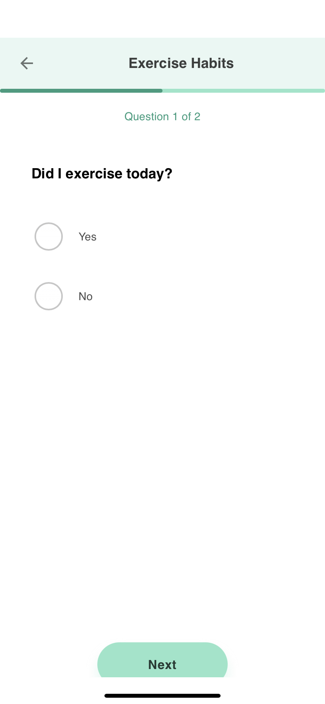
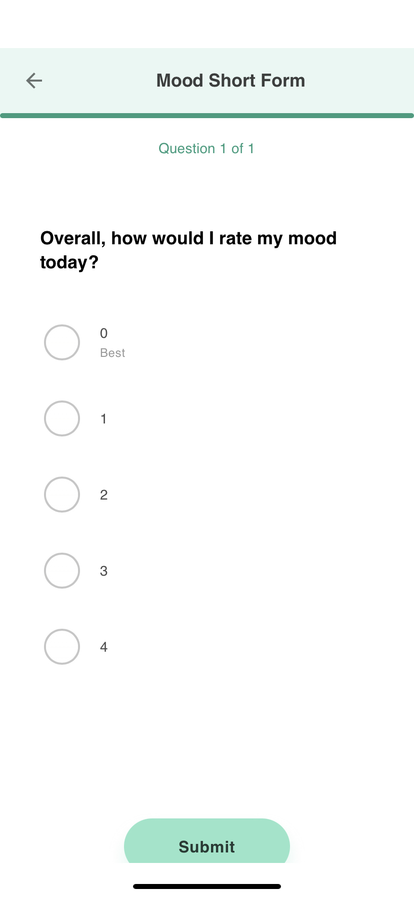
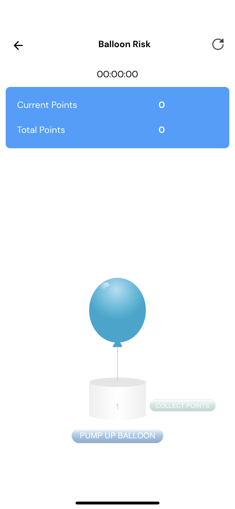
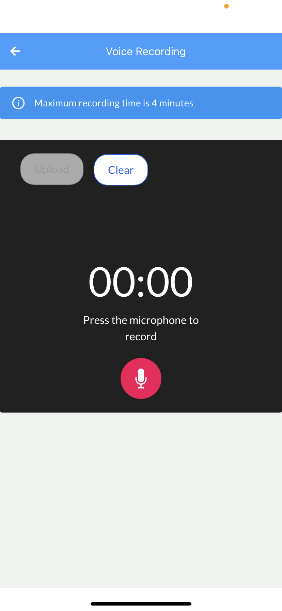

# A - Assess

The **assess** tab continues many features that get active data, such as surveys and cognitive games. Their content, answer choice style, and time of delivery – are customized by clinicians and researchers in the Dashboard. Patients and study participants complete them on the app and answers are stored over time.

Patients and study participants can have customized surveys related to mood, symptoms, and behaviors unique to them through the Assess tab. The types of surveys range from numerous gold-standard clinical assessment to customized surveys that assess symptoms and topics that are unique to an individual user. Some standard survey assessments adminstered through LAMP are the PHQ-9 (mood), GAD-7 (anxiety), PSS (stress), PSQI (sleep), PQ-16 (prodromal), and more. For further reading on what kind of questions are included in each of these standard assessments, see the individual tabs for each survey in the documentation. 

**Surveys** can also be administered through various mediums outside of typical single-answer questions. Question items can be customized to be on a Likert scale, a Boolean (True/False), multiple choice, sliders, multi-answers, and text. See an examples of different survey types below:

| Text    | Multiple Choice | Likert Scale |
| ----------- | ----------- | ----------- |
|       |  |  |

mindLAMP offers a variety of neurocognitive assessments in the form of **games** native to the app. These will show up on the Assess page of the app, and performance scores can be displayed on the Prevent page. These games include Jewels, Spatial Span, Cats and Dogs, Pop the Bubbles, and Balloon Risk. Further details and reading about each of these games can be read in the "Cognitive Games and Assessments" section of documentation. An example of the Jewels game is below:

Voice recordings is a new feature also available for specific cases of assessing differences in pitch or other audio factors based on active data scores like mood and anxiety. See example of the voice recording screen below:

| Jewels    | Voice Recording |
| ----------- | ----------- | 
|      |  |

**Sensors** function as one mindLAMP's integral features for passive data collection. Sensors are passive data markers that allow the mindLAMp team to create features out of raw passive data. An example of this is using accelerometer, which is detected by the motion of your phone, to create a measure of sleep duration based on when your phone is not moving for an extended period of time at parts of the day. Sensor data collection allows for data analysis to glean insights about how sensor data may be related to active data. If someone was wondering if a patient is experiencing greater depressive symptoms and if that is related to them being at home for longer, a researcher could view the time they may be spending at home based on the GPS data and then look at how their mood scores may reflect changes based on the GPS data. Sensors are added by researchers through the Dashboard and data is obtained through users accepting permissions for the app to access their device's native sensor features (like allowing for mindLAMP to access your location when you open the app for the first time on an iOS device). 
