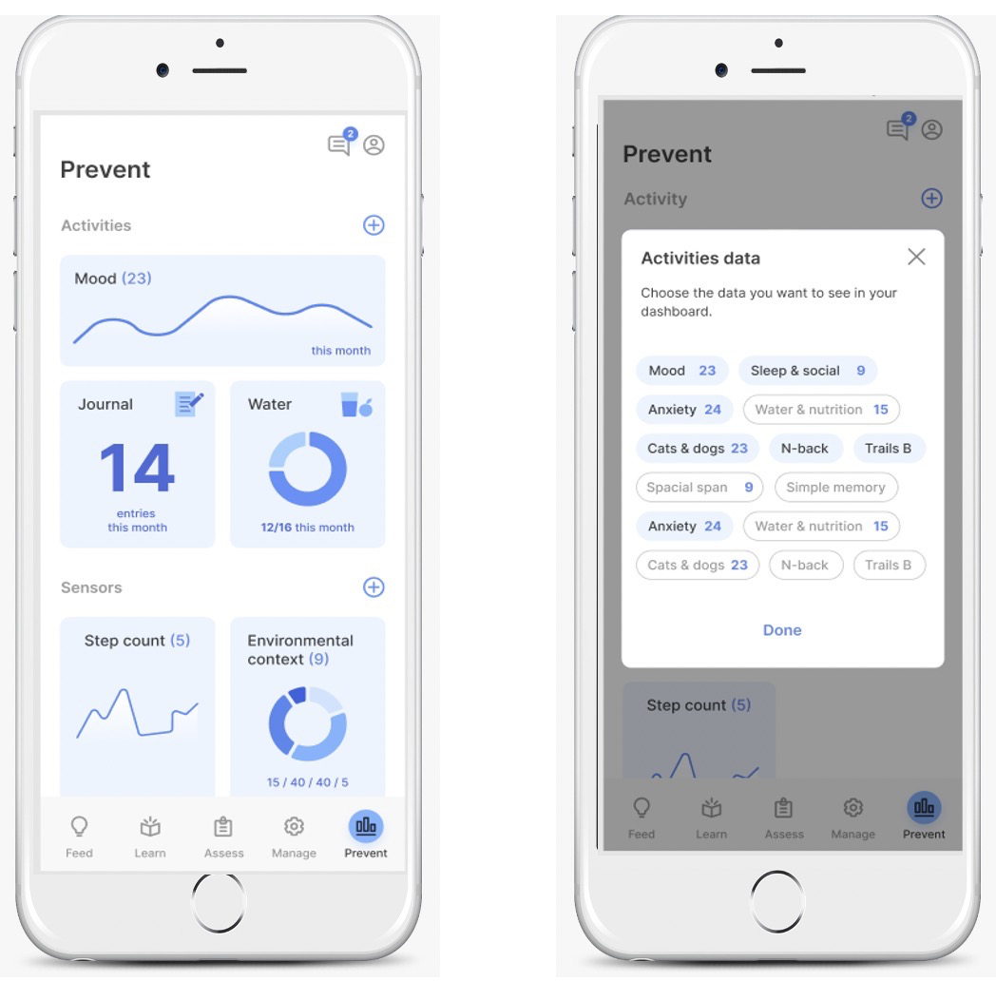

# P - Portal

The portal tab serves as a way for the the people involved with mindLAMP to view data. mindLAMP collects a combination of active and passive data. Patients and study participants, and clinicians and researchers, can view aggregated data on mindLAMP or on the Dashboard. Data appears in various types of charts and graphs. Data collected from mindLAMP – including survey responses and passive data such as step count – can be viewed through the Portal tab. See examples in the attached images below. 

As mindLAMP develops, more features created from passive data will be graphed as well. Clinicians can use the portal tab to have an idea of the clinical implications of a patient's active and passive data and users can view the portal tab to understand their data and see trends in their activity. 

