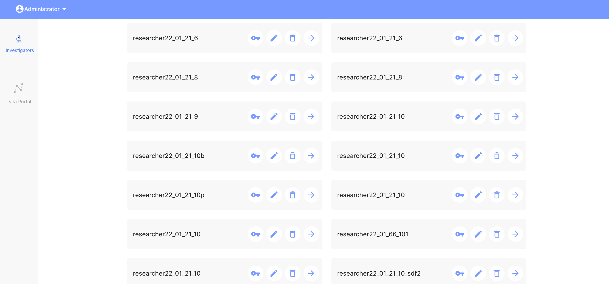
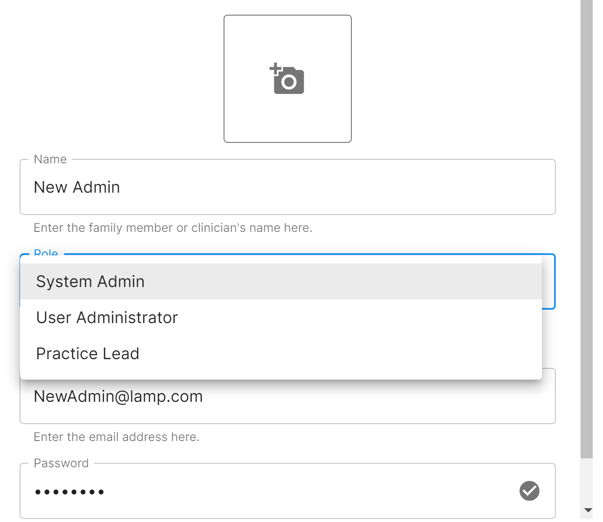
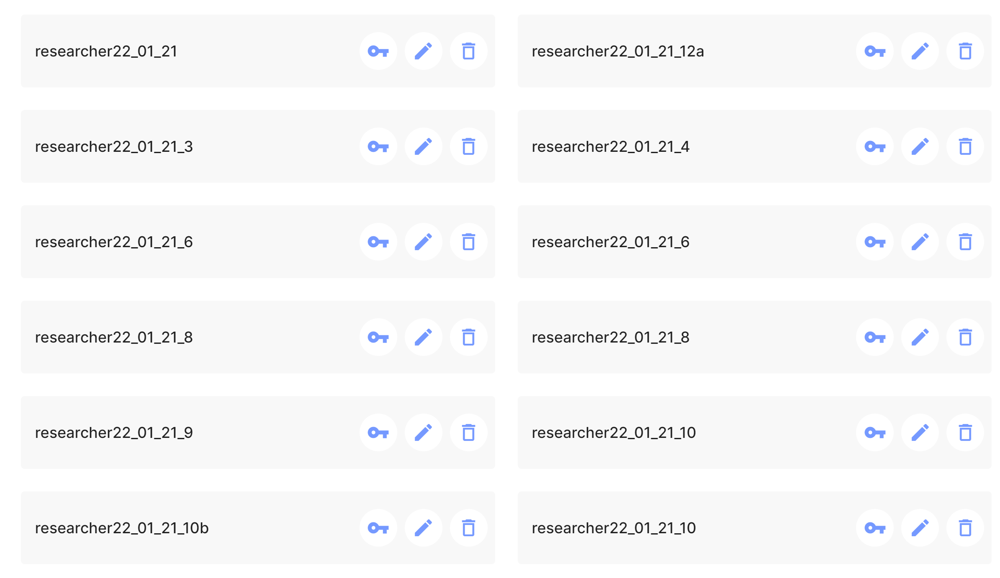
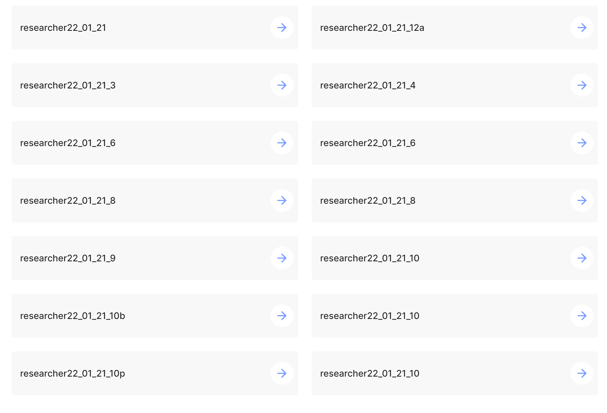

# Clinical vs. Research Use

mindLAMP now supports use cases for collaborators that require the usage of mindLAMP for strictly clinical purposes as opposed to research purposes. While still fully supporting researcher use, mindLAMP users from the dashboard can now access clinical views through a few new options.

For Admins views only, new administrative accounts can be created if security purposes demand it. From a system admin view, new credentials can be created for two new user types outside of **System Admin**: the **User Admin** and the **Practice Lead**. Each of these 3 users have different permissions dependant on what level of administrative access a clinic, program, or research group desires. See each user types permissions below:

| System Admin                  | User Admin             | Practice Lead              |  
|----------------               |------------------------| ---------------------------| 
| All administrative access     | Can manage credentials | Can **NOT** manage researcher/clinical group credentials |
| Can manage all credentials    | Can create and delete new researcher/clinical groups| Can view any patient data/imitate patients|
| Can create/delete users at all levels| Can **NOT** access any patient data|                     |
| Can access patient data/imitate patients  | Can **NOT** enter researcher/clinical groups|                     |

## Creating a New Administrative User Type
To create a new User Admin or Practice Lead, follow the steps below:

1. Access Admin account (or ask an Admin account user to do these steps for you)
1. As an Admin, go into manage credentials, and create a new credential assigned to the new user type you wish to create.
1. Login as the newly created admin type. Depending on the type of admin you are logged in to, your view will be differences based on the permitted functionality for that user type. See visual difference for User Admin and Practice Lead below.

| User Admin                | Practice Lead          |
|----------------               |------------------------| 
|    |  |

## User Views

If accessing the mindLAMP dashboard from a user (specifically a researcher or clinician) standpoint, there are an additional two new views at this user level: **Simple Mode** and **Advanced Mode**

This can be found by looking in the top right corner, in which there will be a small, oval-shaped button that can toggle between "Simple Mode" and "Advanced Mode". See the images below for a visual. Simple mode simplifies the view so that only the users tab is visible in case a clinician as no need for the extra features and the advanced view is for researchers who require the full usage of LAMP's research capabilities. By default, views will start off in Simple Mode.

| Simple Mode  | Advanced Mode |
| ----------- | ----------- |
|       |  |

## Why would someone want to use different modes?

One of mindLAMP's greatest strengths is its flexibility. Many collaborators and users of the opensource app need it for different reasons. Some need to for extremely advanced research purposes, which require complex and intricate use of all of the app's features and beyond, while others may require it for simpler, more clinically accessible uses. While mindLAMP was originally designed for fully research-compatible use, it is evolved to become a platform clinicians can use to present an accessible format for the deliverance of clinical care based on the functionalities the app offers. Sometimes, having so many buttons and abilities right from the start of using the app can be overwhelming, thus highlighting the importance of simpler and neater views. Additionally, security purposes and specific team setups may require that only specific users have access to specific features based on their roles within the team, which is now accounted for by the new administrative user types.

While transferable between researcher and clinical use, perhaps the greatest potential of this feature is the ability for users to seamlessly transition between research and clinical views, allowing full easy integration of both research and clinical care. You can always create new users with either specialized credentials or overall credentials and you can always transition between Simple and Advanced mode views dependant on what you need it for. 