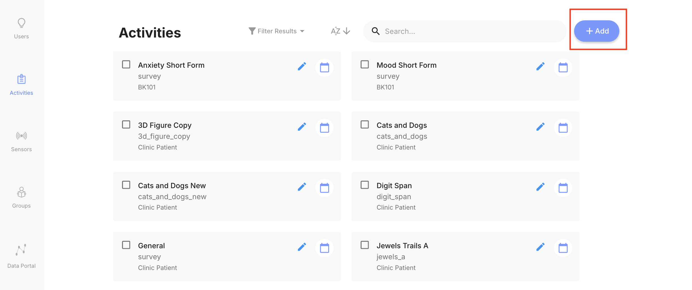

# Creating Activity Groups

Activity groups can be created on the mindLAMP dashboard so that users receive activities in a specific order.

1. Go to the Activities tab in your dashboard and click "Add" to create all of the activities you wish to be grouped together.

2. When creating each of the activities, select "Customize which Tab this Activity appears in". In the dropdown to the right, make sure all Tabs are __UNCHECKED__.
    

    
3. Create an activity group. Give it a name, upload an icon, and select the tabs where you would like the group to appear.

4. Click on the box located at the bottom left of the screen to select which activities should be grouped together. Additional activities can be added by clicking on the plus icon; the delete button can be used to eliminate any individual activity. Once created, activities can be dragged around to appear in whatever order is desired.

5. Finally, save the activity group.

