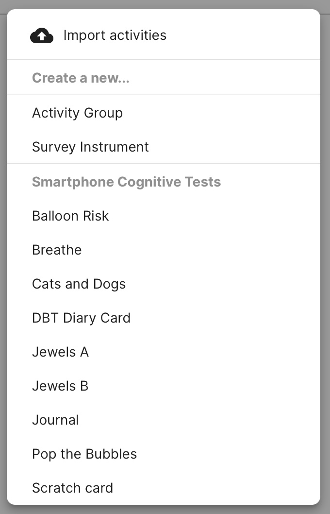

# Create and Customize Activities

<iframe width="560" height="315" src="https://www.youtube.com/embed/-km1ztZgLdY" title="YouTube video player" frameborder="0" allow="accelerometer; autoplay; clipboard-write; encrypted-media; gyroscope; picture-in-picture" allowfullscreen></iframe>

*How to add an Assess cognitive test from the Patient Profile*

<iframe width="560" height="315" src="https://www.youtube.com/embed/SJpWGlI_jdQ" title="YouTube video player" frameborder="0" allow="accelerometer; autoplay; clipboard-write; encrypted-media; gyroscope; picture-in-picture" allowfullscreen></iframe>

*How to add a Manage activity from the Patient Profile*

If you would like to create your own custom activity, you can do so by writing it in html/javascript. There is no required structure or framework; as long as it is in html/javascript it will work with LAMP.

Survey instruments and other Activities in the LAMP Platform afford you automatic version control. In other software or when managing “paper & pencil” data, it is typically difficult, if not impossible, to track changes to survey questions or survey responses when administered with a patient. 

### Create a New Activity for the Assess and Manage tabs

1. Log in to the dashboard and navigate to the Activities tab.
2. Click the `[+ Add]` button at the top right of the list to begin. If you would like to edit an existing activity, simply tap on its row in the list instead.
3. Select an activity like the DBT Diary Card or a cognitive test like Jewels for the Assess tab.
4. Select an activity like Mindfulness for the Manage tab.
5. If you would like to create a group of activities, click Activity Group.

Note, you can add surveys and activities to an activity group. This group of activities can then be scheduled like a survey or other activities.

# Customize Which Tab an Activity Appears in 

*How to customize which tab on LAMP an Activity Appears in*

If you would like to customize which tab an activity appears in, you can do so by clicking the pencil icon next to the activity you would like to move. Next, check the box next to "Customize which Tab this Activity sppears in". 

Finally, click the dropdown to display all tab options. 

There are four tab options to choose from: Assess, Learn, Manage, and Portal. Check off the box next to the desired tab you would like the activity to appear in.

Note that you can select no tabs, which hides the activity. This can be helpful if there are schedules assigned to a particular activity. It can also be helpful if there are several surveys grouped together, and you only would like the group to appear. Note that you can also display the activity on multiple tabs. 

Finally, click the "Save" button on the bottom right. 
