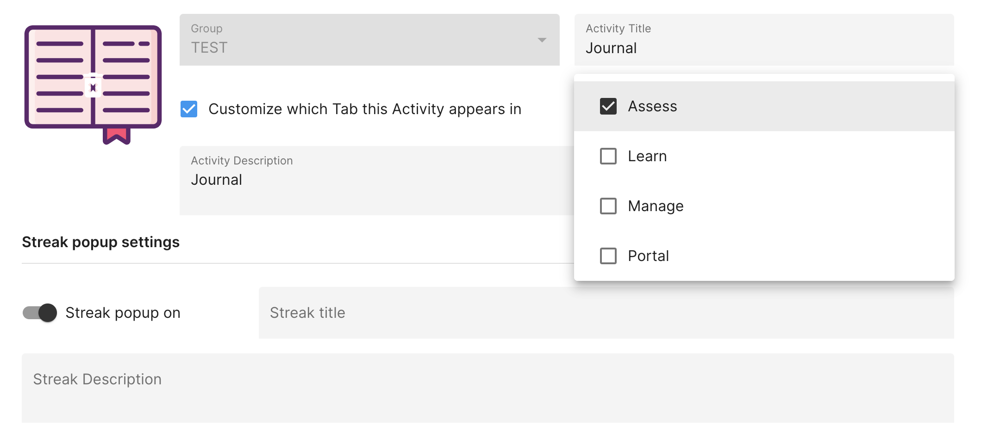

# Customize Which Tab an Activity Appears in 

*How to customize which tab on LAMP an Activity Appears in*

If you would like to customize which tab an activity appears in, you can do so by clicking the pencil icon next to the activity you would like to move. Next, check the box next to "Customize which Tab this Activity sppears in". 

Finally, click the dropdown to display all tab options. 

There are four tab options to choose from: Assess, Learn, Manage, and Portal. Check off the box next to the desired tab you would like the activity to appear in. Finally, click the "Save" button on the bottom right. 
