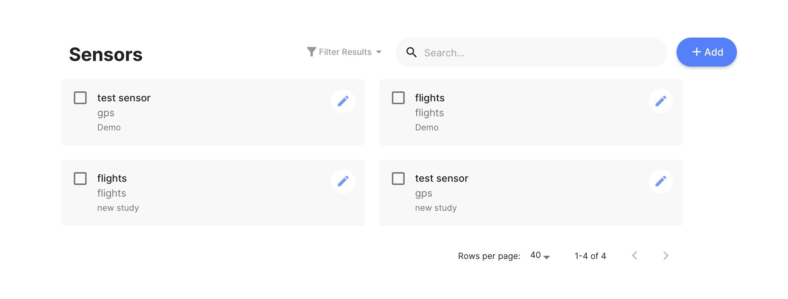
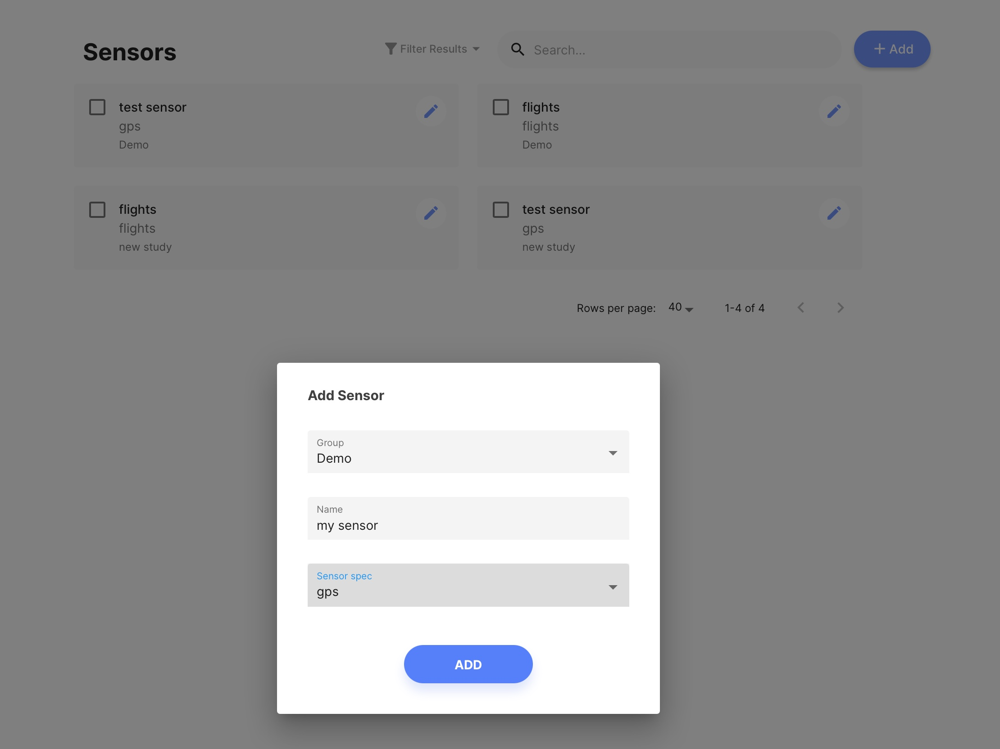

# Adding a Sensor

1. Log into the mindLAMP app or dashboard.
2. Navigate to the "Sensors" tab.
3. Click the blue `[+ Add]` button. 
4. Select the group you want to add your sensor to.
5. Name your sensor.
6. Select the sensor spec (e.g. gps, accelerometer) 
7. Select the blue `[Add]` button to save your sensor.
