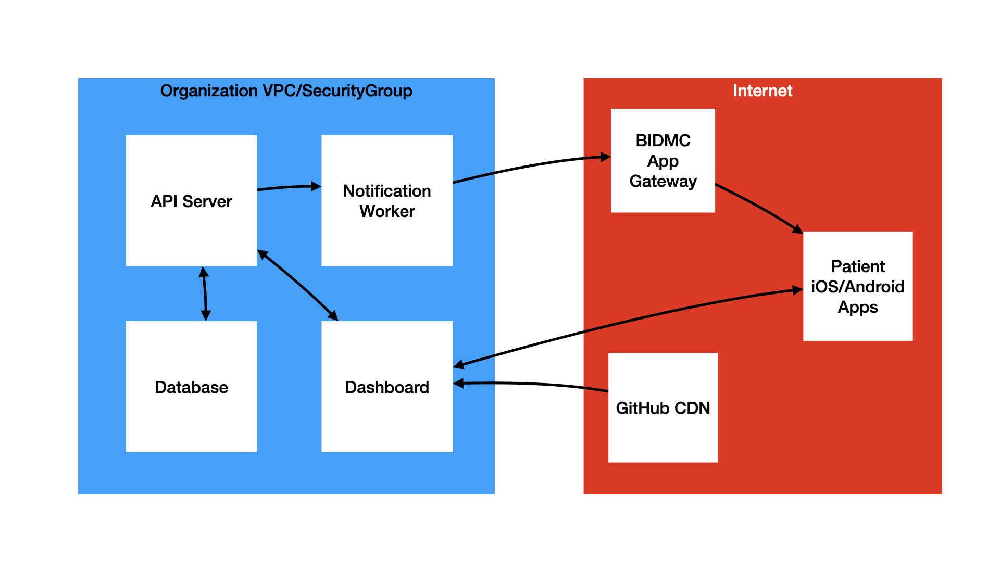

# Preparing Resources on AWS

The following instructions will result in a Docker Swarm setup prepared to deploy LAMP. You will need to continue following the instructions after this phase to successfully configure LAMP.



_Digital Psychiatry's AWS Network Diagram for the LAMP Platform_

### For EC2 Instances Only:

A **HARD** requirement for the successful operation of the LAMP Platform is the use of a high performance SSD volume. For more information on these hard limitations and requirements, [see the MongoDB documentation here.](https://docs.mongodb.com/manual/administration/production-notes/)
1. Required maximum (saturable) disk bandwidth: `4750 Mbps`
2. Required maximum disk throughput: `593.75 MB/s`
3. Required maximum disk I/O operations: `20000 IOPS`
2. Required minimum disk throughput: `125 MB/s`
3. Required minimum disk I/O operations: `3000 IOPS`
4. Required minimum disk space: `64 GB`

If using AWS, provisioning a DocumentDB cluster is the simplest way to achieve these baseline requirements for efficient and accurate data collection with no database outages or upload rejections. 

**You must replace the value of `MY_DNS_NAME` in the commands below.**

```markdown
 1. Create an EC2 instance.
				-> AMI: AWS Linux 2
				-> Instance Type: [MINIMUM] t2.medium
				-> Create a new IAM role with the `AmazonSSMManagedInstanceCore` policy.
				-> Enable termination protection.
				-> Create a [RECOMMENDED] 1TB EBS volume WITH encryption enabled.
				-> Configure security group:
						-> HTTP: TCP 80 from anywhere
						-> HTTPS: TCP 443 from anywhere
						-> Docker Daemon: TCP 2375 from this Security Group
						-> Docker Machine: TCP 2376 from this Security Group
						-> Docker Swarm: TCP 2377 from this Security Group
						-> Docker Swarm: TCP 7946 from this Security Group
						-> Docker Swarm: UDP 7946 from this Security Group
						-> Docker Overlay: UDP 4789 from this Security Group
				-> Create a new key pair and keep it private.
				-> Allocate and assign an elastic IP to the instance.
 2. Run the following commands in the instance.
				sudo yum -y update && sudo yum -y install docker -y
				sudo usermod -a -G docker ec2-user
				sudo hostnamectl set-hostname <MY_DNS_NAME>
				sudo printf "[Service]\nExecStart=\nExecStart=/usr/bin/dockerd -H tcp://0.0.0.0:2375 -H fd:// --containerd=/run/containerd/containerd.sock\n" | sudo tee /etc/systemd/system/docker.service.d/override.conf
				sudo systemctl daemon-reload && sudo service docker restart
				sudo docker swarm init
 3. Create your DNS binding in Route53.
```

### EC2 Commands

The following is a set of bash commands to be used from within AWS Systems Manager once a new EC2 instance and EBS volume are created with the AWS SSM IAM role.

**DO NOT USE THIS AS A SCRIPT!
THOROUGHLY READ IT AND RUN EACH COMMAND INDIVIDUALLY!
SUBSTITUTE ALL VARIABLES BEFORE CONTINUING!**

```bash
# Assumes nvme1n1 is the name of the EBS volume. 
# Use lsblk to confirm this before running the script.

# Attach EBS volume and configure auto-reattach on restart.
mkfs -t xfs /dev/nvme1n1
mkdir /data && mount /dev/nvme1n1 /data
printf "\nUUID=$(blkid -s UUID -o value /dev/nvme1n1)     /data       xfs    defaults,nofail   0   2" >> /etc/fstab
umount /data && mount -a

# Install Docker and move Docker root to EBS volume.
yum install docker
mkdir -p /data/var/lib/docker && ln -s /data/var/lib/docker /var/lib/docker

# Set hostname before starting Docker and join the Swarm.
hostnamectl set-hostname node-01.example.com
service docker start
docker swarm join --token SWARM_TOKEN IP_ADDR:2377
```

**In case your EBS volume runs out of storage space, follow the instructions below:**

```bash
# expand the EBS volume using the AWS management console first
lsblk
growpart /dev/nvme1n1 1
xfs_growfs -d /data
```

### AWS SSM Instructions

We recommend disabling all SSH (port 22) or remote access to any EC2 instances you configure. [Use AWS Systems Session Manager (AWS SSM) to access your node.](https://docs.aws.amazon.com/systems-manager/latest/userguide/session-manager-working-with-sessions-start.html#start-ec2-console) Additionally, follow the instructions below on your local computer to securely communicate with the instance(s).

1. [Install the AWS CLI SSM plugin.](https://docs.aws.amazon.com/systems-manager/latest/userguide/session-manager-working-with-install-plugin.html)
2. [Configure SSH to support AWS SSM tunneling.](https://docs.aws.amazon.com/systems-manager/latest/userguide/session-manager-getting-started-enable-ssh-connections.html)
3. Alternatively, manually open a port forwarding tunnel.

    ```bash
    aws ssm start-session \
    	--target $(aws ec2 describe-instances \
    		--filter "Name=tag:Name,Values=node-01" \
    		--query "Reservations[].Instances[?State.Name == 'running'].InstanceId[]" \
    		--output text) \
    	--document-name AWS-StartPortForwardingSession \
    	--parameters '{ "portNumber": ["22"], "localPortNumber": ["9999"] }'
    ```

4. Alternatively, manually open a secure SSH tunnel session.

    ```bash
    aws ssm start-session \
    	--target $(aws ec2 describe-instances \
    		--filter "Name=tag:Name,Values=node-01" \
    		--query "Reservations[].Instances[?State.Name == 'running'].InstanceId[]" \
    		--output text) \
    	--document-name AWS-StartSSHSession \
    	--parameters 'portNumber=%p'
    ```

### Using AWS DocumentDB instead of MongoDB (Coming Soon)

The Division of Digital Psychiatry has been working closely with Solutions Architects at Amazon Web Services (AWS) to improve performance and reliability, as well as reduce maintenance overhead and IT skills required for deployment. For this reason, we support MongoDB in addition to the Apache CouchDB database. AWS offers a managed solution for MongoDB databases called DocumentDB that abstracts and simplifies all MongoDB database setup and operations needs, including routine backups and HIPAA-compliant encryption of data at rest and in transit. 

DocumentDB is a high performance database solution built on the AWS Aurora technology that supports global replicated clusters that span across multiple regions (i.e. U.S. East and Mumbai, for example) and up to 15 read replicas in a single region. This provides high availability and performance for the LAMP API and in turn the clinical dashboard and mobile apps that are built upon it. 

This advanced technology and other AWS managed solutions are natively integrated into the LAMP Platform and the Cortex data analysis toolkit, enabling both advanced clinical care management features (such as just-in-time adaptive interventions) and advanced research/data analysis methods. 

**We are working closely with Amazon Web Services (AWS) to bring this feature to all organizations using the LAMP Platform. If you or your organization are interested, please contact us.**
