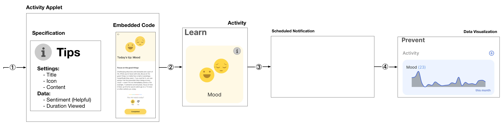
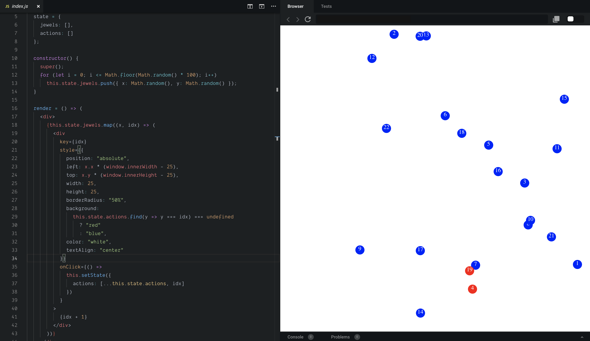

# Building New Activities



Because the **LAMP Platform** is built around around a simple native core and a flexible WebView UI, any HTML/CSS/JavaScript code that works in a browser can work in the app.

Learning modules, surveys, cognitive tests, and interventions all use the same API and using a framework such as React makes it simple, for example, to create new interventions as needed with patient/participant feedback.

Any Javascript-based code can be added the LAMP Platform using the ActivitySpec API, as long as it uses `window.postMessage()` and `window.addEventListener()` API to receive the Activity settings and submit the ActivityEvent once complete. 

Approximately ~40 lines of JavaScript + React code, shown on the left produces a naïve implementation of the Jewels game, shown on the right.



:::info
If you'd like to try creating your own, but don't have a ReactJS development environment, **consider using [CodeSandbox](https://codesandbox.io/)**, a free service.
:::

# Specific Instructions to add Custom Activity

To add a custom activity, the HTML page must be compressed in base64 and must be able to be accessed by the dashboard.
To do this, you can run this command on your html file:

`$ cat index.html | base64 > index.html.b64`

In your Activity Spec DB document it should have an **executable** and a **settings** attribute.
Should look something similiar to this:
```
"executable": "https://path/to/your/index.html.b64"
"settings": {
    "type": "object",
    "properties": {
      "settings": {
        "title": "Activity Settings",
        "type": "object",
        "required": [
          "totalTrials",
          "maxTime"
        ],
        "properties": {
          "totalTrials": {
            "title": "Total Trials",
            "description": "The number of trials.",
            "type": "number",
            "default": 20,
            "minimum": 1,
            "maximum": 100,
            "ui:grid": {
              "xs": 4
            }
          },
          "maxTime": {
            "title": "Max Time",
            "description": "The time it takes to get to the stopsign in seconds",
            "type": "number",
            "default": 0.75,
            "minimum": 0.1,
            "maximum": 2,
            "ui:grid": {
              "xs": 4
            }
          }
        }
      }
    }
  },
```

# Custom Activity HTML file

## Back Button Function in Activity
In your HTML document, include a function where the user can revert back to LAMP. The *onclick* attribute should then call a parent postMessage.

Something like this:

```
function clickedBackButton(){
  console.log('clicked back button')
  parent.postMessage(null, '*');
}
```

In that specific example, the postMessage is sent to the LAMP with no data.

## Initialized Settings from LAMP
Using the settings we added to the document, we can access these variables using the *addEventListener()*

```
window.addEventListener("message", (event) => {
  // console.log(event)
  settings = event.data.activity.settings

  totalTrials = settings.totalTrials // the totalTrials settings can be accessed here

  totalTrials = 20 //default
  maxTime = settings.maxTime // the maxTime settings can be accessed here

   
}, false);
```
