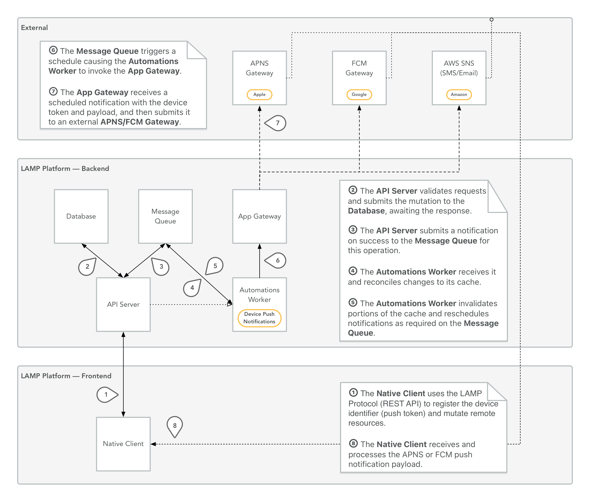
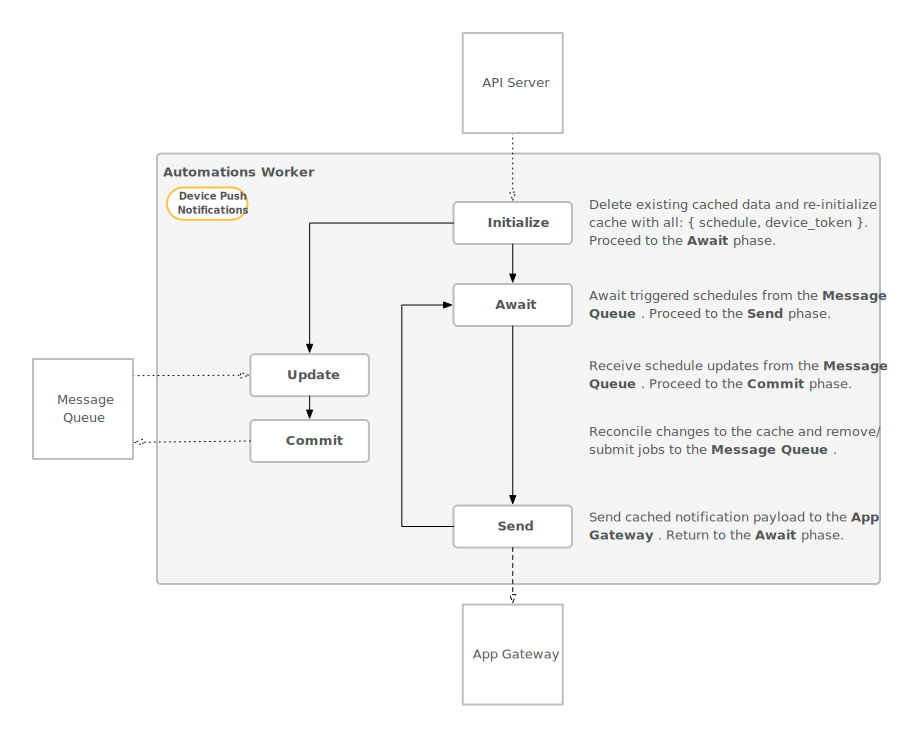

# Working with the App Gateway

The app gateway requires an API Key to make requests and supports `apns` (Apple device push notification service), `gcm` (Google device push notification service), `mailto` (standard mail address via AWS SES), `sms` (standard phone number SMS via AWS SNS), and `slack` (a Slack channel API hook) recipients. 

Example API call:

```bash
curl -XPOST "https://app-gateway.lamp.digital/push" \
 -H 'Content-Type: application/json' \
 --data-binary @- <<'EOF'
{
   "api_key": "YOUR_API_TOKEN_HERE",
   "device_token": "apns:YOUR_APNS_DEVICE_TOKEN_HERE",
   "payload": {
      "aps": {
         "alert": "Hello world!",
         "badge": 0,
         "sound": "default",
         "mutable-content": 1,
         "content-available": 1
      },
      "notificationId": "test123",
      "expiry": 84600000,
      "actions": []
   }
}
EOF
```

The flow of data is shown below:


## Push Notifications 

The `Automations Worker` component handles all push notification scheduling working in tandem with the API Server using the `LAMP-js` SDK. It caches CRON expressions matching to Activity IDs and Participant IDs for delivery. The workflow is shown below:


