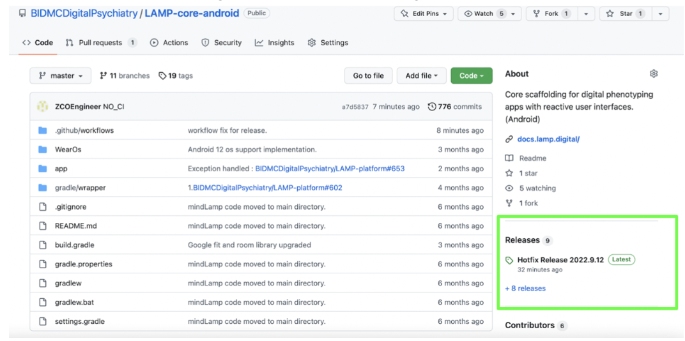
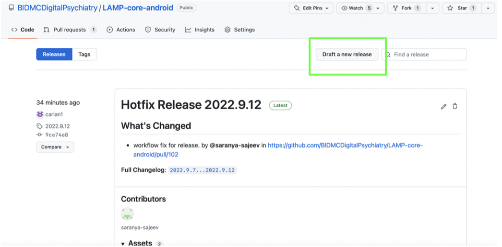
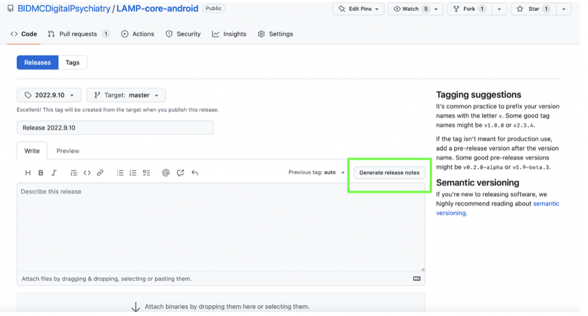
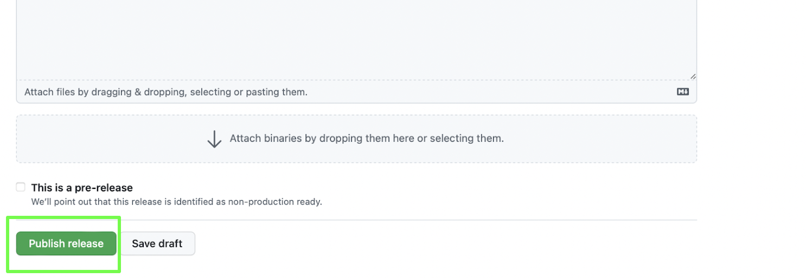

# Creating a Github Release

## Process 
1. On the Github BIDMC Division of Digital Psychiatry homepage, choose the appropriate repository for which you will generate your release. 

3. On the repository page, click the 'Releases' tab on the right-hand side. 
 

3. Click the 'Draft a new release' button.

4. In the ‘Release title’ box, name release using the following convention: Release [today’s date’]. Ex: “Release 2022.8.29”.

6. Click ‘Choose a tag’ and create a new tag for that date.

8. Click 'Generate release notes' button.

7. Once the notes are generated and everything looks good, you can click the green 'Publish release' button at the bottom of the page.

