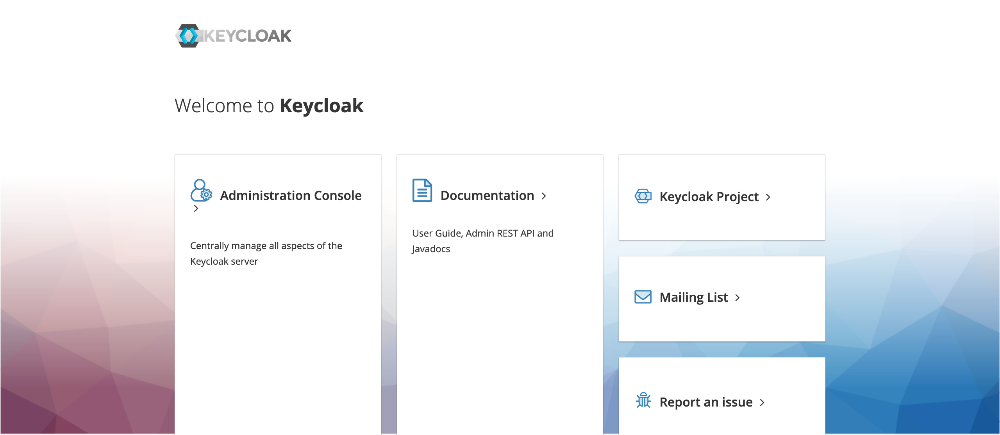

# OAuth2/OIDC Support 

## Introduction

The OAuth2/OIDC integration for the LAMP Platform allows 3rd party identity services systems your organization may already be using (such as **Azure Active Directory** or **AWS Cognito**) to be used for authentication and authorization. This integration works by **binding an existing mindLAMP ID** (such as a Participant ID or Researcher ID) **to an existing or new IdP identity** (that is, the Participant ID within mindLAMP must still be managed manually from the dashboard at this time). Additionally, when using IdPs such as Azure Active Directory, this integration also supports B2C identities; for example, if your hospital organization already has Azure configured and has just set up the LAMP Platform, patients will be able to use their personal Gmail or Twitter accounts (if allowed by your organization) to sign into mindLAMP on their personal devices.

:::note

Support for OAuth2/OIDC is under active development is a **BETA** feature at this time. For more information and assistance, [contact us](mailto:team@digitalpsych.org).

:::

## Setup

New variables added to the MindLAMP Environment to support OAuth 2.0 Auth with different IdPs:

- `OAUTH_AUTH_URL`
    - This is the URL that that we will use to fetch our authorization code from
    - Example value: `https://login.microsoftonline.com/{tenantid}/oauth2/v2.0/authorize`
- `OAUTH_TOKEN_URL`
    - This is the URL we will use to exchange our authorization code for proper access/refresh tokens
    - Example Value: `https://login.microsoftonline.com/common/v2.0/oauth2/token`
- `OAUTH_LOGOUT_URL`
    - This is the URL will be used when logging out of MindLAMP. Since the session with the provider is handled by the provider (Cookies stored in their domain keep the session open, generally) IdPs have their own logout URLs.
    - Example Value: `https://login.microsoftonline.com/common/oauth2/v2.0/logout?post_logout_redirect_uri=https://localhost:3001`
- `OAUTH_CLIENT_ID`
    - Client ID given to us by our IdP when creating an OAuth Credential/Client
- `OAUTH_CLIENT_SECRET`
    - Secret given to us by the IdP when creating an OAuth Credential/Client
- `TOKEN_SECRET`
    - Secret that will be used to sign/validate tokens created inside the mindlamp platform
    - Example Value: `QfTjWnZq4t7w!z%C*F-JaNdRgUkXp2s5u8x/A?D(G+KbPeShVmYq3t6w9y$B&E)H`
    - Can be anything
- `OAUTH_REDIRECT_URI`
    - URL that we will be redirected to after authentication with our IdP
    - Example Value: `http://localhost:3001/`
- `OAUTH_SCOPE`
    - The set of permissions we will be requesting of our IdP
    - Example values and notes: offline_access should always be present, it asks the IdP to emit refresh tokens.
    - For B2C, the Azure Client ID needs to be part of the scope or Azure won't emit Access Tokens
- `OAUTH`
    - This value signifies if the API accetps/handles OAuth Login correctly.
    - Example Values: `on`/`off`

:::warning

**All of the values should be strings.**

:::

### Example using Keycloak

#### Set up a custom OAuth solution with MindLAMP
In this example we set up an existing MindLAMP server with [Keycloak](https://www.keycloak.org/), an open source identity provider which supports the OAuth 2 flow. This choice is supplied as an example; other OAuth 2 solutions could be used.

#### Create and start the Keycloak server
The Docker Compose file you need to use depends on whether you want to run the server in development or production mode. Choose the right one below, save it to a `docker-compose.yaml` file and then run `docker compose -f <path to file>/docker-compose.yaml`.

#### Development mode
<details>
<summary>Click to expand</summary>

```yaml
    version: '3'
    services:
      keycloak:
        image: quay.io/keycloak/keycloak:17.0.0
        command: start-dev
        environment:
          KEYCLOAK_ADMIN: admin
          KEYCLOAK_ADMIN_PASSWORD: <admin password here>
          KC_DB: postgres
          KC_DB_URL_HOST: <database host here>
          KC_DB_USERNAME: mindlamp
          KC_DB_PASSWORD: <database password here>
        ports:
          - 8080:8080
        depends_on:
          - db

      db:
        image: postgres:latest
        environment:
          POSTGRES_USER: mindlamp
          POSTGRES_PASSWORD: <database password here>
          POSTGRES_DB: keycloak
        ports:
          - 5432:5432
```
</details>

#### Production mode

<details>
<summary>Click to expand</summary>

```yaml
    version: '3'
    services:
      keycloak:
        image: quay.io/keycloak/keycloak:17.0.0
        command: ["start", "--auto-build"]
        environment:
          KC_HEALTH_ENABLED: true
          KC_METRICS_ENABLED: true
          KC_HOSTNAME: <hostname here>
          KEYCLOAK_ADMIN: admin
          KEYCLOAK_ADMIN_PASSWORD: <admin password here>
          KC_HTTPS_KEY_STORE_FILE: /tmp/keystore
          KC_HTTPS_KEY_STORE_PASSWORD: <key store password here>
          KC_DB: postgres
          KC_DB_URL_HOST: <database host here>
          KC_DB_USERNAME: mindlamp
          KC_DB_PASSWORD: <database password here>
        ports:
          - 8443:8443
        depends_on:
          - db
        volumes:
          - <key store file here>:/tmp/keystore

      db:
        image: postgres:latest
        environment:
          POSTGRES_USER: mindlamp
          POSTGRES_PASSWORD: Password01
          POSTGRES_DB: keycloak
        ports:
          - 5432:5432
```
</details>

Make sure you match `<database password here>` for both containers. In production mode, HTTPS support is mandatory, so you also need to provide a valid key store file.

Please refer to [https://www.keycloak.org/server/all-config](https://www.keycloak.org/server/all-config) for a complete list of build and configuration options.

#### Set up a realm
1. Open a web browser and go to Keycloak hostname (e.g., [https://0.0.0.0:8443](https://0.0.0.0:8443) if you are in the host in production mode).
   
   Click **Administration Console**.
2. Enter the credentials you specified in the `docker-compose.yaml` file and click **Sign In**.
3. On the top left corner of the screen, hover over **Master** (this is what the default realm is called) and click on the **Add realm** button that will appear.
4. Enter a name for the new realm (for example, `MindLAMP`) and click **Create**.

Once the realm is created, you can add one or more clients for the MindLAMP server to interact with.

#### Add an OAuth client
1. Click **Clients** from the sidebar on the left and then click **Create** on the right.
3. Specify a client ID (for example, `spa`) and pick `openid-connect` as the client protocol. Click on **Save**.

#### Configure the client for MindLAMP
A few settings need to be set up for the new client to work with MindLAMP.
1. Set **Access Type** to `confidential`.
2. Turn on **Implicit Flow Enabled**.
3. Under **Valid Redirect URIs**, add an item for every MindLAMP dashboard that will log in through this client. The _exact_ URL(s) must be specified, otherwise log in will be rejected by Keycloak.
4. Set up any other options that are needed. When you are finished, click on **Save**.
5. Switch to the **Credentials** tab and copy the client secret. You will need it for the following step.

#### Set up the MindLAMP server ##
Finally a few environment variables need to be added to the MindLAMP server. Here's an example of what the OAuth section of the `.env` file could look like:

    OAUTH="on"
    OAUTH_AUTH_URL="https://<hostname here>/realms/<realm name>/protocol/openid-connect/auth"
    OAUTH_TOKEN_URL="https://<hostname here>/realms/<realm name>/protocol/openid-connect/token"
    OAUTH_LOGOUT_URL="https://<hostname here>/realms/<realm name>/protocol/openid-connect/logout"
    OAUTH_CLIENT_ID="<client name here>"
    OAUTH_CLIENT_SECRET="<client secret here>"
    OAUTH_REDIRECT_URI="<dashboard URL here>"
    OAUTH_SCOPE="openid offline_access"
    OAUTH_STATE="12345"
    OAUTH_NONCE="67890"

Hostname needs to be the same as specified in the `docker-compose.yaml` file. The `OAUTH_LOGOUT_URL` is not mandatory, but it is needed so that the user is automatically logged out from Keycloak when they log out from the dashboard.

Remember that `OAUTH_REDIRECT_URI` must be exactly the same as the redirect URI the client was set up with.
