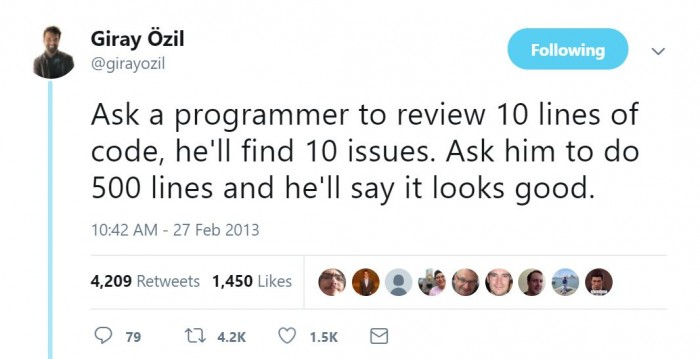

# Training Modules

<aside>
💡 For the best experience viewing these modules, tap the module icon below and use the `[Open as page]` button in the top left toolbar.

</aside>

<aside>
⚠️ **Please be sure to view the video AND read the text/articles.** 

Depending on your level of experience, it may take close to two full work days (**~16 hours**) to complete all modules; plan accordingly!

</aside>

|Name                   |Length     |
|-----------------------|-----------|
|UNIX & Shell           |130 minutes|
|Cloud Computing        |80 minutes |
|Docker & Kubernetes    |105 minutes|
|DevOps & Git           |55 minutes |
|Databases & APIs       |80 minutes |
|Pandas & Vega          |150 minutes|
|TypeScript & React     |100 minutes|
|Code Etiquette & Review|80 minutes |
|Team-specific Resources|110 minutes|
|Markdown               |           |

### Resources

[**→ Learn any X (programming language, file format, etc.) quickly.**](https://learnxinyminutes.com)

# UNIX & Shell

Length: 130 minutes

UNIX is everywhere — if you're using a Mac, you're on a UNIX computer. Linux is one of the big three operating systems (macOS, Windows, Linux) based on UNIX. Even if you're on a Windows computer, [you might still be able to use Linux](https://docs.microsoft.com/en-us/windows/wsl/about)! For our purposes, Linux and UNIX are synonymous (often just shortened to `*nix`). To begin working with a Unix-based system, we need to learn some basics about files and the shell.

---

[https://www.youtube.com/watch?v=dDwXnB6XeiA](https://www.youtube.com/watch?v=dDwXnB6XeiA)

## Everything is a File

`~30 minutes`

> "**This is the Unix philosophy**: Write programs that do one thing and do it well. Write programs to work together. Write programs to handle text streams, because that is a universal interface."
> 
- **UNIX Philosophy [expand to read more]**
    1. **Make each [tool] do one thing well**. To do a new job, build afresh rather than complicate old [tools] by adding new features.
    2. Expect the output of every [tool] to become the input to another, as yet unknown, program. **Don't clutter output with extraneous information**. Avoid stringently columnar or binary input formats. Don't insist on interactive input.
    3. **Design and build [tools] to be tried early**, ideally within weeks. Don't hesitate to throw away the clumsy parts and rebuild them.
    4. Use tools in preference [over] unskilled help to lighten a programming task, **even if you have to detour to build the tools and expect to throw some of them out** after you've finished using them.

While there are MANY important tools (executables) you can use to automate tasks or diagnose problems, for example, it can be difficult to know HOW exactly to use them. Read the article below to learn more about how to... *learn more!* about these tools you'll encounter.

[How to learn Unix tools](https://blog.nindalf.com/posts/how-to-learn-unix-tools/)

---

[https://www.youtube.com/watch?v=42iQKuQodW4&list=PLr08WV22QsVihYD7pkWl14ENWgom6mqVb&index=40&t=40s](https://www.youtube.com/watch?v=42iQKuQodW4&list=PLr08WV22QsVihYD7pkWl14ENWgom6mqVb&index=40&t=40s)

### Directories & Dotfiles

`~10 minutes`

All UNIX systems follow the same standardized directory structure (even your Mac, try it!). You will inevitably encounter most of these directories in practice, even if you're working only with data science tools. 

When you work with developer tools on the command line, you'll need to configure them on the command line. These configuration are stored in your home directory prefixed with a `.` (dot). The most common ones you will see are `.gitignore`, `.bashrc`, `.env`, and `.ssh` (a directory of configuration files). `.env` files are important for local configuration and testing for the LAMP Platform (or Cortex). Read the article below to learn what a `.bashrc` file is.

[What is .bashrc file in Linux? - JournalDev](https://www.journaldev.com/41479/bashrc-file-in-linux)

---

### Processes

This is a list of things your executable code is provided when it's transformed into a live process.

1. Parent: when you launch a process, it ALWAYS has a parent. A process can also have many children.
2. Arguments: when you launch a process, you can provide command line arguments to it, which are strings.
    1. The shell translates this line `echo hello world` → into this argument list `["/bin/echo", "hello", "world"]`, where the first element of that list is the location of the binary code for the executable.
    2. Exit Code: when your process exits, it returns a status code (integer) about why it exited (`0` indicates success, anything greater than `0` indicates an error).
3. Environment Variables: when you launch a process, it **inherits** a customizable set of variables from the current executing environment.
    1. Current Directory (`cwd`): this informs the process of the current directory it's being executed from.
    2. Path List (`$PATH`): when you call a binary in the shell (or import some library in Python), it needs to figure out where the executable code is located, and looks up a customizable list of paths to figure that out.
4. File Descriptors: these are the default data streams created for your process and are actually virtual files.
    1. Input (`stdin` = `0`): this is an optional input file or stream of data.
    2. Output (`stdout` = `1`): this is where print statements go!
    3. Error (`stderr` = `2`): this is where exceptions and errors go!

### Exercises

`~50 minutes`

<aside>
⚠️ [Follow along here.](https://labs.play-with-docker.com) 

**Play-With-Docker** gives you access to a virtual Linux computer so you won't cause harm to your computer.

</aside>

Now you're ready to learn practical examples of these tools; the quick tutorial below will help you learn the basics. You can paste each line into the terminal one by one. 

<aside>
🔥 **READ EACH COMMENT FIRST BEFORE RUNNING THE COMMAND OR YOU MAY IRREVERSIBLY DAMAGE YOUR COMPUTER!**

Some commands will require files like "file.txt" to be present — you can create files in the Terminal using `touch test.txt`.

</aside>

[Learn X in Y minutes Where X=bash](https://learnxinyminutes.com/docs/bash/)

This section below contains list of the **most useful or important commands our research group uses in real life**. Take a look at them and try some of them out!

---

[https://www.youtube.com/watch?v=sXQxhojSdZM&list=PLr08WV22QsVihYD7pkWl14ENWgom6mqVb&index=23&t=68s](https://www.youtube.com/watch?v=sXQxhojSdZM&list=PLr08WV22QsVihYD7pkWl14ENWgom6mqVb&index=23&t=68s)

## Regular Expressions

`~15 minutes`

RegEx allows you to work with files and strings to find and replace text. On the command line, you can use the old-fashioned `grep`, or instead, the more advanced RipGrep/All (`rg`, `rga`) to quickly find and search across entire directories and through binaries, photos, and PDFs!

Use **RegExr** if you need a quick cheatsheet or a tester tool to try out a RegEx before accidentally damaging 150+ files. Yes, this has happened before, and this is why we use Git (which you will learn soon) to roll-back to a previous version.

→ Exercise: Try to write a RegEx to select filenames ending in `.docx` or `.doc` (Word files).

[RegExr: Learn, Build, & Test RegEx](https://regexr.com)

- Solution (Don't peek!)
    
    `^.*\.(doc|docx)$`
    

---

### CRON Schedules

Another kind of "pattern string" you'll see a lot is a CRON schedule (and they're used extensively in the LAMP Platform for things like push notification scheduling and automations!). CRON is a system service that runs scripts for you at the schedule you set, using a cron schedule expression. The syntax is quite simple, but once you've read the `Overview` section of the article below, use the interactive expression editor to play around with it.

[cron - Wikipedia](https://en.wikipedia.org/wiki/Cron#Overview)

→ Try to come up with a cron schedule expression for:

> At every 30th minute past hour 5 and 15 on every 3rd day-of-month from 1 through 31 in every 3rd month from January through December.
> 

[Crontab.guru - The cron schedule expression editor](https://crontab.guru/#0_0_*_*_*)

- Solution **(Don't Peek!)**
    
     `/30 5,15 1-31/3 1-12/3 *`
    

[https://www.youtube.com/watch?v=-txKSRn0qeA&list=PLr08WV22QsVihYD7pkWl14ENWgom6mqVb&index=39&t=1s](https://www.youtube.com/watch?v=-txKSRn0qeA&list=PLr08WV22QsVihYD7pkWl14ENWgom6mqVb&index=39&t=1s)

## File Editors

`~5 minutes`

<aside>
⚠️ **Watch until 2:05 only.**

</aside>

Editing files on the command line will require you to learn to use a basic text editor like Vim. **If you're a beginner, `nano` is a much simpler but less featured text editor.** 

- Another trick is to use `cat` to save a file quickly.
    1. Copy the text you want to paste into the new file.
    2. Execute `cat > file.txt`. (Or use `>>` instead of `>` to **APPEND** to an existing file.)
    3. Paste the text. You'll see your file contents in the terminal now.
    4. To correctly save the file, press `CTRL-D`.

---

[https://www.youtube.com/watch?v=tzq4asJegKY&list=PLr08WV22QsVihYD7pkWl14ENWgom6mqVb&index=37&t=8s](https://www.youtube.com/watch?v=tzq4asJegKY&list=PLr08WV22QsVihYD7pkWl14ENWgom6mqVb&index=37&t=8s)

## Open Source

`~10 minutes`

Though unrelated to actually using Unix, open source is intertwined with almost all the code and tools we use as a team. There's a lot to unpack about how open source works, but knowing how open source, licensing, and 'forking' repositories works is important behind-the-scenes knowledge. 

---

[https://www.youtube.com/watch?v=emFMHH2Bfvo&list=PLr08WV22QsVihYD7pkWl14ENWgom6mqVb&index=44&t=11s](https://www.youtube.com/watch?v=emFMHH2Bfvo&list=PLr08WV22QsVihYD7pkWl14ENWgom6mqVb&index=44&t=11s)

## Important File Formats

`~10 minutes`

While this may appear to have nothing to do with UNIX at first, there are a number of essential file formats that lay the groundwork for the modules to come. In addition to SVG (which is best explained visually), take a brief pass at the syntax for Markdown (human-readable text documents), JSON (human-readable structured data transfer format), and YAML (human-readable configuration file format).

For **Markdown**, we also use a documentation generator called Docusaurus that provides additional features, such as embedding tabs, live code blocks, admonitions, automatic table-of-contents, and much more. ([Also, Markdown tables can be quite annoying, so use this GUI tool instead to edit those — always stick to compact mode.](https://www.tablesgenerator.com/markdown_tables))

[Learn X in Y minutes Where X=markdown](https://learnxinyminutes.com/docs/markdown/)

[Markdown Features introduction | Docusaurus](https://docusaurus.io/docs/markdown-features)

Whenever possible, avoid JSON for configuration files, only using it as a data storage or transfer protocol; use YAML instead for configuration files.

[Learn X in Y minutes Where X=json](https://learnxinyminutes.com/docs/json/)

[Learn X in Y minutes Where X=yaml](https://learnxinyminutes.com/docs/yaml/)

---

# Useful Linux Commands

```bash
#
# SECTION: BASIC COMMANDS
# NOTE: Use CTRL-C (not CMD-C on macOS) to end a process in the console.
# NOTE: Use CTRL-D (sends an "EOF") to quit the shell or console input.
#

# Get the current UNIX Epoch Timestamp.
date +%s
# List everything in detail in the current directory.
ls -al .
# Create a folder AND all non-existant folders along the way.
mkdir -p ./my/nested/folder
# Create file1.txt
touch ./my/nested/file1.txt
# Change to a new directory "nested" within "my" within current dir (".").
cd ./my/nested
# Concat­enate files ending in .txt (using the * wildcard) and output to console.
# NOTE: This command is most powerful when combined with I/O redirection (below).
cat *.txt
# Copy file1.txt (in ./my/nested) to file2.txt (in a parent directory, "..").
cp file1.txt ../../file1.txt
# DO NOT RUN THIS: Change directory to the parent of the parent of the current dir. 
cd ../..
# RUN THIS INSTEAD: Quickly switch back to the directory we were in before.
# NOTE: The - trick works with git checkout as well to switch branches!
cd -
# Get the file type of file1.
file file1.txt
# Change when file1.txt was last edited.
touch -d "30 minutes ago" file1.txt
# Move (rename) file1.txt to file2.txt.
mv file1.txt file2.txt
# Paginate file1.txt so it fits on screen and scrolls.
less file1.txt
# Output last lines of file1.txt as it changes in real-time.
tail -f file1.txt
# Delete file1.txt.
rm file1.txt
# Delete a non-empty directory and all of its contents.
# WARNING: This will delete everything in ./my!
rm -rf ./my
# Exit the current shell. (This might close your terminal window too!)
exit

#
# SECTION: I/O REDIRECTION
# NOTE: "cmd" in this section refers to any command.
#

# Breaking a comamnd into multiple lines using "\".
cmd \
	--arg1 \
	--arg2
# Run cmd1 then cmd2.
cmd1; cmd2
# Run cmd2 ONLY IF cmd1 is successful.
cmd1 && cmd2
# Run cmd2 ONLY IF cmd1 is not successful.
cmd1 || cmd2
# Use file as stdin for cmd (instead of console).
# The file will be created if it does not already exist.
# If the file already exists, its contents will be overridden.
cmd < file
# Use file as stdout for cmd (instead of console).
cmd > file
# Sending stdout to the special file /dev/null discards it.
cmd > /dev/null
# Append stdout to a file.
# This does not overwrite the file if it exists, and instead adds to it.
cmd >> file
# Use file as stderr (error output) for cmd (instead of console).
cmd 2> file
# Send stdout to same place as stderr. (Rarely used.)
cmd 1>&2
# Send stderr to same place as stdout. (Commonly used.)
cmd 2>&1
# Send all output (both stdout and stderr) of cmd to file.
cmd &> file
# Pipe the stdout of cmd1 to cmd2.
cmd1 | cmd2
# Equivalent to the above: use output of cmd1 as file input to cmd2.
cmd2 <(cmd1)
# Pipe the stderr of cmd1 to cmd2.
cmd1 |& cmd2
# The `tee` command sends its stdin to both the file and the console.
cmd | tee output.log

#
# SECTION: PROCESS MANAGEMENT
# NOTE: "cmd" in this section refers to any command.
#

# See your shell command history (this is saved in ~/.bash_history too).
# NOTE: This is incredibly useful to backtrack and document in Notion something you did while diagnosing a problem or setting up some code/package.
history
# Show current enviro­nment variables.
env
# Output value of $NAME variable. Try it with $HOME or $PATH!
# $PATH = executable search path; $HOME = current user's home directory.
echo $NAME
# Set $NAME to value. (NOTE THE MISSING DOLLAR SIGN HERE.)
export NAME=value
# View an interactive system monitor (CPU & RAM usage per-process).
top
# `ps` prints all processes and `grep cmd` shows ONLY `cmd` specifically.
# NOTE: You need to do this to grab the process ID for below commands.
ps -aux | grep cmd
# Kill sends an "interrupt" to a process ID allowing it to exit cleanly.
kill 43273
# The KILL modifier tells the kernel to force-quit the process immediately.
kill -KILL 43273
# Instantly force-quit all processes matching the name "cmd".
killall cmd

#
# SECTION: ADVANCED COMMANDS
#

# Run your last command as root (sudo).
# NOTE: the "!!" shell keyword is replaced by the previously-run command.
sudo !!
# Recursively find files matching a RegEx pattern or string.
# NOTE: If you have RipGrep installed, use "rg" instead of "grep".
# RipGrep: https://github.com/BurntSushi/ripgrep/blob/master/GUIDE.md
grep "hello world" /home/*
# Download a file using cURL or wget (only one may be installed on your system).
curl -O https://cdn.keycdn.com/css/animate.min.css
wget -o https://cdn.keycdn.com/css/animate.min.css
# cURL allows you to make HTTP requests. "-X" sets the HTTP Method.
# Add new headers with "-H" and send JSON data using "--data".
# NOTE: We use single quotes for data because it won't conflict with double quotes.
curl -X POST \
	"api.lamp.digital" \
	-H 'Authorization: Basic USERNAME:PASSWORD' \
	-H 'Content-Type: application/json' \
	--data '{"hello": "world"}'
# Permissisons: chmod and chown.
# Enable a file to become executable. (Otherwise ./my_script.sh won't work.)
chmod +x my_script.sh
# Recursively set permissions of ~/.ssh to 400 (Google chmod to learn more!)
chmod -R 400 ~/.ssh
# Recursively set ownership of /home/username to the username.
chown -R username:username /home/username
# Check the file size of a folder or file (or use wildcard for multiple folders).
du -sh my_folder_or_file
du -sh /home/*
# Check the current disk space usage of ALL disks.
df -hT
# Find large files (greater than 10M, can be modified to your needs).
find / -size +10M -ls
# Soft-restart the system (the kernel will reboot instead of the hardware.)
# NOTE: NEVER hard-reboot an EC2 instance from the AWS console! Always do this.
reboot

# 
# SECTION: SYSTEM SERVICES
# NOTE: "application" here means any system service. Usually "docker".
#

# List all system daemons (background services).
sudo systemctl list-units --all
# Check the status of application.
sudo systemctl status application
# Start application in the background.
sudo systemctl start application
# Stop application.
sudo systemctl stop application
# Restart application (if something has broken, for example).
sudo systemctl restart application
# Reload the configuration for application.
sudo systemctl reload application
# Enable or disable application to auto-start on reboots.
sudo systemctl enable application
sudo systemctl disable application
# Check the system logs for application.
# "lines" sets the maximum number of lines we want to view.
# "since" and "unit" set the time boundary for logs.
# "follow" allows you to watch incoming logs in real-time.
sudo journalctl --unit application \
	--lines 50 \
	--since "09:00" \
	--until "1 hour ago" \
	--follow

```

# Cloud Computing

Length: 80 minutes

All of the LAMP Platform and all of the Cortex data science we do as a team runs in the Cloud... but what is the Cloud? To put it simply, it's simply "someone else's computer." We pay Amazon Web Services (AWS) to host our computers for us so that, by the click of a button, we can create new computers and hard drives, and also delete them, in exchange for a monthly credit card bill. 

---

[https://www.youtube.com/watch?v=1pBuwKwaHp0&list=PLr08WV22QsVihYD7pkWl14ENWgom6mqVb&index=9&t=11s](https://www.youtube.com/watch?v=1pBuwKwaHp0&list=PLr08WV22QsVihYD7pkWl14ENWgom6mqVb&index=9&t=11s)

## Cloud Paradigms

`~25 minutes`

**We're a research group.** Our focus is on the research we do, the data we collect and the analysis we perform on it. We shouldn't have to focus on running servers and diagnosing network errors and crashes. So we pay someone else to do that for us! 

<aside>
💡 Our team has used every layer of Amazon's cloud computing in some way, shape, or form (only in the `us-east-2` region, however). Our collaborators and partners, however, may not use Amazon at all — some remain "on-prem" (their own servers), or Microsoft Azure, or Google Cloud. 
**The LAMP Platform is architected in a way that remains "platform-agnostic," allowing anyone across these Cloud providers to run LAMP.**

</aside>

<aside>
💡 **Two major concerns arise with Cloud providers: security (IAM) and billing. Managing these for our own tools and systems is still the responsibility of our team.**

</aside>

<aside>
⚠️ A **MAJOR** reason we do our data science in the Cloud is Egress billing: data transfer out of AWS **IS EXTREMELY EXPENSIVE**. Not to mention, the 25 GB/s uplink to other networking and storage resources would be wasted.

</aside>

---

[https://www.youtube.com/watch?v=EOIja7yFScs&t=142s](https://www.youtube.com/watch?v=EOIja7yFScs&t=142s)

Three parts make up cloud infrastructure: **Compute, Networking, Storage**. Let's imaging an application (or data analysis tool) as a road trip. You'll need some form of transportation to complete your road trip. You can think of:

1. "IaaS" [Infrastructure as a Service] as leasing a car for three years and using it to take several road trips over time.
2. "PaaS" [Platform as a Service] as renting a car each time you take a road trip. 
3. "FaaS" [Functions as a Service] as taking a taxi from point-to-point during your road trip.

Some road trips, such as a tour of New England, may be cheapest and fastest when taking a taxi point-to-point, but others, such as going cross-country twice a year, might be cheapest and most effective when outright leasing a car.

[https://www.youtube.com/watch?v=XRdmfo4M_YA](https://www.youtube.com/watch?v=XRdmfo4M_YA)

## Amazon Web Services

`~15 minutes`

The example presented in this video about Computer Vision training is strikingly similar to the kinds of behavioral data analysis we currently (and aim) to do in our research group. 

We use AWS as our Cloud Provider, and the two guides below will help you better understand which weirdly-named services does what thing, and why (or why not) you should use it. 

[The good parts of AWS - A visual summary](https://hassenchaieb.com/aws-good-parts/)

[Amazon Web Services In Plain English](https://expeditedsecurity.com/aws-in-plain-english/)

---

[https://www.youtube.com/watch?v=keeqnciDVOo&list=PLr08WV22QsVihYD7pkWl14ENWgom6mqVb&index=26&t=1s](https://www.youtube.com/watch?v=keeqnciDVOo&list=PLr08WV22QsVihYD7pkWl14ENWgom6mqVb&index=26&t=1s)

## Networking

`~15 minutes`

Computers in the Cloud work almost exactly the same as the computer (or phone!) you're using right now to access this page. While multiple programs (executables) can run together easily on a single computer, networking allows multiple computers to talk together.

---

[https://www.youtube.com/watch?v=2llWuivdS7w](https://www.youtube.com/watch?v=2llWuivdS7w)

From the very basics of "provisioning a node" (aka "renting a computer") in the Cloud, it's important to understand how IP addresses and ports work. 

1. The **computer** also has 65k **ports** that identify services (i.e. executables) on the system. Many services reserve certain ports, for example, port `80` is reserved for HTTP (websites), and port `25` is reserved for SMTP (email).
    
    [List of TCP and UDP port numbers - Wikipedia](https://en.wikipedia.org/wiki/List_of_TCP_and_UDP_port_numbers#Well-known_ports)
    
2. A **socket** is the combination of an **IP address** and a **port number**. When Computer A (IP `75.124.87.210`) connects to Computer B (IP `3.12.74.150`) to download a web page (port `80`), a socket is created on both computers to transfer the data.

---

[https://www.youtube.com/watch?v=JKxlsvZXG7c&list=PLr08WV22QsVihYD7pkWl14ENWgom6mqVb&index=30&t=16s](https://www.youtube.com/watch?v=JKxlsvZXG7c&list=PLr08WV22QsVihYD7pkWl14ENWgom6mqVb&index=30&t=16s)

Servers are just computers that are designed to handle public incoming traffic (usually HTTP, aka web pages). Load balancers are just public-facing servers that redirect incoming traffic to different internal protected servers. 

While this tutorial is about NGINX, we use Traefik, a similar load balancer with more advanced features and easier configuration.

- Traefik allows you to serve more than just static files: it can link databases, containers, and other tools to the outside world.
- Instead of configuration files, Traefik "hooks into" Docker to automatically discover which domain names map to which containers.

---

[https://www.youtube.com/watch?v=5EqAXnNm0FE](https://www.youtube.com/watch?v=5EqAXnNm0FE)

[https://www.youtube.com/watch?v=FLp88DzvtUk](https://www.youtube.com/watch?v=FLp88DzvtUk)

## Storage

`~10 minutes`

All data (in the form of files) need to live somewhere to be modified and accessed by a computer. 

Cloud providers like Amazon (AWS) offer storage in three different ways. Each of these storage types have very different performance, cost, and usage characteristics. 

- S3: Object Storage (i.e. databases)
    - Cheapest but offers the least performance, and thus is often used to archive petabytes of data. Any number of computers may read or write objects without mounting the drive.
        
        <aside>
        💡 **Fun fact!** Most of the internet (web pages, media such as YouTube, etc.) all run on Object Storage, specifically AWS S3.
        
        </aside>
        
- EBS: Block Storage (i.e. standard hard drives or SSDs)
    - The most standard and compatible storage, because it emulates a hard drive. You can format the block storage from the operating system and work with files and directories, or just write blocks of raw data to the storage. Only one computer may mount the storage drive at a time.
- EFS: File Storage (i.e. network file shares)
    - The most expensive by far, but allows multiple computers to mount and use the storage drive simultaneously. Emulates a network file share, natively giving the operating system a view of files and directories.

---

[https://www.youtube.com/watch?v=HmxkYNv1ksg](https://www.youtube.com/watch?v=HmxkYNv1ksg)

[https://www.youtube.com/watch?v=Lb-Pnytoi-8&list=PLr08WV22QsVihYD7pkWl14ENWgom6mqVb&index=2&t=87s](https://www.youtube.com/watch?v=Lb-Pnytoi-8&list=PLr08WV22QsVihYD7pkWl14ENWgom6mqVb&index=2&t=87s)

## Managing Resources

`~15 minutes`

It's really easy to quickly click the shiny buttons on the AWS Management Console and provision hundreds of databases and nodes and thousands of terabytes of storage and so on. **You can even provision orbital satellites, robots, and quantum computers!** 

Therein lies the problem: how do you keep track of all of these things, and how do you make sure that everyone is on the same page about what provisioned service is being used to do what, **and especially**, how much they all cost per month? What if there are bugs in the application or data analysis code that run up massive bills and they go un-noticed? 

[Please fix the AWS Free Tier before somebody gets hurt](https://cloudirregular.substack.com/p/please-fix-the-aws-free-tier-before)

---

# Docker & Kubernetes

Length: 105 minutes

Containers (Docker) and container orchestration (Kubernetes, Docker Swarm) are a distinct microcosm of cloud computing, and this is where UNIX skills, networking concepts, and more, come together to breathe life into a pile of code through `Dockerfile`s and `docker-compose.yml`s.

<aside>
💡 **→ Wherever you see or hear `Kubernetes`, replace it in your head with `Docker Swarm`. 

⛔️ Kubernetes** is a container orchestration tool built by Google for Google-scale companies (millions of containers and business-critical data) that requires tremendous expertise to wield correctly. 
✅ **Docker Swarm** is a much simpler (with less features) scaled-back version that makes far more sense for data scientists and individual research teams like ours.

</aside>

---

[https://www.youtube.com/watch?v=Gjnup-PuquQ&list=PLr08WV22QsVihYD7pkWl14ENWgom6mqVb&index=24&t=2s](https://www.youtube.com/watch?v=Gjnup-PuquQ&list=PLr08WV22QsVihYD7pkWl14ENWgom6mqVb&index=24&t=2s)

[https://www.youtube.com/watch?v=0qotVMX-J5s](https://www.youtube.com/watch?v=0qotVMX-J5s)

## Docker

`~10 minutes`

Virtual machines allow you to run multiple virtual computers, like AWS EC2 instances, on top of one hardware computer. They're "heavyweight" — meaning, they require you to virtualize everything from hard disks to USB ports to graphics, to separate one virtual computer from another. Containers follow the same concept, allowing you to run multiple "lightweight" "computers" on top of a shared Linux kernel that only really virtualize the file system. They're much lighter, faster, and simpler to use.

**Your Code**

↳ Docker Container

↳ AWS EC2 Virtual Machine

↳ Hardware Rack

---

[https://www.youtube.com/watch?v=gAkwW2tuIqE&list=PLr08WV22QsVihYD7pkWl14ENWgom6mqVb&index=25&t=2s](https://www.youtube.com/watch?v=gAkwW2tuIqE&list=PLr08WV22QsVihYD7pkWl14ENWgom6mqVb&index=25&t=2s)

## Dockerfiles

`~25 minutes`

<aside>
⚠️ [Follow along here.](https://labs.play-with-docker.com) 

**Play-With-Docker** allows you to use Docker without installing it on your personal computer.

</aside>

Let's learn how Docker works in practice by creating a container and running it. Follow along with this tutorial (**BOTH** from the video and the link below) to learn how to create and work with **Dockerfiles** and create containers from them.

[Hello World in Docker](https://docker.farhan.info/hello-world-in-docker)

Notes about this tutorial:

1. Use `git clone <URL>` to download the example materials to the Play-With-Docker instance. 
2. When you see URLs like `http://127.0.0.1:3000/` There's an "open port" option at the top of Play-With-Docker that you should use to generate a link to port `3000` instead of actually going to the link specified.

---

You'll likely want to bookmark these two references as they will help you work with `Dockerfile`s and `docker-compose.yml`s.

[Dockerfile reference](https://docs.docker.com/engine/reference/builder/)

[Compose file version 3 reference](https://docs.docker.com/compose/compose-file/compose-file-v3/)

---

[https://www.youtube.com/watch?v=PziYflu8cB8&list=PLr08WV22QsVihYD7pkWl14ENWgom6mqVb&index=29&t=2s](https://www.youtube.com/watch?v=PziYflu8cB8&list=PLr08WV22QsVihYD7pkWl14ENWgom6mqVb&index=29&t=2s)

[https://www.youtube.com/watch?v=kBF6Bvth0zw](https://www.youtube.com/watch?v=kBF6Bvth0zw)

## Container Orchestration

`~10 minutes`

Orchestration of containers is where things get really interesting, since now with a single `Dockerfile` we can "shrink-wrap" application environments to run anywhere on any computers. Similarly, a `docker-compose.yml` file (which refers to a type of configuration file and not a filename itself; you can rename them to `whatever.yml`) allows you to "shrink-wrap" and describe how many of these application environments deploy and work together.

---

→ Why did we choose Docker Swarm over Kubernetes? **It's built-in to Docker and takes one command per node to set up the cluster.** 

[Lessons learned from using Docker Swarm mode in production | Bugsnag Blog](https://www.bugsnag.com/blog/container-orchestration-with-docker-swarm-mode)

[Getting started with swarm mode](https://docs.docker.com/engine/swarm/swarm-tutorial/)

→ Docker's command line tools are also compatible with Kubernetes, so using Docker-specific configuration is perfectly acceptable, even if another team wants to deploy the same thing on Kubernetes.

[Simplifying Kubernetes with Docker Compose and Friends - Docker Blog](https://www.docker.com/blog/simplifying-kubernetes-with-docker-compose-and-friends/)

---

[https://www.youtube.com/watch?v=aSrqRSk43lY](https://www.youtube.com/watch?v=aSrqRSk43lY)

## Docker Compose Files

`~45 minutes`

<aside>
⚠️ [Follow along here.](https://labs.play-with-docker.com) 

**Play-With-Docker** allows you to use Docker without installing it on your personal computer.

</aside>

While watching these videos, replace the Kubernetes-specific terms with the Docker-specific terms below.

1. `Master Node` → `Manager Node`
2. `API Server` & `Kubelet` → `Docker Daemon`
3. `Pod` → `Container`
4. `kubectl` → `docker` (the command line tool)
5. `Load Balancer` → (ignore this; docker does this automatically)
6. `ClusterIP` → (ignore this; docker does this automatically)
7. `NodePort` → (`ports` parameter for docker `service`)
8. `Ingress` → (we use `Traefik` which relies on docker `service`)

---

[https://www.youtube.com/watch?v=NPFbYpb0I7w](https://www.youtube.com/watch?v=NPFbYpb0I7w)

**Once you're finished with these videos**, try this practical example in Play-With-Docker or on your computer. 

[mogensen/docker-handson-training](https://github.com/mogensen/docker-handson-training/blob/master/3-Docker-swarm/Exercises.md)

→ To learn how to set up a Traefik ingress, follow along with this guide.

[Docker - Traefik](https://doc.traefik.io/traefik/providers/docker/)

---

[https://www.youtube.com/watch?v=CdBtNQZH8a4](https://www.youtube.com/watch?v=CdBtNQZH8a4)

[https://www.youtube.com/watch?v=bvVgP4tw_Hc&t=47s](https://www.youtube.com/watch?v=bvVgP4tw_Hc&t=47s)

## Microservices

`~15 minutes`

Now we've learned how to make containers and how to orchestrate them... but what kind of code goes inside of one of these containers? How exactly ARE they talking to each other? 

Where Microservices are flexible and use container orchestration to achieve performance and scalability, Monoliths (i.e. the "old way" of doing things) are installed and run at the IaaS layer, or directly on a computer/node. It's difficult to manage, upgrade, maintain, and debug. 

The rules below dictate how best to design microservices, and you may recognize how philosophically related these rules are to the Unix philosophy of "everything is a file" and "build flexible, tested, single-function tools." If the UNIX philosophy represents a 2D picture, then microservices are a higher dimension: 3D.

- **Rules of Microservices**
    1. An app that cannot crash. It has a way to fail gracefully but that doesn't involve some downstream coder poking through your call stack.
    2. An app that does one and only one useful business function.
    3. An app that is composable with other apps from the command line.
    4. An app that uses dynamic, free-form, late-bound text streams to talk to other apps.
    5. An app that can be reasoned about, modified, or completely replaced by a maintenance programmer many years from now with little or no preparation.
    6. The app must have tests.
    7. The app must do what the tests say it does.
    8. The app cannot do anything that the tests do not cover.
    9. These tests exist in a compilation unit separate from the app itself and are in no way coupled to it.
    10. When in doubt, think of your compiled app as a pure function running inside a program. That program is a plain, vanilla, default operating system.
    
    — [Citation](https://danielbmarkham.com/honest-microservices/)
    

---

But while it was once easy to know what your computer was running by using `top` or `ps` and checking logs as raw files, like `tail -f /var/log/mycoolapp.log`, how is it possible to do that with microservices? How do you debug and monitor and maintain them? The answer is: **Logging, Monitoring, and Metrics**. Docker fortunately does a very good job of logging for us, and the tools and systems our research group runs are small enough that we don't need advanced monitoring (beyond Slack notifications) and metrics (beyond "wow our CPU usage has been at 100% for four days now!").

---

[https://youtu.be/y8OnoxKotPQ](https://youtu.be/y8OnoxKotPQ)

Now watch this 3min documentary (and check out the YouTube comments) on Microservices in the real world. Thankfully, the LAMP Platform is not this far gone... *or is it?*

---

# DevOps & Git

Length: 55 minutes

How do we release software, such as the LAMP Platform, or even our own data analysis (such as feature extraction or analysis methods), in such a way that there are no issues to the patient or research experience? How do multiple scientists or developers collaborate on one large project without stepping on each others' toes and causing massive issues? DevOps is the answer. ([By the way, this is a great app if you need to use Git on your Mac.](https://gitup.co))


---

[https://www.youtube.com/watch?v=UbtB4sMaaNM](https://www.youtube.com/watch?v=UbtB4sMaaNM)

## DevOps

`~5 minutes`

Short for Development Operations, DevOps is essentially a support and management role for software engineers and data scientists. The DevOps pipeline spans from user stories and user experience to ongoing work items and code changes that land in production environments. The DevOps folks abstract away all of the "hard stuff" and "data plumbing" that you're about to learn to allow engineers and data scientists to focus on their work effectively.

[What is DevOps? - Amazon Web Services (AWS)](https://aws.amazon.com/devops/what-is-devops/)

If you haven't had much experience working with complex systems or other peoples' code, you might wonder, "why is this even important?" This entertaining article describes the pain that you would have naively gone through (and that our research group once upon a time, aka 2018, did go through).

[Infrastructure as Code, Part One - CrateDB](https://crate.io/a/infrastructure-as-code-part-one/)

---

[https://www.youtube.com/watch?v=hwP7WQkmECE&list=PLr08WV22QsVihYD7pkWl14ENWgom6mqVb&index=15&t=1s](https://www.youtube.com/watch?v=hwP7WQkmECE&list=PLr08WV22QsVihYD7pkWl14ENWgom6mqVb&index=15&t=1s)

## Git & GitHub

`~15 minutes`

Git is the de facto source code versioning system used by most developers today. All LAMP and Cortex code lives in a Git repository, hosted on GitHub.com. The `master` branch is the current live code, and "feature branches" contain new features, bug fixes, etc. that need to be merged into the `master` branch after all testing and human code review.

[Understanding the GitHub flow](https://guides.github.com/introduction/flow/)

→ Once you've watched the video, try out some basic commands here:

[Learn Git Branching](https://learngitbranching.js.org)

---

[https://www.youtube.com/watch?v=wpISo9TNjfU](https://www.youtube.com/watch?v=wpISo9TNjfU)

GitHub offers a number of other features beyond just basic version control:

- `Repository`: Git in the Cloud, but with forking and pull requests
    - Allows anyone in the world to collaborate on software (or anything else!)
    - `README.md`: What is this repo? Explain that here as simple or as complex as you want. [Complex example here.](https://github.com/GitGuardian/gg-shield/blob/main/README.md)
    - `LICENSE.md`: The legal aspect of open source. [See possible licenses here.](https://choosealicense.com/)
    - `SECURITY.md`: Explain the responsible disclosure policy for security issues and how to report them.
    - `CONTRIBUTING.md`: helps others understand how to contribute to the repo. [See **AMAZING** example here.](https://github.com/atom/atom/blob/master/CONTRIBUTING.md)
    - Issue/PR Templates: For standardized bug reporting and pull request code review processes.
- `Pages`: website hosting (usually for docs, blogs, and other small things)
- `Wiki`: repo-specific Wikis for documentation
- `Issues`: track problems and feature requests (and more) per-repo
    
    → You'll want to thoroughly understand Issues, and this guide will help you with that.
    
    [Mastering Issues](https://guides.github.com/features/issues/)
    
- `Milestones`: track development sprints and work item progress per-repo
- `Projects`: track issues and pull requests across repositories
- `Releases`: track important releases and share them with the world safely
- `Actions`: automated code actions (see below)
- `Discussions`: similar to issues, but more like a per-repo discussion board
- `Insights`: security bulletins and collaboration metrics

---

[https://www.youtube.com/watch?v=8lGpZkjnkt4&list=PLr08WV22QsVihYD7pkWl14ENWgom6mqVb&index=19&t=3s](https://www.youtube.com/watch?v=8lGpZkjnkt4&list=PLr08WV22QsVihYD7pkWl14ENWgom6mqVb&index=19&t=3s)

Fun fact: you don't have to use the GitHub website for everything! There's a command line tool companion to `git` called `gh` that can help. Set this up in your Jupyter IDE or local computer. 

**(You don't need to follow this guide right now and actually install/use the `gh` tool.)**

[Manual](https://cli.github.com/manual/)

For example, once you've pushed some code, you can do `gh pr create` right in the command line to send off a pull request and assign a reviewer! 

[gh pr create](https://cli.github.com/manual/gh_pr_create)

---

[https://www.youtube.com/watch?v=scEDHsr3APg&list=PLr08WV22QsVihYD7pkWl14ENWgom6mqVb&index=17&t=34s](https://www.youtube.com/watch?v=scEDHsr3APg&list=PLr08WV22QsVihYD7pkWl14ENWgom6mqVb&index=17&t=34s)

## DevOps Pipeline

`~25 minutes`

Continuous pipelines are the bread and butter of DevOps, automating the entire workflow end-to-end. Remember, the leading cause of problems in code are humans! Automations help simplify and react to code changes or issues dynamically.

---

**The pipeline explained in a simple diagram:**


---

[https://www.youtube.com/watch?v=RYQbmjLgubM](https://www.youtube.com/watch?v=RYQbmjLgubM)

### Continuous Testing

**→ Types of Tests:**

1. `Unit`: Test each individual "unit" of code (such as functions or classes within a project).
    1. Unit tests explain what a unit of code is supposed to do and should be narrow in scope, without any dependencies on other code. (For example, `assert 2 + 2 == 4` is a unit test that confirms the behavior of the `+` operator.)
2. `Snapshot`/`Interaction`: Test the user interface in snapshots as well as through user interaction from one component to another. (This is analogous to unit testing for the frontend. `API` testing is the same but for the backend.)
3. `Integration`: Test multiple units of code and how they work together, for example, different dependencies, libraries, or multiple peoples' code being merged together.
4. `Regression`: Re-test all individual units of code to ensure integration hasn't broken anything in the process.
5. `Acceptance`: Test to ensure the entire release of the application (or data analysis notebook) works the way the end users expect it to work.
    1. Often, this is a manual step performed by a human (the "release manager") or others on the team to go through a very detailed checklist of each requirement. (Though there are ways to automate this phase as well!)

---

[https://www.youtube.com/watch?v=1er2cjUq1UI](https://www.youtube.com/watch?v=1er2cjUq1UI)

### Continuous Integration

[https://www.youtube.com/watch?v=2TTU5BB-k9U](https://www.youtube.com/watch?v=2TTU5BB-k9U)

### Continuous Deployment

We use the terms "continuous deployment" and "continuous delivery" interchangeably in our team due to our quite small scale (as opposed to massive companies like Apple or Google...). We use several environments with the LAMP Platform:

1. `Development`: Each individual data scientist or developer will commit changes to code in a local environment and show that it runs correctly and passes all tests before making a pull request to merge it into the `master` branch. 
    1. Developers/scientists will perform code review before approving the pull request as well, allowing a pair of human eyes to triple-check everything.
2. `Staging`: This is the environment built on the `master` branch where **completed features, improvements, and bug fixes** are integrated and tested for quality assurance (QA). 
3. `Production`: When staging is QA tested and cleared, a `git tag` is created (i.e. GitHub Release) on that specific commit in the `master` branch to indicate that "this release is ready to go and usable by others!" 
    1. When something hits production, it's going to be used by **thousands of patients (with or without serious mental illness), and tens to hundreds of clinicians!** You should NEVER be pushing faulty code to production, and AVOID testing anything in production if you can!

[https://www.youtube.com/watch?v=LNLKZ4Rvk8w](https://www.youtube.com/watch?v=LNLKZ4Rvk8w)

Now enjoy this meme about developer experience vs. testing in production. You'll start off naively testing in production, then learn enough to know that testing in production is terrible, but then eventually realize that life is too short to concern yourself with that, and then you'll test in production anyways. 🙂


[https://www.youtube.com/watch?v=eB0nUzAI7M8&list=PLr08WV22QsVihYD7pkWl14ENWgom6mqVb&index=18&t=2s](https://www.youtube.com/watch?v=eB0nUzAI7M8&list=PLr08WV22QsVihYD7pkWl14ENWgom6mqVb&index=18&t=2s)

## GitHub Actions

`~10 minutes`

Here you'll see how CI/CD (and testing) is automated in practice across the LAMP Platform and Cortex repositories. You don't need to follow along!

An important note is that most CI/CD pipelines involve "secrets" — passwords or tokens that allow users to control some kind of tool. For example, an AWS token allows you or a malicious third-party to control ANY AWS service, such as spinning up hundreds of EC2 instances for crypto-mining, causing our team to be charged thousands of dollars. 

It's important to keep all secrets separate from code and CI/CD pipelines; we do so through Docker Compose environment variables and GitHub repository secrets, which are only visible to our team.

If you would like to follow along on the terminal, see the guide below:

[Work with GitHub Actions in your terminal with GitHub CLI - The GitHub Blog](https://github.blog/2021-04-15-work-with-github-actions-in-your-terminal-with-github-cli/)

---

](assets/Screen_Shot_2021-05-06_at_8.14.31_AM.png)

[**— GoatOps.**](http://www.goatops.com)

[GoatOps.](http://www.goatops.com/) 🙂

---

# Databases & APIs

Length: 80 minutes

The three main goals of an application, in our flexible definition, are:

1. Access and manipulate data and perform tasks about the data.
2. Communicate with other tools and services that help it fulfill its role.
3. Externalize itself by allowing clients to speak to it.

To achieve these goals, we'll need to databases (#1), message queues (#2), and an API (#3).

---

[https://www.youtube.com/watch?v=LxcH6z8TFpI&t=118s](https://www.youtube.com/watch?v=LxcH6z8TFpI&t=118s)

## Data Lakes & Databases

`~20 minutes`

Data Lakes are a term that originated with Big Data, but essentially refer to a massive collection of different data sources acting as one big database. The LAMP Platform database is actually more of a mini data lake with combined feature store support! Read the article below to better understand what feature stores are, and why feature extraction (i.e. through LAMP Cortex) is important.

[What is a Feature Store? - Tecton](https://www.tecton.ai/blog/what-is-a-feature-store/)

---

[https://www.youtube.com/watch?v=W2Z7fbCLSTw&list=PLr08WV22QsVihYD7pkWl14ENWgom6mqVb&index=27&t=3s](https://www.youtube.com/watch?v=W2Z7fbCLSTw&list=PLr08WV22QsVihYD7pkWl14ENWgom6mqVb&index=27&t=3s)

There are MANY different kinds of databases that all work with data in different ways; we primarily use key-value databases (which you may also know in Cloud parlance as Object Storage) and document databases (which hold schema-less JSON data). (We'll talk about what "schema" means in the data modeling context later on.)

---

[https://www.youtube.com/watch?v=eIQh02xuVw4&list=PLr08WV22QsVihYD7pkWl14ENWgom6mqVb&index=41&t=2s](https://www.youtube.com/watch?v=eIQh02xuVw4&list=PLr08WV22QsVihYD7pkWl14ENWgom6mqVb&index=41&t=2s)

While we do not use GraphQL, the LAMP Platform uses a combination of technologies (OpenAPI, JSONSchema, and JSONata) to support what are referred to as `document transforms`. These document transforms are essentially the same as GraphQL queries. It also integrates support for images, files, and **dynamic visualizations** using Vega, which you'll learn about in a later module.

---

[https://www.youtube.com/watch?v=aOE90VAVOcU](https://www.youtube.com/watch?v=aOE90VAVOcU)

While we no longer use CouchDB (as of April 2021), the same principles presented here apply to MongoDB (and AWS DocumentDB, the managed version of MongoDB we use). 

---

[https://www.youtube.com/watch?v=aj9CDZm0Glc](https://www.youtube.com/watch?v=aj9CDZm0Glc)

## Message Queues

`~20 minutes`

Message queues are another incredibly important paradigm for designing robust software, across the healthcare systems spectrum. While the LAMP Platform does not use Apache Kafka, it uses NATS, which operates on the same fundamentals. 

It's not hard to understand why we want something like this as part of LAMP: "If a survey is scheduled for 3pm on Friday, send a push notification to the patient's mobile device," or "If a patient scores highly on suicidality, send a notification to their physician immediately."

Read the below article as well **(only until the `Arguing Semantics` section)** to gain a better understanding. The rest of the article is **optional** if you do want a more comprehensive explanation of specific message queues or Cloud services.

[The Big Little Guide to Message Queues](https://sudhir.io/the-big-little-guide-to-message-queues/)

---

[https://www.youtube.com/watch?v=kG-fLp9BTRo&t=213s](https://www.youtube.com/watch?v=kG-fLp9BTRo&t=213s)

## APIs & SDKs

`~40 minutes`

**Application Programming Interface (API)**s are essentially a set of nouns and verbs that create a vocabulary for a microservice. By documenting and exporting (sharing) your API with others, you enable others to integrate your tools with their tools. For example, to be considered part of the LAMP Platform, a service must speak the "LAMP Protocol," which is an API. 

**Software Development Kit (SDK)**s are a programming language-specific toolbox for handling an API. For example, the LAMP Platform offers the `LAMP-py` SDK for Python, the `LAMP-r` SDK for R, and the `LAMP-js` SDK for JavaScript/TypeScript. All of these SDKs call through to the exact same API, but take care of housekeeping for you and allow you to call methods on native objects and not think about HTTP network calls, JSON serialization, TLS security and so on.

---

[https://www.youtube.com/watch?v=-MTSQjw5DrM&list=PLr08WV22QsVihYD7pkWl14ENWgom6mqVb&index=42&t=62s](https://www.youtube.com/watch?v=-MTSQjw5DrM&list=PLr08WV22QsVihYD7pkWl14ENWgom6mqVb&index=42&t=62s)

[https://www.youtube.com/watch?v=lsMQRaeKNDk](https://www.youtube.com/watch?v=lsMQRaeKNDk)

### HTTP & REST

The LAMP Protocol relies on HTTP/2.0 (for transporting data between client and server), TLS/1.3 (for encryption in transit), and JSON (for encoding of data payloads). 

You do not need to follow along with the NodeJS example in the video, but do realize that this is the exact same setup used by the LAMP Platform's API Server! 

Across LAMP-supported languages, there are packages to set up your own web server:

- `express` for NodeJS
- `flask` for Python
- `plumber` for R

---

You'll also need to understand how URLs work, as they are part of the HTTP standard:

[How URLs work?](https://howurls.work/#/)

---

Enjoy this 20+ year old easter egg in the HTTP standard:


---

[https://www.youtube.com/watch?v=pRS9LRBgjYg](https://www.youtube.com/watch?v=pRS9LRBgjYg)

### OpenAPI & JSONSchema

There's no point to an API if no one understands how to use it — or worse, if it can't be tested and maintained. OpenAPI allows you to do just that by documenting APIs, and even more, like automatically generating SDKs! 

JSONSchema is one part of that, allowing you to document specifically JSON objects. The LAMP Platform uses JSONSchema for its `*Spec` data types, allowing the dashboard to automatically understand, configure, and work with any kind of Activity, Sensor, or Tag. (You'll learn more about this in the LAMP documentation.)

[Understanding JSON Schema - Understanding JSON Schema 7.0 documentation](https://json-schema.org/understanding-json-schema/index.html)

---

[https://www.youtube.com/watch?v=UBUNrFtufWo&list=PLr08WV22QsVihYD7pkWl14ENWgom6mqVb&index=32&t=3s](https://www.youtube.com/watch?v=UBUNrFtufWo&list=PLr08WV22QsVihYD7pkWl14ENWgom6mqVb&index=32&t=3s)

### Authentication & Authorization

Authentication refers to the process of understanding "who you are," and authorization is the process of understanding "what you can do." They're both required and interlinked, but authentication is a handshake process that happens between the client and server. Once the client authenticates, the server will already know what possible actions the client can take. 

There are three main ways to support authentication in an HTTP-based API:

1. `Session`: uses browser cookies and saves session data on the server; requires specific login and logout functions to start and stop a session.
    1. If the password is changed, the server can auto-logout the browser session.
2. `Basic Tokens`: a simple username-and-password combination; VERY insecure UNLESS using HTTPS, which encrypts this data.
    1. If the password is changed, API calls using the old password will fail.
3. `Bearer Tokens`: the server generates a token representing an authorized user, with specific parameters and an expiration.
    1. If the password is changed, **it is incredibly difficult to handle.** The only way of doing so is to keep track of a list of disabled tokens until their expiry date has passed. 

Another concept is **API Tokens**, which we will not cover here, but are essentially a  "password" that identifies which client code is calling the API. For example, "`John` requests `Patient X data` using `Dashboard`" vs. "`John` requests `Patient X data` using `MyCoolApp`." This is helpful to understand usage patterns and disable bad actors from abusing an API.

---

# Pandas & Vega

Length: 150 minutes

In our field of research, building and orchestrating applications is just the first phase. It's important to discuss now how clients (ourselves, technically) use what we have established in the last several modules to understand, manipulate, and visualize data in an effective and contextual way. This is true across R, Python, and Javascript/Typescript. Also, there's some important housekeeping lessons to be used for R and Python, such as package management.

<aside>
💡 This module expects you have experience with either [Python/Pandas](https://pandas.pydata.org) or [R/Tidyverse](https://www.tidyverse.org/learn/). If you do not, please complete the tutorial(s) below. 

While R is a supported language, our lab prefers and primarily only uses Python for data analysis. If you are transitioning from R to Python, try the tutorial(s) below.

</aside>

[Learning Python: From Zero to Hero](https://www.freecodecamp.org/news/learning-python-from-zero-to-hero-120ea540b567/)

→ The following are reference guides only and do not need to be followed line-by-line: [Python](https://learnxinyminutes.com/docs/python/), [Statistical Computing in Python](https://learnxinyminutes.com/docs/pythonstatcomp/), and [R script](https://learnxinyminutes.com/docs/r/). They are useful if you need to brush up on Python/R or already have programming experience and just need to look something up quickly. Below is another quick reference guide to many basic and advanced Python operations.

[gto76/python-cheatsheet](https://github.com/gto76/python-cheatsheet)

---


## Data Frames

`~80 min`

Data frames are the most essential data structure used across statistical and scientific computing. You can think of them as an Excel spreadsheet or CSV file, for the most part, but with Python functions and operators to help you mold and manipulate data easily.

[10 minutes to pandas - pandas 1.2.4 documentation](https://pandas.pydata.org/pandas-docs/stable/user_guide/10min.html#)

**From this User Guide, complete the following chapters:**

1. 10 minutes to pandas
2. Intro to data structures
3. Essential basic functionality
4. Indexing and selecting data
5. Merge, join, concatenate and compare
6. Windowing Operations
7. Time series / date functionality
8. Time deltas
9. Frequently Asked Questions
10. Cookbook

---

**You MUST read and understand this guide below as well!**

Pandas and NumPy allow you to operate on extremely large data sets efficiently using vectorized operations but it is up to the user (you!) to structure your analysis code correctly. 

It really does make the difference between **15 days and 15 minutes** for data processing.

[A Beginner's Guide to Optimizing Pandas Code for Speed](https://engineering.upside.com/a-beginners-guide-to-optimizing-pandas-code-for-speed-c09ef2c6a4d6)

Read the article below as well to get a better understanding for why NumPy is so fast — faster than raw C in some cases (when using `numexpr`)!

[NumPy/Pandas Speed](https://ggbaker.ca/732/content/pandas-speed.html)

---

[https://www.youtube.com/watch?v=AAuPPorsmJc&t=109s](https://www.youtube.com/watch?v=AAuPPorsmJc&t=109s)

## Altair for Visualization

`~40 min`

To those familiar with `ggplot2` in R, Altair should be quite familiar as it also implements the same "grammar of graphics." To those familiar with `matplotlib` or `seaborn` in Python, **forget what you know and start fresh!**

An article representation of these few videos is also available:

[Understanding The Altair Stack](https://eitanlees.github.io/altair-stack/)

→ Once you've watched the video (and/or read the article above), try following along to this getting started guide.

[Basic Statistical Visualization - Altair 4.1.0 documentation](https://altair-viz.github.io/getting_started/starting.html)

---

[https://www.youtube.com/watch?v=U7w1XumKK60](https://www.youtube.com/watch?v=U7w1XumKK60)

Once you've watched this video, working with Altair may look a little bit complex. Rest assured, it is by far the simplest visualization library to use. Skim through this article showing code examples across different Python libraries for different types of visualizations:

[A Dramatic Tour through Python's Data Visualization Landscape (including ggplot and Altair)](https://dsaber.com/2016/10/02/a-dramatic-tour-through-pythons-data-visualization-landscape-including-ggplot-and-altair/amp/)

→ For a more in depth understanding (optional), [check out this guide-book from the team that built Vega/Altair](https://uwdata.github.io/visualization-curriculum/intro.html).

---

](assets/Screen_Shot_2021-04-20_at_2.33.55_PM.png)

[To learn how to use UpSetR plots in Altair, see the example code here.](https://github.com/hms-dbmi/upset-altair-notebook)

[https://www.youtube.com/watch?v=LSEPyCqjoAg&t=108s](https://www.youtube.com/watch?v=LSEPyCqjoAg&t=108s)

Now open the Vega live editor and tap the `[Examples]` button in the top toolbar to play with some sample visualizations. Note that all Vega/Altair visualizations can be interactive and **embedded into the LAMP Platform user interfaces** or generate static PNG/SVG files. 

[Editor/IDE for Vega and Vega-Lite](https://vega.github.io/editor/)

[Example Gallery - Altair 4.1.0 documentation](https://altair-viz.github.io/gallery/index.html)

---

[https://www.youtube.com/watch?v=FSs_JYwnAdI&list=PLr08WV22QsVihYD7pkWl14ENWgom6mqVb&index=6&t=10s](https://www.youtube.com/watch?v=FSs_JYwnAdI&list=PLr08WV22QsVihYD7pkWl14ENWgom6mqVb&index=6&t=10s)

## Programming Language Internals

While you write code at a very superficial level, there's a lot that goes on behind the scenes, from managing threads on your CPU's many cores to managing heap and stack allocations on system memory (RAM). This video approaches the concept from the perspective of Javascript, but everything here is true of any interpreted language, including Javascript/Typescript, Python, and (especially) R. 

- While there is mention of `prototype-based inheritance`, this is largely JS-specific, and most other languages have the familiar model of classes → objects.
- R as a statistics scripting language surprisingly has several implementations of class-based inheritance, [such as S3, S4, and R6, which is preferred](https://r6.r-lib.org/articles/Introduction.html).
- Python supports non-blocking async I/O event loops [through the `asyncio` built-in library](https://docs.python.org/3/library/asyncio.html), and R [supports the same through several libraries](https://cran.r-project.org/web/packages/promises/vignettes/intro.html).

---

## Online Algorithms

`~10 minutes`

As a minor note, it's important to understand that the kind of data analysis we do, primarily operating on extremely large quantities of time series data, requires a different approach than you may be used to for smaller data sets that may have been able to fit into Excel. Since there's simply no possible way for any  the terabytes of LAMP data to fit in system memory, let alone an Excel sheet, we turn to a category of algorithms called **Online Algorithms**. Read the article below to better understand what they are and why we need them.

[Data Streams and Online Machine Learning in Python](https://medium.com/analytics-vidhya/data-streams-and-online-machine-learning-in-python-a382e9e8d06a)

---

## Package Managers

`~10 minutes`

When working with JavaScript or TypeScript, the default package manager, `npm` (Node Package Manager) handles a lot of dependency management and development script workflow for you, avoiding what's called **"dependency hell"**. In Python, be sure that all packages use the **Poetry** package manager. (In R, be sure that all packages use the **[Packrat** package manager](https://rstudio.github.io/packrat/).) The tutorial/guide below will explain why a package manager is critical and how to set up and begin using Poetry.

[A Poetic Apology](https://muttdata.ai/blog/2020/08/21/a-poetic-apology.html)

---

`Cell 0`

```python
# First, define a function that performs your API call or download.
def my_big_scary_download():
	  # TODO: Download 5 TB of data from somewhere like LAMP.
    pass
```

`Cell 1`

```python
# Next, check if the cached pickle exists and load it.
# If not, run the download/API call function and then cache it.
import pickle
try:
    df = pickle.load(open("_cache.pickle", "rb"))
except (OSError, IOError) as e:
    df = my_big_scary_download()
    pickle.dump(df, open("_cache.pickle", "wb"))
```

`Cell 2`

```python
# Now use the df like any other python variable!
df.head()
```

## Python Pickles

<aside>
🔥 **AVOID DUMPING DATA TO CSV FILES AT ALL COST!**
This is a highly inefficient and expensive process (if on AWS like we are, for example).

</aside>

When performing data analysis on a LARGE quantity of data, either from the LAMP Platform or some other network resource that requires downloading of data, it's bad practice to re-download the same data each and every time your analysis code raises a SyntaxError or some other silly exception. Instead, use `pickle`s in your Jupyter notebooks to effectively cache and uncache data!

<aside>
💡 By using two cells like the ones at the left here in all of your Jupyter notebooks, you allow your notebook to work in isolation AND be completely portable. (Meaning, others are able to understand where the data came from and save the cache on their computers too.)

</aside>

If you're curious how much better Pickles are, check this comparison out, and also keep in mind that Pickles are native to Python and can embed billions of arbitrary objects into one file, where in contrast for CSV files, you'll need to write custom code for managing thousands of files.

](assets/Untitled2.png)

[→ Original Source Article](https://towardsdatascience.com/stop-persisting-pandas-data-frames-in-csvs-f369a6440af5)

→ Two concerns are left as exercises for the reader to complete someday:

1. A python function to delete the cached pickle file to re-download everything.
2. A python function to progressively append to the existing pickle instead of deleting and re-downloading data.

---

# TypeScript & React

Length: 100 minutes

While Python or R make sense for data analysis and scientific/statistical computing, it's not possible to build a website or app user interface in those languages. And while Python allows you to build backend systems, it may not be the best choice in some cases. This is where TypeScript and React come in — one unified language for all frontend and backend development. From patient and clinician dashboards, to automated gift card scripts, to cognitive tests, almost everything non-analysis in our research group is written in TypeScript.


<aside>
💡 This module expects you have BASIC experience with Python or a similar programming language. If you do not, please complete the tutorial below. 

**The exercises in this module are OPTIONAL if you are not going to be working on interactive data visualization, etc.**

Please still watch the videos!

</aside>

[Learning Python: From Zero to Hero](https://www.freecodecamp.org/news/learning-python-from-zero-to-hero-120ea540b567/)

---

[https://www.youtube.com/watch?v=9emXNzqCKyg&list=PLr08WV22QsVihYD7pkWl14ENWgom6mqVb&index=7&t=10s](https://www.youtube.com/watch?v=9emXNzqCKyg&list=PLr08WV22QsVihYD7pkWl14ENWgom6mqVb&index=7&t=10s)

## TypeScript

`~45 minutes`

Before we can begin talking about TypeScript, let's begin with a refresher on JavaScript basics. If you'd like a more in-depth written tutorial, the one below will help. (Additionally, Mozilla Developer Network hosts the official/best JS documentation available on the internet.)

[JavaScript Guide](https://developer.mozilla.org/en-US/docs/Web/JavaScript/Guide)

One major difference between JS and other similar languages (like Python) is the existence of the `undefined` keyword in addition to `null` (or `None` in Python, and `NULL` in R, but R also has the `NA` keyword which is similar).

[`undefined` vs. `null` revisited](https://2ality.com/2021/01/undefined-null-revisited.html)

---

[https://www.youtube.com/watch?v=ahCwqrYpIuM&list=PLr08WV22QsVihYD7pkWl14ENWgom6mqVb&index=3&t=35s](https://www.youtube.com/watch?v=ahCwqrYpIuM&list=PLr08WV22QsVihYD7pkWl14ENWgom6mqVb&index=3&t=35s)

TypeScript is an incremental superset of JavaScript that resolves a **significant** number of concerns with JS, including the most basic annoyances that cause significant bugs, like `1 == '1'` (in JS, `string 1 equals number 1`, which is horrifying!). For these reasons, **we strongly prefer using TypeScript instead of JavaScript dirctly.**

[Documentation - TypeScript for JavaScript Programmers](https://www.typescriptlang.org/docs/handbook/typescript-in-5-minutes.html)

---

[https://www.youtube.com/watch?v=fsVL_xrYO0w&list=PLr08WV22QsVihYD7pkWl14ENWgom6mqVb&index=4&t=17s](https://www.youtube.com/watch?v=fsVL_xrYO0w&list=PLr08WV22QsVihYD7pkWl14ENWgom6mqVb&index=4&t=17s)

Object-oriented and functional programming (aka lambda programming) are two ways to solve problems (which you can find across JS, TS, Python, and R!). The principles of functional programming are: pure functions that do not manipulate state AND immutable data. You'll see these concepts come up in both the context of data analysis but also in the next sections about React for user interface programming.

---

[https://www.youtube.com/watch?v=Tn6-PIqc4UM&list=PLr08WV22QsVihYD7pkWl14ENWgom6mqVb&index=28&t=4s](https://www.youtube.com/watch?v=Tn6-PIqc4UM&list=PLr08WV22QsVihYD7pkWl14ENWgom6mqVb&index=28&t=4s)

## React

`~20 minutes`

Most of the time, user interfaces are built using imperative programming: instantiate some objects that represent visual elements on the screen, when something changes, update properties on those objects, and at the same time, register callbacks on those objects to know when the user does something like press a button or type some text. 

React, however, flips that on its head through the declarative programming paradigm. With React, you describe what the user interface should look like in a **pure function** (a component) and React will help you reconcile the changes.

Once you've finished watching the video, the article below will help you understand how to think differently when working with React — which is, believe it or not, the critical difference between your patient dashboard loading in 15 minutes vs. 15 seconds.

[Thinking in React - React](https://reactjs.org/docs/thinking-in-react.html)

---

Before we go further, let's talk about what makes up a "bare" HTML page. That is, some individual `my_cool_site.html` that would run in the browser on its own without any extra effort!

[My current HTML boilerplate](https://www.matuzo.at/blog/html-boilerplate/)

- At its core, the simplest HTML file would look like this! [expand to view]
    
    ```html
    <!DOCTYPE html>
    <html lang="en">
    <head>
      <title>My Cool Website!</title>
      <meta charset="UTF-8">
      <meta name="viewport" content="width=device-width, initial-scale=1.0">
    	<!-- (This is an HTML comment!) Use Water.CSS to automatically spruce up your website! -->
    	<link rel="stylesheet" href="https://cdn.jsdelivr.net/npm/water.css@2/out/water.css">
    	<style>
    		.hello-world-text {
    			color: #fff;
    		}
    	</style>
    </head>
    <body>
      <center>
    		<p class="hello-world-text">Hello World!</p>
    	</center>
      <script type="module">
    		console.log("This is where the JS goes!");
    	</script>
    </body>
    </html>
    ```
    

[https://www.youtube.com/watch?v=5IG4UmULyoA&list=PLr08WV22QsVihYD7pkWl14ENWgom6mqVb&index=31&t=1s](https://www.youtube.com/watch?v=5IG4UmULyoA&list=PLr08WV22QsVihYD7pkWl14ENWgom6mqVb&index=31&t=1s)

Once upon a time, back when "Web 2.0" was still a thing, all you needed was HTML, CSS, and JS to spin up a website. Things are different today, with a number of steps (resembling the old "compiling and linking" of programming languages like C++) between your writing of code and the deployment of your website or app. 

While writing backend code in TypeScript using NodeJS is fairly simple, frontend development today is significantly more complicated — but at least the pain can be automated away! Luckily, React automates all of the Webpack setup (`create-react-app` and `react-scripts`) so most of the suffering you'll witness in this video is not something you or others have to do manually.

If you're not building a web **application** and just need a lean web **site** in a single HTML file, consider using SkyPack instead! This simplifies what would have been a tremendous amount of effort!

[Skypack + CodePen - CodePen Blog](https://blog.codepen.io/2020/11/18/skypack-codepen/)

- At its core, the simplest HTML file using React/JSX (and also Material-UI) would look like this! [expand to view]
    
    ```html
    <!DOCTYPE html>
    <html>
    <!-- Do not add anything else to the head! -->
    <head>
    <meta charset="UTF-8" />
    <meta name="viewport" content="minimum-scale=1, initial-scale=1, width=device-width" />
    <script src="https://unpkg.com/@babel/standalone"></script>
    </head>
    <body>
    <div id="root" />
    
    <!-- Use CSS imports instead of head-links. -->
    <style type="text/css">
    	@import url('https://fonts.googleapis.com/css?family=Roboto:300,400,500,700&display=swap');
    	@import url('https://fonts.googleapis.com/icon?family=Material+Icons');
    </style>
    
    <!-- Use JS (ESM) imports instead of external script href's. -->
    <!-- Combines Skypack with Babel to entirely replace Webpack and NPM. -->
    <script type="text/babel" data-type="module">
    	import React from 'https://cdn.skypack.dev/react';
    	import ReactDOM from 'https://cdn.skypack.dev/react-dom';
    	import { 
    		ThemeProvider, 
    		Box, 
    		Typography, 
    		CssBaseline,
    		createMuiTheme,
    		colors
    	} from 'https://cdn.skypack.dev/@material-ui/core';
    
        // Your actual app code goes here now:
    	function App() {
    		const [data, setData] = React.useState([]);
    		return (
    			<Box>
    				<Typography>Hello world!</Typography>
    			</Box>
    		)
    	}
    
    	ReactDOM.render(
    		<ThemeProvider theme={createMuiTheme({
    			palette: {
    				primary: {
    					main: '#556cd6',
    				},
    				secondary: {
    					main: '#19857b',
    				},
    				error: {
    					main: colors.red.A400,
    				},
    				background: {
    					default: '#fff',
    				},
    			},
    		})}>
    			<CssBaseline />
    			<App />
    		</ThemeProvider>, 
    		document.getElementById('root')
    	);
    	document.title = "Example"
    </script>
    </body>
    </html>
    ```
    

---

[https://www.youtube.com/watch?v=sFsRylCQblw&list=PLr08WV22QsVihYD7pkWl14ENWgom6mqVb&index=34&t=19s](https://www.youtube.com/watch?v=sFsRylCQblw&list=PLr08WV22QsVihYD7pkWl14ENWgom6mqVb&index=34&t=19s)

## Progressive Web Apps

`~20 minutes`

<aside>
⚠️ **Watch the video until 2:03 ONLY.**

</aside>

While you might think of websites as pretty static pieces of content, today there are a number of features that are accessible **entirely from the web browser.** This is called a Progressive Web App (PWA, or "browser app"), and the LAMP dashboard, for example, can be installed as am offline-capable browser app with no side effects (except missing out on all sensor data collection of course). The example below is a meditation app that can be installed on your phone but runs entirely in your mobile browser!

[Calmaria - Focus / Breathe / Relax](https://calmaria.app/pwa/)

---

[https://www.youtube.com/watch?v=ppwagkhrZJs&list=PLr08WV22QsVihYD7pkWl14ENWgom6mqVb&index=35&t=7s](https://www.youtube.com/watch?v=ppwagkhrZJs&list=PLr08WV22QsVihYD7pkWl14ENWgom6mqVb&index=35&t=7s)

So now we know that websites can be installed as apps, and sometimes even work offline, but what features can you tap into? Once you've finished watching the video, on your **mobile device**, open the page below to see how many crazy things are possible **entirely** from a browser today.

[permission.site](https://permission.site)

---

[https://www.youtube.com/watch?v=Qhaz36TZG5Y&list=PLr08WV22QsVihYD7pkWl14ENWgom6mqVb&index=47&t=29s](https://www.youtube.com/watch?v=Qhaz36TZG5Y&list=PLr08WV22QsVihYD7pkWl14ENWgom6mqVb&index=47&t=29s)

## CSS Layout & Animations

`~15 minutes`

While we won't be going over the basics of CSS, the language we use to impart styles and layouts and colors and more to a website (or app!), it's important to know how powerful CSS is. **If you don't understand some of what's going on in the second half of the video, that's okay!**

Especially when used together with React, you can design and develop almost any 2D user interface rapidly. [We use the Material-UI framework in our code](https://material-ui.com), a toolbox that abstracts some of these things away so we can think about UI in terms of buttons and dialogs and text fields and so on.

<aside>
💡 It's important to learn how to use the DevTools (Inspector) in your browser to diagnose missing or broken user interface elements, but this is an exercise left for the reader. 😄

</aside>

---

[https://www.youtube.com/watch?v=K74l26pE4YA&list=PLr08WV22QsVihYD7pkWl14ENWgom6mqVb&index=14&t=3s](https://www.youtube.com/watch?v=K74l26pE4YA&list=PLr08WV22QsVihYD7pkWl14ENWgom6mqVb&index=14&t=3s)

[https://www.youtube.com/watch?v=uuOXPWCh-6o&list=PLr08WV22QsVihYD7pkWl14ENWgom6mqVb&index=16&t=2s](https://www.youtube.com/watch?v=uuOXPWCh-6o&list=PLr08WV22QsVihYD7pkWl14ENWgom6mqVb&index=16&t=2s)

[https://www.youtube.com/watch?v=HZHHBwzmJLk&list=PLr08WV22QsVihYD7pkWl14ENWgom6mqVb&index=22&t=28s](https://www.youtube.com/watch?v=HZHHBwzmJLk&list=PLr08WV22QsVihYD7pkWl14ENWgom6mqVb&index=22&t=28s)

# Code Etiquette & Review

Length: 80 minutes

At the most fundamental level beyond the infrastructure or packages or libraries that make up the software or analysis notebook you're working on, are the problems you will stumble into while writing code. It's important to understand this set of principles from debugging code to writing better code to reviewing others' code.

---

[https://www.youtube.com/watch?v=4Zc9ci9L5wY&list=PLr08WV22QsVihYD7pkWl14ENWgom6mqVb&index=33&t=20s](https://www.youtube.com/watch?v=4Zc9ci9L5wY&list=PLr08WV22QsVihYD7pkWl14ENWgom6mqVb&index=33&t=20s)

## Describing & Debugging Code

`~20 minutes`

It's important to know how to describe what your code is doing. For example, one way to describe something Cortex does is "it saves the data after you compute the feature functions that follow the same rules for a long time" and a more accurate way of summarizing that is "it provides an abstraction to memoize idempotent features."


---

[https://www.youtube.com/watch?v=UFc-RPbq8kg&list=PLr08WV22QsVihYD7pkWl14ENWgom6mqVb&index=20&t=1s](https://www.youtube.com/watch?v=UFc-RPbq8kg&list=PLr08WV22QsVihYD7pkWl14ENWgom6mqVb&index=20&t=1s)

Learning how to solve problems is just as important as solving the problems. You can ignore most of the problem-specific terms and tools being used in this video, but be sure to follow along with the thought process and the idea of using automation code to solve problems, even if that code will only ever be used once.

[Approaching software problems from first principles](https://world.hey.com/andre.prado/approaching-software-problems-from-first-principles-c8b8906a)

---

[https://www.youtube.com/watch?v=kt0bfw4YkFk&list=PLr08WV22QsVihYD7pkWl14ENWgom6mqVb&index=1](https://www.youtube.com/watch?v=kt0bfw4YkFk&list=PLr08WV22QsVihYD7pkWl14ENWgom6mqVb&index=1)

## Code Etiquette

`~40 minutes`

Care and attention should be applied when writing code; it's not just you who will read and use it, after all. Other humans need to understand it and debug it as well, and good code etiquette starts with good comments! 

Read the articles below after the short video. Some articles focus on specific tools or programming languages to explain the concepts they're discussing; you can ignore the specifics and focus on the abstract.

<aside>
💡 **Remember, the best code is simple, readable, and reusable, even if it takes longer to perform its task.**

</aside>

[Optimize For Simplicity First - Qvault](https://qvault.io/clean-code/optimize-for-simplicity-first/)

[god of frontend - god of frontend](https://godoffrontend.com/posts/terseness-vs-control/)

---


### Technical Debt

There are particular issues with research software, and some wonder how data analysis code or notebooks get to that terrible unfortunate point where it becomes easier to throw out a previous team member's analysis and re-write it all from scratch. The **answer is technical debt** (and poor code etiquette, along with emphasis on "I just need to publish my paper, the code doesn't matter").

[The Shape of Code](http://shape-of-code.coding-guidelines.com/2021/02/21/research-software-code-is-likely-to-remain-a-tangled-mess/)

[The True Meaning of Technical Debt 💸](https://refactoring.fm/p/the-true-meaning-of-technical-debt)

[Things You Should Never Do, Part I](https://www.joelonsoftware.com/2000/04/06/things-you-should-never-do-part-i/)

---

### Misc. Principles of Good Code

These are small miscellaneous but important things that make for better code.

[You've only added two lines - why did that take two days!](https://www.mrlacey.com/2020/07/youve-only-added-two-lines-why-did-that.html)

[Ship Small Diffs](https://blog.skyliner.io/ship-small-diffs-741308bec0d1)

And of course, use the code you've written yourself **FIRST**, before telling others they can/should/need to use it.

[Eating your own dog food - Wikipedia](https://en.wikipedia.org/wiki/Eating_your_own_dog_food)

---


### Code Reviews

When your teammates create a pull request, it's the whole team's responsibility to ensure that the code is of high quality and **delivers value**. Learning how to do effective code reviews makes for a better scientist/developer and for better code. Think of it as the publication peer review process but internal to your team.

[8 Tips for Great Code Reviews](https://kellysutton.com/2018/10/08/8-tips-for-great-code-reviews.html)

[https://www.freecodecamp.org/news/a-zen-manifesto-for-effective-code-reviews-e30b5c95204a/](https://www.freecodecamp.org/news/a-zen-manifesto-for-effective-code-reviews-e30b5c95204a/)



---

[https://www.youtube.com/watch?v=g2o22C3CRfU&list=PLr08WV22QsVihYD7pkWl14ENWgom6mqVb&index=11&t=1s](https://www.youtube.com/watch?v=g2o22C3CRfU&list=PLr08WV22QsVihYD7pkWl14ENWgom6mqVb&index=11&t=1s)

## Big Data Analysis

`~10 minutes`

These are quite minor conceptual explanations of things that you should be aware of when working with large datasets.

### Algorithmic Analysis

When doing any kind of data analysis, understanding the time and performance complexity of the operation being executed is critical. Big O notation allows you to measure that in an abstract way. 

---

[https://www.youtube.com/watch?v=DC471a9qrU4&list=PLr08WV22QsVihYD7pkWl14ENWgom6mqVb&index=10&t=37s](https://www.youtube.com/watch?v=DC471a9qrU4&list=PLr08WV22QsVihYD7pkWl14ENWgom6mqVb&index=10&t=37s)

[https://www.youtube.com/watch?v=tVCYa_bnITg&list=PLr08WV22QsVihYD7pkWl14ENWgom6mqVb&index=12&t=2s](https://www.youtube.com/watch?v=tVCYa_bnITg&list=PLr08WV22QsVihYD7pkWl14ENWgom6mqVb&index=12&t=2s)

### Functional Map-Reduce

While these two videos show you how to use the functional programming paradigms `map()` and `reduce()` on simple arrays in Javascript, these core concepts apply exactly the same whether running on a small array or a petabytes-large database in the cloud. 

Google realized this and developed `MapReduce`, and the below example shows how the task of counting word occurrences in a body of literature could be processed in this framework. (For a simple array, splitting is part of the mapping process, and shuffling is part of the reducing process.)

](assets/a11.png)

**→** [To learn more about Apache Spark or Hadoop/MapReduce, read this article.](https://www.ibm.com/cloud/learn/apache-spark)

---

[https://www.youtube.com/watch?v=RvYYCGs45L4&list=PLr08WV22QsVihYD7pkWl14ENWgom6mqVb&index=13&t=2s](https://www.youtube.com/watch?v=RvYYCGs45L4&list=PLr08WV22QsVihYD7pkWl14ENWgom6mqVb&index=13&t=2s)

### Asynchronous Functions

Both Python and Javascript support asynchronous functions to enable concurrent execution of tasks. This is different than parallel execution of tasks, as explained in the diagram below.


---

## Programming Fallacies

`~10 minutes`

Most of this is fun reading! These articles are quite short and entertaining and will help you understand incorrect assumptions before you even make them. 

[Falsehoods programmers believe about time and time zones](https://www.creativedeletion.com/2015/01/28/falsehoods-programmers-date-time-zones.html)

[Falsehoods Programmers Believe About Names](https://www.kalzumeus.com/2010/06/17/falsehoods-programmers-believe-about-names/)

[Falsehoods Programmers Believe About Pagination](https://www.hezmatt.org/~mpalmer/blog/2018/12/12/falsehoods-programmers-believe-about-pagination.html)

[Falsehoods Programmers Believe about REST APIs](http://slinkp.com/falsehoods-programmers-believe-about-apis.html)

[Fallacies of distributed computing - Wikipedia](https://en.m.wikipedia.org/wiki/Fallacies_of_distributed_computing)

---

# Team-specific Resources

Length: 110 minutes

Now that you've covered the entire spectrum of writing code to visualizing data to provisioning resources in the Cloud, the next step is understanding the specific workflows that our team follows. For example, creating repositories, triaging issues, managing releases to the App Stores, and so on. This module is relatively barebones compared to all the prior modules, since you'll now need to learn by putting your knowledge and these resources to practice.

---

## Managing Team GitHub Repos

`~10 minutes`

Our team GitHub organization houses a LOT of repositories; mostly the LAMP Platform, but some are other projects (or random things like archived old code from ~2017, or the first version of the mindLAMP app...).

[BIDMC Division of Digital Psychiatry](https://github.com/BIDMCDigitalPsychiatry)

At the organization level, we primarily only create repositories, add team members to the organization, or manage Docker images (explained later).

1. It's important to re-configure security access controls for each member of the organization as team members come and go.
2. The `NPM` and `PyPI` tokens (explained later) are configured as GitHub secrets at the organization level. If certain secrets can span across several repositories, it's best to keep them at the organization level instead of repo level.
3. We primarily use team discussions with LAMP Platform development as a message board between our team and the clients/contractors doing the actual development.
4. When creating a new LAMP Platform/Cortex repository at the organization level, ensure the following are configured:
    1. Files that MUST be created in the repo:
        1. `.gitignore` configured correctly for the desired programming environment of the repo.
        2. `[README.md](http://readme.md)` with limited contents that points at `[docs.lamp.digital](http://docs.lamp.digital)` (which is where ALL documentation must go).
        3. `[LICENSE.md](http://license.md)` file with the `BSD 3-Clause License`.
        4. Any project management files, like `package.json`, `package-lock.json`, `pyproject.toml`, or `poetry.lock`.
        5. `.github/workflows/*` for any GitHub Actions that enable the CI/CD pipeline.
    2. **Disable** Wikis, Issues, Projects, and Discussions: all of these are instead redirected and centralized to the `LAMP-platform` repository.
    3. Configure per-repo security access controls, for example, if an external collaborator only needs push access for `LAMP-cortex` and NOT the entire LAMP Platform.
    4. Configure a Branch Protection Rule for the `master` branch to: 
        1. Require pull request reviews before merging
            
            When enabled, all commits must be made to a different branch and submitted via a pull request with the required number of approving reviews (one) and no changes requested before it can be merged into the `master` branch.
            
        2. Dismiss stale pull request approvals when new commits are pushed
            
            New reviewable commits pushed to `master` will dismiss pull request review approvals.
            
        3. Require status checks to pass before merging
            
            Choose which status checks must pass before branches can be merged into the `master` branch. When enabled, commits must first be pushed to another branch, then merged into `master` after status checks have passed.
            
        4. Require branches to be up to date before merging
            
            This ensures pull requests targeting the `master` branch have been tested with the latest code.
            
        5. Enforce all configured restrictions above for administrators
        6. Restrict who can push to matching branches (to our organization)
    5. Enable GitHub Pages if the build output is a website (i.e. something HTML-based).

[TODO: Talk about good git commit etiquette.](https://cbea.ms/git-commit/)

---

### Issue/Project Tracking

`~10 minutes`

Specifically for the LAMP Platform, we want to centralize all issues, project tracking, and discussions into the `LAMP-platform` repository.

[BIDMCDigitalPsychiatry/LAMP-platform](https://github.com/BIDMCDigitalPsychiatry/LAMP-platform/projects/1)

We use the following scheme to manage issues and releases:

1. **Work Item**: Represents exactly one pull request (having its own branch in one of the platform repos) performing exactly ONE bug fix OR feature request.
2. **Issue**: Represents exactly ONE work item, and is tracked as a GitHub Issue on the `LAMP-platform` repo, labeled appropriately with the issue category, type, and **specific** details about the bug to fix or feature request.
    1. These are triaged by how long it's expected to take to complete the work item, how expensive, or how important it is, and so on.
    2. There is a GitHub issue template for collaborators to report bugs or request features that will auto-assign a team member to triage the issue.
3. **Sprint**: Represents two weeks worth of issues (work items) that are triaged by priority.
4. **Release**: Represents two sprints worth of issues (work items) that constitute a monthly release of each of the components of the LAMP Platform.
    1. When creating a release (i.e. on `LAMP-server`), collect all the pull requests/commits merged since the last release and create a well-formatted summary list of changes.
    2. The release version MUST be the current date in the format `YYYY.MM.DD` (e.g. `2021.6.1`).
    3. The CI/CD pipeline will take care of the rest! Be sure to post the update to the [docs.lamp.digital](http://docs.lamp.digital) What's New page.
5. **Project**: Represents the evolving nature of the entire LAMP Platform, encompassing all past and future releases. 
    1. The GitHub Project board should contain all triaged issues (work items) that are actively important for our team to take care of, but not ones that are not important to us.

<aside>
🌟 Tip: linking a GitHub issue or PR in one repository from another entirely separate repository allows GitHub to show that in-line with the comments.

</aside>

---

## Managing Package Deployment

`~10 minutes`

The CI/CD pipelines attached to each GitHub repository through GitHub Actions automate build/test/deploy processes.

1. Code changes made on the `master` branch via merged pull requests to a particular repository should trigger a "staging" deployment.
2. Once a GitHub Release is created (which is actually just a `git tag` under the hood), a "production" deployment should be triggered.
3. Deployments (both staging and production) may need to upload code/etc. to package repositories.
    1. Because all submissions to the CRAN repository are required to be emailed to the CRAN staff and undergo a manual human review, we do not deploy R packages.
    2. Credentials to the **NPM** (Javascript) and **PyPI** (Python) accounts can be found in the `Onboarding → Internal Passwords` page.
        
        [Profile of bidmc_digitalpsych](https://pypi.org/user/bidmc_digitalpsych/)
        
        [npm](https://www.npmjs.com/~digitalpsychiatry)
        
    3. An organization-wide GitHub Secret also provides the `PYPI_TOKEN` and `NPM_TOKEN` for any GitHub Action to use for deployment, so you will not need to manually remember/configure passwords.
4. If a deployment generates a Docker image instead, we do not use DockerHub, and instead use GitHub Packages to host these images. All our team's Docker images can be found here:
    
    [Build software better, together](https://github.com/orgs/BIDMCDigitalPsychiatry/packages)
    
    → There are no additional credentials for GitHub Packages management (and the `GITHUB_TOKEN` is provided to any GitHub Actions scripts to push Docker images).
    

---

### iOS & Android App Releases

`~10 minutes`

Both the iOS and Android apps must be manually pushed to staging and production with each release cycle.

1. If a code change is made via merged pull request to the iOS app, for example, the GitHub Actions set for that repo will then run. 
2. It should automatically build the image and submit it for beta testing. 
3. Apple and Google both will send an email to the Team email once processing of this build has completed. 
4. At this point, you must log into Apple or Google's app store management console to start beta testing (i.e. "staging") or release the beta build (i.e. "production").
    1. Credentials for both can be found in the `Onboarding → Internal Passwords` page.
    
    [](https://appstoreconnect.apple.com/)
    
    [](https://play.google.com/console/u/0/developers)
    
5. If the App Store review process rejects the build, you will need to respond/follow up and submit a new build via merging a pull request (see step 1).

---

### Utility Scripts (& Automations)

`~5 minutes`

In addition to actual CI/CD pipelines, our team sometimes uses GitHub Actions for other additional utilities. It's important to double check these scripts once in a while to make sure they're running on schedule with no unexpected results or errors.

Instead of setting up the Action to trigger on created release or merged pull request, in these cases we set up the Action to execute on a `cron` schedule. 

→ For example, the automated RedCap clinical scales importer is a very lightweight Python script that hooks into the LAMP Platform and re-uploads raw RedCap data (which is essentially an Excel file converted to JSON) into the LAMP database.

- This makes it possible for our team to work with RedCap data directly through the LAMP API or by using Cortex.

[BIDMCDigitalPsychiatry/clinical-scale-importer](https://github.com/BIDMCDigitalPsychiatry/clinical-scale-importer)

---

[Recording](assets/Screen_Recording_2021-04-29_at_2.36.05_PM.mov)

## Managing Team AWS Services

`~5 minutes`

Download this HTML file below and open it in Google Chrome. Plug your credentials in and navigate through `us-east-1` and `us-east-2` and it will show you every AWS resource billed on our team account! (Some are automatically created by AWS and some are free instead though.)

[aws_inventory.html](Team-specific%20Resources%201257ae9781c04cce8eb484c7c0d856e6/aws_inventory.html)

→ For the LAMP Platform, we essentially stick to these few main services in the `us-east-2 (Ohio)` region:

- IAM/Security [required]
- Billing [required]
- EC2 (Compute Nodes)
    - `node-01` (with 30GB EBS volume)
        - Primarily used for ONLY production LAMP Platform
    - `node-02` (with 30GB EBS volume)
        - Primarily used for staging stuff and Jupyter IDEs
    - **Watch the video to the left to see how you can access a console for either nodes.**
        - This is possible because we enable AWS Session Manager! (If you create new nodes, be sure to do that!)
- DocumentDB (Database)
    - Currently provisioned for 2x `r5.2xlarge` nodes, but may need to be scaled back down to one `r5.large` node.
- Route53 (Domain Routing)
    - `*.lamp.digital` domain group: refers to anything LAMP Platform related
    - `*.psych.digital` domain group: primarily for testing/convenience purposes only
    - `*.mapnet.io` domain group: specifically for MAPNET use only
    - Any of the other domain groups are for other team projects.
- S3
    - Backups/Misc. Stuff
- CloudFront CDN
    - Currently, `[dashboard.lamp.digital](http://dashboard.lamp.digital)` is configured to point to the CloudFront distribution.
    - This distribution is configured to point at `[db-cdn.lamp.digital](http://db-cdn.lamp.digital)` and refresh itself any time `index.html` changes.
    - Because the React build process creates unique CSS and JS filenames on each re-build, this triggers a full re-cache in CloudFront.

Be sure to take a peek and familiarize yourself with what S3 buckets we've provisioned or EC2 instances we've provisioned, etc. An example of what you can do right from the command line through AWS is automating sending emails and text messages!

- **Sending a text message or email via AWS**
    
    ### Install & configure AWS CLI
    
    If running AWS CLI on macOS, use `brew install` instead of `sudo apt-get install.`
    
    ```json
    sudo apt-get install awscli && aws configure
    ```
    
    ### Send an SMS
    
    ```json
    aws sns publish \
      --phone-number "+1-111-111-1111" \
      --message "Hello world!"
    ```
    
    ### Send an Email
    
    ```json
    aws ses send-email \
      --from "john@gmail.com" \
      --to "person1@gmail.com person2@gmail.com" \
      --subject "My Email Subject"
      --text "My Email Body"
    ```
    
    - In addition to `--to`, the `--cc` and `--bcc` parameters exist; all of support multiple emails delimited by a single space.
    - In addition to `--text`, the `--html` parameter exists, which supports basic HTML tags, inline CSS, but does **NOT** support `<script />` or `<style />` tags.

---

[Team-specific%20Resources%201257ae9781c04cce8eb484c7c0d856e6/Screen_Recording_2021-04-27_at_12.26.13_PM.mp4](Team-specific%20Resources%201257ae9781c04cce8eb484c7c0d856e6/Screen_Recording_2021-04-27_at_12.26.13_PM.mp4)

## JupyterLab Cloud IDE

`~10 minutes`

<aside>
🌟 **Tip:** Once you've been assigned a JupyterLab Cloud IDE, you can convert it to an actual app on your Mac by following the instructions in this video.

***Fun Fact:** This process will work for any installable web app (PWA), including mindLAMP itself!*

</aside>

→ Our team's JupyterLab setup is fairly simple: each team member and external collaborator receives a fresh working directory in `/home/` with their first name (sometimes different if there's already someone with the same name). 

- To provision a new IDE instance, use our team's Docker console — use the existing template/stack and add a new service to it.

→ Please be sure to keep your home folder organized and readable as other team members may come check stuff out if they need assistance! (Also, if your home folder is >10GB in size, that might be an issue...)

- Try to keep each project in its own folder (or nest project folders by category) and add a `[README.md](http://readme.md)` file even if for your own reference to make it easy to understand what's going on in each project folder.
    - (This is essentially what's in a local Git repository without Git... but you can also do `git init` to make it a real Git repo!)

→ Any and all shared non-LAMP-related data lives in `/home/_data/` (because prefixing a folder with an underscore causes it to appear at the top of the file browser list). **Only important data that MUST be preserved outside of the LAMP Platform should be saved here.**

---

[Recording](assets/Screen_Recording_2021-05-11_at_11.43.06_AM.mov)

### Debugging in Notebooks

`~5 minutes`

Be sure to create a new linked `Console` for your `Notebook` to avoid polluting your Notebook code! 

Also, use Markdown cells for rich explanations/comments instead of very long embedded comments in your code cells. Code comments are still important to describe what a particular line or function call does though, so don't ditch those entirely!

In case you need some special magic for your notebooks (for example, to time how long your code takes to run), see this magic commands list:

[Built-in magic commands - IPython 7.23.1 documentation](https://ipython.readthedocs.io/en/stable/interactive/magics.html#cell-magics)

Also, in case you're struggling with Pandas DataFrames...

[Master Python's pandas library with these 100 tricks](https://www.dataschool.io/python-pandas-tips-and-tricks/)

---

## LAMP Platform

`~40 minutes`

Now, read the LAMP Platform documentation to learn more about how to use mindLAMP and Cortex.

[Welcome | LAMP Platform](https://docs.lamp.digital)

---

# 🎉 Welcome to the team! 🎉

*Now it's time to request access to all of these tools and services from the current team member that sent you these onboarding materials.*

# Markdown

How to update the What’s New page on docs

1. Go to https://github.com/BIDMCDigitalPsychiatry/LAMP-platform
2. Click **blog** 
3. Click most recent **.md** file 
4. Copy contents of most recent **.md** file
5. Navigate to top right of page; click **Add File**; click **Create New File**
6. Paste copied contents into New File 
7. Hit **Command S**  
8. Rename the **.md** file with the corresponding date of the file creation in the following format: “YYYY-M-DD.md”
9. Copy and paste contents into [https://mindlamp.discourse.group/c/news/5](https://mindlamp.discourse.group/c/news/5)
by hitting add new on top right, cut the title and put into the top box. Only
thing is danger might now show up
    1. Change danger sign - get rid of colon and put into greater than sign

Other notes/defintions: 

**Asterisks embolden** 

**Repo** - lamp server is repository

**Italics** underline

**Frontend:** content patients can see. This includes the dashboard and activities

**Backend:** content patients cannot see. This includes anything on the server.

**Instructions below on how to make a warning sign (for more information, navigate to** [https://docusaurus.io/docs/markdown-features/admonitions](https://docusaurus.io/docs/markdown-features/admonitions))**:** 

Danger sign syntax:

:::danger

[insert the message]

:::
