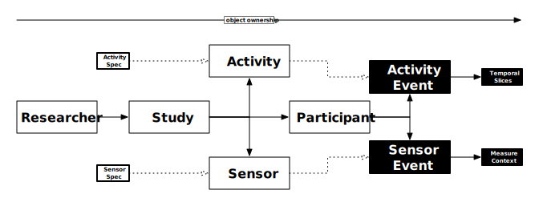

# Introduction

**The API sandbox (in the menu bar at the top of this page) allows you to test the raw HTTP REST API against a live server to see how to work with the low-level API itself.** 
If you're interested in working in Ry, Python, or JS, we recommend you try out our programming libraries instead. 

## LAMP Protocol
The `LAMP Protocol`, or Application Programming Interface (API), is the formalized inter-component language used by any app or tool connecting to the `LAMP Platform`. It consists of major "surfaces" that describe types of data, actions that may be performed on these types of data, and access and manipulation control of these data. These "surfaces" are designed to be compatible with the Health Level 7 (HL7) organization's Fast Healthcare Interoperability Resources (FHIR) standard resources as well as compliant with the Health Insurance Portability and Accountability Act (HIPAA).

A schema (data blueprint) presented below for each type of data in relation to other types, along with a description of the properties and actions available. The use of `JSON Schema` at build-time codifies these schema using sets of validation rules and declared links between types and properties. Furthermore, the Spec data types use `JSON Schema` at run-time to constrain data from different device sensors or activity interfaces dynamically.

## Object Model


- `ActivitySpec`: (global) a representation of an interactive user interface that can be presented to `Participant`s.
- `SensorSpec`: (global) a representation of a physical hardware sensor that can be used to passively collect data on a device owned by a `Participant`.
- `Researcher`: encapsulates access and control of multiple `Studies`.
    - `Study`: encapsulates the assignment of `Activities` and `Sensors` to `Participants`.
        - `Activity`: activates, configures, and optionally schedules, an interactive   activity for the `Participant` to use, and optionally, receive notifications for.
        - `Sensor`: activates and configures a hardware sensor on the `Participant`'s physical device for sensor data collection.
        - `Participant`: encapsulates the storage and retrieval of `ActivityEvent` and `SensorEvent` data streams.
            - `ActivityEvent`: a chronologically ordered timestamp-indexed packet of data synthesized from the `Participant`'s interaction session with an `Activity`, containing temporal slices representative of each tap or action within the session.
                - `Note:` this object is owned both by the `Participant` AND the `Activity`, and so it is possible to query the data either cross-`Activity` for a specific `Participant` `OR` cross-`Participant` for a specific `Activity`.
            - `SensorEvent`: a chronologically ordered timestamp-indexed packet of data synthesized by hardware sensors on a physical device being used by `Participant`.
                - `Note:` this object is owned both by the `Participant` AND the `Sensor`, and so it is possible to query the data either cross-`Sensor` for a specific `Participant` `OR` cross-`Participant` for a specific `Sensor`.

Each of the above data types also support the below associated data types:
- `Type`: *(any of the data types above)*
    - `Credential`: a security credential granting authorization to read and write to this specific object and any of its children, with which all data read/write operations are appended to a global audit log.
        - `Device`: a specifically identified physical hardware device, console, or browser that represents the origin of a read/write operation in the global audit log.
    - `Tag`: any arbitrary key-value indexed data, either represented as a JSON object (with or without an associated `JSON Schema`), or as a data-url encoded string.

Though the above hierarchy is described in terms of object composition, that is, in a manner similar to files recursively nested within several folders, it is important to distinguish and describe a form of object inheritance used by `Spec/*/Event` data types.
- `ActivitySpec`/`SensorSpec`: similar to apps on an App Store, the Spec object describes the schema for input (configuration) and output (data) for an interactive activity or a hardware sensor.
    - `Activity`/`Sensor`: this object can be thought of as an 'instance' of a Spec object assigned within a `Study`, with a specific name, icon, schedule, customized parameters, and more. 
        - `ActivityEvent`/`SensorEvent`: represents an 'event' as part of a time series event stream recorded by the `Activity` or `Sensor`. 

## Using the SDK
To follow along with the sample code provided in this document, install the appropriate SDK. Currently, we officially support the following:

`JavaScript`
```bash
npm i lamp-core
```
`Python`
```bash
pip install LAMP-core
```
`R`
```bash
R -e 'install.packages("devtools"); devtools::install_github("BIDMCDigitalPsychiatry/LAMP-r")'
```
