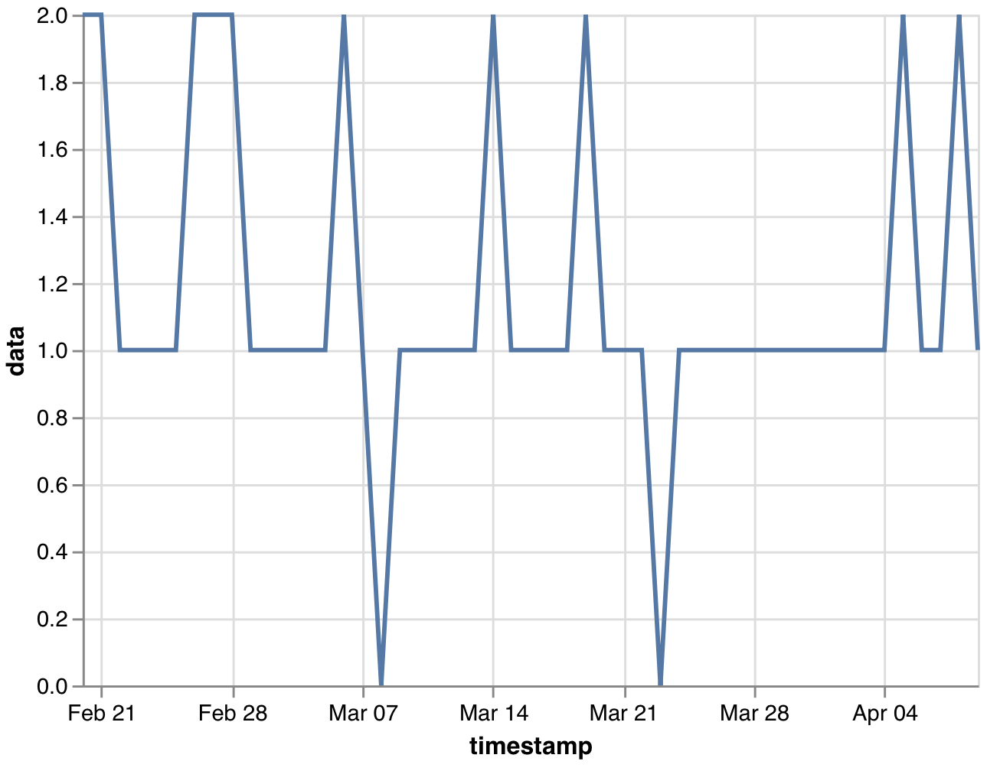

# Sensor Types

All event streams in the LAMP API are catalogued by a timestamp and specific "blueprints" (schema) of what kind of data they hold. For example, a sensor event that occurred 20 minutes ago would carry that instant's timestamp, along with a link to what kind of sensor it was, and that sensor's measurement as a payload of data. The kinds of activities and sensors available are declared below, along with the blueprint you can expect their events' data to follow. 

Active sensor events are produced on a rolling basis in the background via interactions by a Participant. They are transferred to the **Platform Server** automatically by using the Activity API written in JavaScript. A list of existing Sensors is provided below with name and description; a live server instance must be consulted for data schema information (see GET /sensor_spec). Implementations for these hardware sensors are provided in the GitHub repository.

For some sensors, the data that is returned is different for iOS versus Android phones. This is documented below.

| Name           | SensorSpec                | Requires watch / other device |
|----------------|---------------------------| ---------------
| Analytics      | lamp.analytics            | |
| Location       | lamp.gps                  | |
| Device Motion  | lamp.accelerometer       | |
|                | lamp.device_motion       | |
| Screen         | lamp.device_state  | |
| Pedometer      | lamp.steps                | |
| Bluetooth & WiFi | lamp.nearby_device      | |
| Calls & Texts  | lamp.telephony            | |
| Sleep          | lamp.sleep                | Y |
| Workouts       | lamp.segment              | Y |
| Activity Recognition | lamp.activity_recognition | Y |
| Nutrition      | lamp.nutrition            | Y |
| Blood Glucose  | lamp.blood_glucose        | Y |
| Oxygen Saturation | lamp.oxygen_saturation | Y |
| Body Temperature | lamp.body_temperature   | Y |
| Blood Pressure | lamp.blood_pressure       | Y |
| Heart Rate & HRV | lamp.heart_rate         | Y |
|                  | lamp.heartratevariability_sdnn | Y|
| Respiratory Rate | lamp.respiratory_rate   | Y |

**Deprecated sensors:**
| Name           | SensorSpec                | Requires watch / other device |
|----------------|---------------------------| ---------------
| Device Motion  | lamp.gyroscope       | |
|  | lamp.magnetometer       | |
| Location       | lamp.distance                  | |
| Pedometer | lamp.flights      | |
| Screen         | lamp.screen_state         | |
| Calls & Texts  | lamp.calls           | |
|   | lamp.sms          | |
| Bluetooth & WiFi | lamp.bluetooth      | |
|  | lamp.wifi      | |
| Weight | lamp.weight      | |
| Height | lamp.height      | |

### Location

SensorSpec: lamp.gps

Cortex: cortex.raw.gps

#### Description

The location sensor records the device's current GPS coordinates. Depending on the device operating system and device battery level, the source of the data from this sensor may alternate between GPS antennae (high accuracy), cellular tower triangulation (moderate accuracy), WiFi triangulation (poor accuracy), or a combination of these. 

#### Settings

- `frequency`: (number, units: Hz) the required location measurement frequency; the sensor will make a best effort to match the requested `frequency` but no guarantees are made by the device hardware or operating system. The maximum frequency is 1 Hz.

#### Data

- `latitude`: (float, units: degrees) the coordinate's latitude.
- `longitude`: (float, units: degrees) the coordinate's longitude.
- `altitude`: (float, units: meters) the coordinate's altitude, relative to sea level.
- `accuracy`:  (float, units: meters) the coordinate's estimated accuracy representing the radius of a circle formed around the reported latitude/longitude pair, [for which there is **AT LEAST** a 68% probability that the true coordinate is contained within.](https://en.wikipedia.org/wiki/Circular_error_probable)
    - `0.0`: no accuracy could be determined.

*Unsupported event properties:* `bearing` *and* `speed`*.*

#### Example

```markdown
{
  "timestamp": 1234567890,
  "sensor": "lamp.gps",
  "data": {
    "latitude": 80.4827,
    "longitude": 46.28344,
    "altitude": 12.12455,
    "accuracy": 48
  }
}
```

### Accelerometer

SensorSpec: lamp.accelerometer

Cortex: cortex.raw.accelerometer

#### Description

The triaxial accelerometer measures acceleration applied to the device. Each measurement is measured in Gs and is taken relative to the coordinate plane of the device, screen facing upwards. For example, a device resting face-up on a flat surface will report a measurement with the coordinate values `<0, 0, 1>`.

For Android, the data format is different than for iOS. The device_motion information (motion, magnetic, altitude, gravity, rotation) dictionary holds only motion for lamp.accelerometer and only rotation for lamp.device_state. The data format for iOS is described below.

#### Settings

- `frequency: number`: (units: Hz) the required accelerometer measurement frequency; the sensor will make a best effort to match the requested `frequency` but no guarantees are made by the device hardware or operating system. The current maximum frequency is 5 Hz. 

#### Data

- `x`: (float, units: G) the X-axis coordinate.
- `y`: (float, units: G) the Y-axis coordinate.
- `z`: (float, units: G) the Z-axis coordinate.

#### Example
```markdown
{
  "timestamp": 1234567890,
  "sensor": "lamp.accelerometer",
  "data": {
    "x": 0.19378492,
    "y": 1.28473749,
    "z": -0.19384932,
  }
}
```
### Device Motion

SensorSpec: lamp.accelerometer.device_motion

#### Description

The motion sensor gathers information on the device's physical movement. It includes metrics on device rotation, experienced gravity, and magnetic field. The acceleration measure here differs from `lamp.accelerometer` in that this measure does not correct for gravity.

For Android, the data format is different than for iOS. The device_motion information (motion, magnetic, altitude, gravity, rotation) dictionary holds only motion for lamp.accelerometer and only rotation for lamp.device_state. The data format for iOS is described below.

#### Data

- `motion`: (dict)
    - `x`: (float) the x-component of motion
    - `y`: (float) the y-component of motion
    - `z`: (float) the z-component of motion
- `magnetic`: (dict)
    - `x`: (float, units: micro T) the geomagnetic field strength along the device's x-axis, where the x-axis runs from left to right, across the front screen
    - `y`: (float, units: micro T) the geomagnetic field strength along the device's y-axis, where the y-axis runs vertically from the bottom to the top of the device's screen
    - `z`: (float, units: micro T) the geomagnetic field strength along the device's z-axis, where the z-axis runs towards the outside of the device's screen (toward the user)
- `altitude`: (dict)
    - `x`: (float) the x-component of altitude
    - `y`: (float) the x-component of altitude
    - `z`: (float) the y-component of altitude
- `gravity`: (dict)
    - `x`: (float) the force of gravity along the device's x-axis, where the x-axis runs from left to right, across the front screen
    - `y`: (float) the force of gravity along the device's y-axis, where the y-axis runs vertically from the bottom to the top of the device's screen
    - `z`: (float) the force of gravity along the device's z-axis, where the z-axis runs towards the outside of the device's screen (toward the user)
- `rotation`: (dict)
    - `x`: (float) the rotation vector component around the x-axis, which points tangentially along the ground, to the East: `x * sin(theta/2)`
    - `y`: (float) the rotation vector component around the y-axis, which points tangent along the ground, to the North: `y * sin(theta/2)`
    - `z`: (float) the rotation vector component around the z-axis, which points towards the sky, perpendicular to the ground: `z * sin(theta/2)`

#### Example

```markdown
{
  'sensor': 'lamp.device_motion',
  'data': {
    'motion': {
      'x': -0.0017750263214111328,
      'y': 0.004897803068161009,
      'z': -0.00017660856246948242
     },
    'magnetic': {
      'x': 3.450927734375,
      'y': 8.881887435913086,
      'z': 53.096649169921875
     },
    'attitude': {
      'x': 2.9586798819128934,
      'y': 0.1373790520467436,
      'z': -0.9628289634642353
     },
    'gravity': {
       'x': 0.18018077313899994,
       'y': -0.13694733381271362,
       'z': 0.9740535616874695
      },
     'rotation': {
       'x': 0.001726057380437851,
       'y': -0.008104033768177036,
       'z': 0.004878027364611627
      }
    },
   'timestamp': 1647386641091
}
```
### Device State

SensorSpec: lamp.device_state
Cortex: cortex.raw.screen_state

#### Description

The device state sensor records when the screen was turned on or off, when the device was locked or unlocked, and changes in battery level from charging or discharging the device. 

This sensor **DOES NOT** record the amount of time spent within specific apps on the device or how many notifications were received.

#### Settings

- None

#### Data

- `screen_state`: (int) the current device screen / lock state.
    - `0`: screen_on; the screen was turned on, either by the user or by a notification.
    - `1`: screen_off; the screen was turned off, either by the user or by screen timeout.
    - `2`: device_locked; the device was locked, either by the user or by device timeout.
    - `3`: device_unlocked; the device was unlocked by the user.
    - `4`: battery_charging; the device was plugged in to charge by the user.
    - `5`: battery_unplugged; the device was unplugged from the charger by the user.
- `battery_level`: (float, units: percentage) the current battery level of the device.

#### Example

```markdown
{
    'sensor': 'lamp.device_state',
    'data': {
        'value': 1,
        'representation': 'screen_off',
        'battery_level': 0.07000000029802322
    },
   'timestamp': 1649465295573
}
```

### Nearby device

SensorSpec: lamp.nearby_device

#### Description

The nearby device sensor records wifi connections. 

#### Data
- `bssid`: (string) BSSID of WiFi event
- `ssid`: (string) SSID of WiFi event
- `rssi`: (int, units: DB) WiFI signal strength.
    > RSSI is a term used to measure the relative quality of a received signal to a client device, but has no absolute value. […] Cisco, for example, uses a 0-100 scale, while Atheros uses 0-60. It’s all up to the manufacturer (which is why RSSI is a relative index), but you can infer that the higher the RSSI value is, the better the signal is. […] There’s a lot of math we could get into, but basically, the closer to 0 dBm, the better the signal is. [-- Source](https://www.metageek.com/training/resources/understanding-rssi.html)

| Signal Strength | TL;DR                | 
|-----------------|---------------------------| 
| -30 dBm |     Amazing        | 
| -67 dBm        |    Very Good               | 
| -70 dBm    |     Okay    | 
| -80 dBm              |    Not Good    | 
| -90 dBm     | Unusable |


#### Example

```markdown
{
    'data': {
        'bssid': 'e4:c3:2a:d5:d7:0b',
        'rssi': -94,
        'ssid': 'willet'},
   'sensor': 'lamp.nearby_device',
   'timestamp': 1649866397374
}
```

### Telephony

SensorSpec: lamp.telephony

#### Description

The telephony records phone call information.

#### Data
- `duration`: (float, units: s) the duration of the call
- `type`: (string) "incoming" or "outgoing"

#### Example
```
{
    'data': {
        'duration': 24,
        'type': 'incoming'
    },
    'sensor': 'lamp.telephony',
    'timestamp': 1649864919743
}
```


### Sleep

SensorSpec: lamp.sleep

Cortex: cortex.raw.sleep

#### Description

The sleep sensor reports sleep data stored on the phone, generally sourced from smartwatches such as an Apple Watch. If you plan on capturing data via an Android device, you may need to test to ensure the associated watch is high enough quality to regularly collect good data.

#### Data
- `value`: (int) 0, 1, or 2, if the user is in bed, asleep, or awake, respectively 
- `source`: (string) the source of data, e.g. `com.apple.health`
- `duration`: (int, unit: ms) the time in ms the specific activity (e.g. sleep) lasted
- `representation`: (string) one of `in_bed`, `in_sleep`, or `in_awake`, reflecting the state of the user at the time of measurement

#### Example
```
{
    'sensor': 'lamp.sleep',
    'data': {
        'value': 0,
        'source': 'com.apple.health.CACD64E0-EE17-4430-9B0B-5255F09075DE',
        'representation': 'in_bed',
        'duration': 12523000
    }
    'timestamp': 1636639670000
}
```

### Blood Pressure

SensorSpec: lamp.blood_pressure

### Description
Records blood pressure from an external connected monitor.

#### Data
- `value`: (float) the blood pressure reading.
- `units`: (string) the units of the reading.

#### Example

## Deprecated sensors
### Bluetooth
SensorSpec: lamp.bluetooth

#### Description

The bluetooth sensor logs information about the device's Bluetooth sensor and about surrounding Bluetooth devices that are enabled and/or visible. The device scan for surrounding Bluetooth devices at a set frequency (default is 60 seconds). If multiple devices are detected in a single scan, they are all assigned the same timestamp.

#### Data

- `bt_address`: (string) address of Bluetooth event.
- `bt_rssi`: (int, units: DB) WiFI signal strength.
    > RSSI is a term used to measure the relative quality of a received signal to a client device, but has no absolute value. […] Cisco, for example, uses a 0-100 scale, while Atheros uses 0-60. It’s all up to the manufacturer (which is why RSSI is a relative index), but you can infer that the higher the RSSI value is, the better the signal is. […] There’s a lot of math we could get into, but basically, the closer to 0 dBm, the better the signal is. [-- Source](https://www.metageek.com/training/resources/understanding-rssi.html)

| Signal Strength | TL;DR                | 
|-----------------|---------------------------| 
| -30 dBm |     Amazing        | 
| -67 dBm        |    Very Good               | 
| -70 dBm    |     Okay    | 
| -80 dBm              |    Not Good    | 
| -90 dBm     | Unusable |


#### Example
```
{
    'timestamp': 1616172858929,
    'sensor': 'lamp.bluetooth',
    'data': 
        {
            'bt_rssi': -91,
            'bt_address': 'CCF087D3-A0FC-0FDF-D7F9-1285211653FB'
        }
}
```

#### Example

(Sample code to generate a plot of number of unique addresses encountered per day per patient.)

```python
import cortex
import altair as alt 

# Generate an Altair chart with Cortex data source:
alt.Chart(

    # Obtain patient U123's bluetooth data.
    cortex.run("U123", ["bluetooth"])

        # Resample (aggregate/group-by) the data per-day.
        .resample('D')

        # Count the number of unique entries (address) encountered per day.
        .nunique()

        # Revert the df index to a column for Altair to access it.
        .reset_index())

# Encode "timestamp vs. address (unique count)" as a line plot.
.mark_line().encode(x='timestamp', y='address')
```


### Calls

SensorSpec: lamp.calls

#### Description

The calls sensor measures information on phone calls made and received by the user. Each event is a single phone call, with information on its type (incoming, outgoing, missed, etc), duration, and trace (the other device which the user connected with during the call). 

Call type options differ between Android and iOS devices. This sensor has been replaced by lamp.telephony.

#### Data

- `call_trace`: (string) the SHA-1-encrypted source/target of the call. A device will have a consistent trace.
- `call_type`: (int): integer label for the call type
        - `1`: incoming; the call was received by the user
        - `2`: outgoing; the call was made by the user
- `call_duration`: (int, units: seconds) the length of the call session.

#### Example
```
{
    'timestamp': 1609711564846,
    'sensor': 'lamp.calls',
    'data': {
        'call_trace': '4DE07C9D-6496-41B5-B9F9-DCFDA746FE49',
        'call_type': 2,
        'call_duration': 23
    }
}
```

### Distance

SensorSpec: lamp.distance

#### Data

- `value`: (float) the distance.

#### Example
```
{
    'timestamp': 1609791149998,
    'sensor': 'lamp.distance',
    'data': {
        'value': 6685.931218739017
    }
}
```

### Gyroscope

SensorSpec: lamp.gyroscope

#### Description

The gyroscope sensors measures the rate of rotation around each of a device's x, y and z axes. Rotation values are in radians/second. Positive values indicate counter-clockwise rotation; negative values indicate clockwise rotation. These are raw values—i.e. they do not correct for nosie or drift. This sensor has been replaced by lamp.device_motion.

#### Data

- `x`: (float, units: rad/s) the rotational velocity around the x-axis. The x-axis goes from left to right, across the device's screen face
- `y`: (float, units: rad/s) the rotational velocity around the y-axis. The y-axis is vertical and points up
- `z`: (float, units: rad/s) the rotational velocity around the z-axis. The z-axis is horizontal and points out from the front screen (towards the user looking at the screen)

#### Example

```markdown
{
    'timestamp': 1609796944931,
    'sensor': 'lamp.gyroscope',
    'data': {
        'x': -0.018976621329784393,
        'y': -0.0030131004750728616,
        'z': -0.01834332011640072
    }
}
```


### SMS

SensorSpec: lamp.sms

#### Description

The sms sensor measures information on text messages sent and received by the user. Each event is a single message, with information on its type (incoming, outgoing) and trace (the other device involved in the messaging exchange). 

#### Data

- `trace` (string): the SHA-1-encrypted source/target of the text message. A device will have a consistent trace.
- `type`: (int): integer label for the message type
    - `1`: received; the message was received by the user
    - `2`: sent; the message was sent by the user

### Screen

SensorSpec: lamp.screen_state

#### Description

The screen state sensor records when the screen was turned on or off, when the device was locked or unlocked, and changes in battery level from charging or discharging the device. 

This sensor **DOES NOT** record the amount of time spent within specific apps on the device or how many notifications were received.

lamp.screen_state has been replaced with lamp.device_state

#### Settings

- None

#### Data

- `screen_state`: (int) the current device screen / lock state.
    - `0`: screen_on; the screen was turned on, either by the user or by a notification.
    - `1`: screen_off; the screen was turned off, either by the user or by screen timeout.
    - `2`: device_locked; the device was locked, either by the user or by device timeout.
    - `3`: device_unlocked; the device was unlocked by the user.
    - `4`: battery_charging; the device was plugged in to charge by the user.
    - `5`: battery_unplugged; the device was unplugged from the charger by the user.
- `battery_level`: (float, units: percentage) the current battery level of the device.

#### Example

```markdown
{
    'sensor': 'lamp.screen_state',
    'data': {
        'value': 1,
        'representation': 'screen_off',
        'battery_level': 0.07000000029802322
    },
   'timestamp': 1649465295573
}
```

### Weight

SensorSpec: lamp.weight

#### Description

#### Data

### Height

SensorSpec: lamp.height

#### Description

#### Data

### WiFi

SensorSpec: lamp.wifi
Cortex: cortex.raw.wifi

#### Description

The wifi sensor provides information about the devices to which the user's device connects via wifi. The new version of this sensor is lamp.nearby_device.

#### Data

- `bssid`: (string) BSSID of WiFi event
- `ssid`: (string) SSID of WiFi event

#### Example
```
{
    'timestamp': 1609796928526,
    'sensor': 'lamp.wifi',
    'data': {
        'bssid': 'a4:2b:b2:d3:d:52',
        'ssid': 'RB_Tiger'
    }
}
```


- **lamp.analytics:** records events such as page opens, notification receipt, or login sessions.
    1. **This data type is currently for internal use only.**
    2. **event_name**: string
    3. **event_payload**: any
- **lamp.flights:** records stairs of flights climbed.
    1. **value**: number
    2. **units**: string
- **lamp.magnetometer:** records triaxial magnetic field changes.
    1. **x**: number
    2. **y**: number
    3. **z**: number
- **lamp.respiratory_rate: r**ecords respiratory rate from an external connected monitor.
    1. **value**: number
    2. **units**: string
- **lamp.heart_rate:** records heart rate from an external connected monitor.
    1. **value**: number
    2. **units**: string
- **lamp.segment:** records workout segment duration and length.
    1. **value**: number
    2. **units**: string
- **lamp.steps:** records number of steps taken since last such event, or the start of the day.
    1. **value**: number
    2. **units**: string
