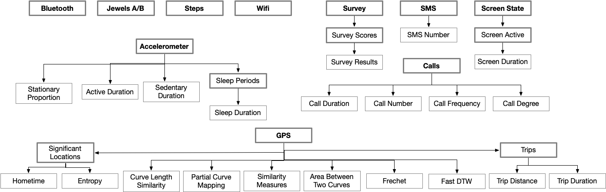
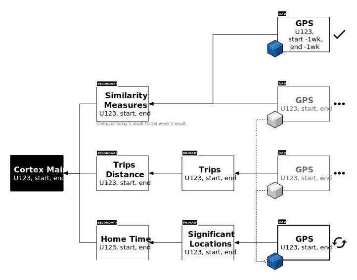

# Cortex

## **What is Cortex?**

The Cortex data analysis and machine learning toolkit is part of the LAMP Platform, enabling researchers and clinicians with a variety of backgrounds have use pre-build tools to analyze their data and build analysis pipelines. 

- It integrates tightly across the platform to provide a unified processing pipeline to convert patient or participant data into useful features that provide valuable clinical and research insight.
- It offers robust support for artificial intelligence, behavioral feature extraction, interactive visualizations, generation of targeted and automated adaptive interventions, and high-performance data processing through parallelization and vectorization techniques.
- It obviates the need for individual analyses tied to custom code for specific sensor types across various devices. It also provides access to processed Apple HealthKit and Google Fit sensor data, such as activity recognition or heart rate variability.
- It provides a companion IDE based on JupyterLab and VSCode that abstracts away login and security issues by securely injecting an authenticated connection to the server into Cortex and resulting analysis notebooks.

_Categories of Activity and Sensor data types alongside Cortex features synthesized from raw data streams. Availability of Wearable Sensors depends on the device type used and supported API; Apple Watch (HealthKit) sensors are shown here._

## **Why Cortex?**

The unique data structure of the LAMP platform allows all users to analyze their data without the need for a specific data science team. Cortex makes meaningful analysis easy and accessible with only a few lines of code.

- *Robust data streams — Cortex leverages the wide variety of data collected in the LAMP platform to provide researchers, clinicians, and patients numerous features that characterize users’ moment-by-moment physiology, behaviors, and well-being. These data streams are derived from data reported within the app as well as data sensed passively by user devices.*
- *Flexible — Cortex allows you to easily customize the processing of your data. For example, whether you want to view your data at hourly, daily, or weekly intervals, Cortex will automatically parse your data into the timeframe of your choice. While the pipeline will attempt to generate the maximum number of features given the available data, you can easily remove unwanted features from your dataset post-processing, or add new data streams to your dataset using your own scripts.*
- *Scalable — The LAMP platform was designed with large datasets in mind. Handling data across large studies is often a challenge. Cortex can process any amount of data, without requiring extra code.*
- *Interoperable — In Cortex, raw data from the mindLAMP app is transformed into and stored as dataframes in Pandas, a popular package that provides a robust set of tools for analyzing data. For example, after processing is done and your featurized data is ready for use as a dataframe, you can perform correlational or time-series analysis with just a few lines of code. If you would like to perform analysis using another statistical package, such as R or SPSS, you can easily export the processed data in CSV/XLS format and import it in the exogenous environment. You can also run other team’s algorithms or see how your code procedures result compared to others.*

## Cortex Engine

The Cortex Engine breaks down data streams into three fundamental categories of "features." A feature is a consolidated representation of significant behavioral measures as captured by _both_ activities and sensors in the LAMP Platform. Features may also act as target or independent variables, for example, in the context of machine learning models. 

1. **Raw Features**: A "raw" feature is a fully virtualized Cortex-compatible abstraction of a low level data stream from the LAMP Platform. For example, survey question responses or accelerometer data. The integration of raw features allows for simplified development of analysis code both within Cortex and outside of Cortex, by avoiding the need to switch contexts between the higher-level Cortex abstractions and the lower-level underlying LAMP Protocol when writing code.
1. **Primary Features**: A "primary" feature is a miniaturized abstraction around a raw feature that can either be used directly, or used within _multiple_ secondary features and analyses. It acts as a reusable intermediate or bridge between these higher-level representations features and lower-level raw data streams. For example, `Significant Locations` is a primary feature that processes raw GPS data and groups these data points together into weighted travelled regions of significance.
1. **Secondary Features**: A "secondary" feature is a composite (i.e. summary) clinical/behavioral representation of multiple data streams, either through raw or primary features. Secondary features are additionally windowed by time resolution (i.e. "time spent at home each day" vs. "time spent at home each week"). For example, `Home Time` is a secondary feature that buckets `Significant Locations` by the specified resolution and determines the amount of time an individual spent at home within that time window. Additionally, `Trip Distance` is a secondary feature that also relis on the `Significant Locations` primary feature to calculate the distance traveled by an individual per time window. 

It's easy to use existng features to create your own novel features, or start entirely from scratch. Cortex will automatically handle the dependency and execution graph to ensure your data streams are post-processed in the right order. Cortex also intelligently caches raw features for re-running processing code and parallelized workflows across multiple features.

Features in Cortex need not handle pre-processing for variation in sensor data between Android and iOS, because the LAMP Platform harmonizes the data, accounting for various differences in functionality and recording between Apple and Android devices. For example, accelerometer measurements taken on Apple devices are measured in G's (unit of gravity) with a frame of reference experiencing -1G in the downward-facing axis, whereas measurements on Android are measured in meters per second squared (m/s^2) without a frame of reference provided. Because the platform automatically applies this harmonization step, data analysis code and Cortex feature code need not have an intrinsic understanding of the source of the data. 

_A sample execution plan for Cortex:_
1. The clinician or researcher creates an aggregate operation.
2. Cortex transparently interposes the correct feature layers by creating a dependency graph of data and executes each “atomic operation” (i.e. independent of external variables) in the order it computes to be most efficient.
3. Any raw sensor data is transparently cached during execution.
4. As multiple operations require the same raw sensor data, Cortex blocks their execution until the cached data becomes available, to avoid duplicate downloads, wasted computation, and over-saturation of network bandwidth.

## **Examples of Algorithms**

*Entropy*: The variability of the time a participant spent at significant locations (i.e. clusters) determined by their GPS data.

*Dynamic Time Warping (DTW)*: An algorithm for measuring similarity between two series of GPS points, which may vary in length and timing. Moreover, the DTW algorithm provides a score that measures the change in a participant’s location in a convenient way.

### *Sleep Suite*

Cortex provides daily estimated sleep duration for users, derived from sensor data. Estimates are customized to each user’s individual behavior, as Cortex finds their most common sleep window. The sleep estimation method is highly reliant on accelerometer data in particular, so users must have data from this sensor in order for Cortex to provide an accurate estimate. From this sensor data Cortex also provides estimates for time spent in active and sedentary states.

While sleep duration estimates are automatically processed and stored in the main dataframe, you can also view the estimates in the user dashboard. Graphs are plotted for the user’s last ten days of data and updated daily. You can download

### *Mobility Suite*

Cortex provides various features characterizing a user’s mobility in a given time window. Unlike the sleep estimates, the mobility suite can be used at any time scale, whether that is two minutes, hours, days, or months. Mobility features rely on GPS sensor data, so users must have data from this sensor in order for processing to successfully occur.

Mobility features belong to one of two categories: *trips* and *significant locations*. *Trips* provide information on discrete movement events that a user undergoes—e.g. commuting to work or going to the grocery store. Features included in this category are trip duration, distance and count. *Significant locations* provide information on places that users commonly visit. The coordinates of these locations is provided as well as the amount and fragmentation of time spent at each one, such as hometime location entropy, respectively.

### *Activity Suite*

Cortex provides activity segmentation derived from a user’s accelerometer and gyroscope sensor data. The segmentation involves 6 different activity classes: *Walking*, *Jogging*, *Walking Upstairs*, *Walking Downstairs*, *Sitting*, and *Standing*. Using labeled activity data, we are able to train a model to predict the activity a user is performing. Please note that this model does not return 100% accuracy - Cortex will never know the “ground truth” (i.e. the actual activity a user is performing). Moreover, for a large sample of points, we can provide a rough estimate of the amount of time a user spends performing each activity.
