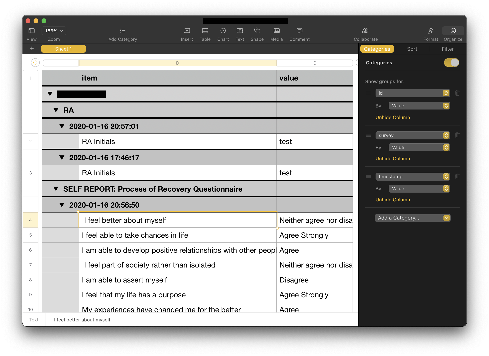

# Cortex Quick Start Guide

## Setting up Cortex

You will need Python 3.4+ and `pip` installed in order to use Cortex. 
  - You may need root permissions, using `sudo`.
  - Alternatively, to install locally, use `pip --user`.
  - If `pip` is not recognized as a command, use `python3 -m pip`.

If you meet the prerequisites, install Cortex:

```sh
pip install lamp-cortex
```

If you do not have your environment variables set up (see Advanced section below), you will need to perform the initial server credentials configuraton below:


```python
import os
os.environ['LAMP_ACCESS_KEY'] = 'YOUR_EMAIL_ADDRESS'
os.environ['LAMP_SECRET_KEY'] = 'YOUR_PASSWORD'
os.environ['LAMP_SERVER_ADDRESS'] = 'YOUR_SERVER_ADDRESS'
```

## Source Code

The source code can be found here: https://github.com/BIDMCDigitalPsychiatry/LAMP-cortex

## Example: Passive data features from Cortex
The primary function of Cortex is to provide a set of features derived from pasive data. Data can be pulled either by calling Cortex functions directly, or by using the `cortex.run()` function to parse multiple participants or features simultaneously. For example, one feature of interest is screen_duration or the time spent with the phone "on".

First, we can pull this data using the Cortex function. Let's say we want to compute the amount of time spent by
participant: "U1234567890" from 11/15/21 (epoch time: 1636952400000) to 11/30/21 (epoch time: 1638248400000) each day (resolution = miliseconds in a day = 86400000):

```python
import cortex
screen_dur = cortex.secondary.screen_duration.screen_duration("U1234567890", start=1636952400000, end=1638248400000, resolution=86400000)
```

The output would look something like this:
```
{'timestamp': 1636952400000,
 'duration': 1296000000,
 'resolution': 86400000,
 'data': [{'timestamp': 1636952400000, 'value': 0.0},
  {'timestamp': 1637038800000, 'value': 0.0},
  {'timestamp': 1637125200000, 'value': 0.0},
  {'timestamp': 1637211600000, 'value': 0.0},
  {'timestamp': 1637298000000, 'value': 0.0},
  {'timestamp': 1637384400000, 'value': 0.0},
  {'timestamp': 1637470800000, 'value': 8425464},
  {'timestamp': 1637557200000, 'value': 54589034},
  {'timestamp': 1637643600000, 'value': 50200716},
  {'timestamp': 1637730000000, 'value': 38500923},
  {'timestamp': 1637816400000, 'value': 38872835},
  {'timestamp': 1637902800000, 'value': 46796405},
  {'timestamp': 1637989200000, 'value': 42115755},
  {'timestamp': 1638075600000, 'value': 44383154}]}
 ```
The 'data' in the dictionary holds the start timestamps (of each day from 11/15/21 to 11/29/21) and the screen duration for each of these days.
 
Second, we could have pulled this same data using the `cortex.run` function. Note that `resolution` is automatically set to a day in `cortex.run`. To invoke `cortex.run`, you must provide a specific ID or a `list` of IDs (only `Researcher`, `Study`, or `Participant` IDs are supported). Then, you specify the behavioral features to generate and extract. Once Cortex finishes running, you will be provided a `dict` where each key is the behavioral feature name, and the value is a dataframe. You can use this dataframe to save your output to a CSV file, for example, or continue data processing and visualization. This function call would look like this:

 ```python
import cortex
screen_dur = cortex.run("U1234567890", ['screen_duration'], start=1636952400000, end=1638248400000)
```
And the output might look like:
```
{'screen_duration':              id           timestamp       value
 0   U1234567890 2021-11-15 05:00:00         0.0
 1   U1234567890 2021-11-16 05:00:00         0.0
 2   U1234567890 2021-11-17 05:00:00         0.0
 3   U1234567890 2021-11-18 05:00:00         0.0
 4   U1234567890 2021-11-19 05:00:00         0.0
 5   U1234567890 2021-11-20 05:00:00         0.0
 6   U1234567890 2021-11-21 05:00:00   8425464.0
 7   U1234567890 2021-11-22 05:00:00  54589034.0
 8   U1234567890 2021-11-23 05:00:00  50200716.0
 9   U1234567890 2021-11-24 05:00:00  38500923.0
 10  U1234567890 2021-11-25 05:00:00  38872835.0
 11  U1234567890 2021-11-26 05:00:00  46796405.0
 12  U1234567890 2021-11-27 05:00:00  42115755.0
 13  U1234567890 2021-11-28 05:00:00  44383154.0}
 ```
The output is the same as above, except the 'data' has been transformed into a Pandas DataFrame. Additionally, the dictionary is indexed by feature -- this way you can add to the list of features processed at once. Finally, a column "id" has been added so that multiple participants can be processed simultaneously. 

We can process two participants and add "entropy" to our feature list. Instead of 11/15-11/29/21, let's change the timeframe to the past 7 days. If you try this with your own participant IDs, it may take a moment to run:
```python
import cortex
MS_IN_A_DAY = 1000 * 60 * 60 * 24 # The miliseconds in a day
features = cortex.run(["U1234567890", "U0011008800"], ['screen_duration', 'entropy'], start=cortex.now() - 7 * MS_IN_A_DAY, end=cortex.now())
```
Output:
```
{'screen_duration':             id           timestamp       value
 0  U1234567890 2021-12-05 05:00:00  37035845.0
 1  U1234567890 2021-12-06 05:00:00  53403478.0
 2  U1234567890 2021-12-07 05:00:00  40274745.0
 3  U1234567890 2021-12-08 05:00:00  46607703.0
 4  U1234567890 2021-12-09 05:00:00  50506566.0
 5  U1234567890 2021-12-10 05:00:00  45152245.0
 0  U0011008800 2021-12-05 05:00:00  18144929.0
 1  U0011008800 2021-12-06 05:00:00  49786516.0
 2  U0011008800 2021-12-07 05:00:00  18542471.0
 3  U0011008800 2021-12-08 05:00:00  18710925.0
 4  U0011008800 2021-12-09 05:00:00         0.0
 5  U0011008800 2021-12-10 05:00:00         0.0,
 'entropy':             id           timestamp     value
 0  U1234567890 2021-12-05 05:00:00 -0.000000
 1  U1234567890 2021-12-06 05:00:00 -0.000000
 2  U1234567890 2021-12-07 05:00:00 -0.000000
 3  U1234567890 2021-12-08 05:00:00 -0.000000
 4  U1234567890 2021-12-09 05:00:00  0.491646
 5  U1234567890 2021-12-10 05:00:00 -0.000000
 0  U0011008800 2021-12-05 05:00:00 -0.000000
 1  U0011008800 2021-12-06 05:00:00 -0.000000
 2  U0011008800 2021-12-07 05:00:00  0.214006
 3  U0011008800 2021-12-08 05:00:00  0.191434
 4  U0011008800 2021-12-09 05:00:00       NaN
 5  U0011008800 2021-12-10 05:00:00       NaN}
 ```

## Example: Retrieving survey data from Cortex

We can also run the `survey` feature (which is not a behavioral feature, but rather a convenience around raw survey data) and save it to a csv using Pandas:

```python
import cortex
cortex.run('YOUR_RESEARCHER_ID', ['survey'], start=0, end=cortex.now())['survey'].to_csv('~/export.csv', index=False)
```

Yielding the following CSV output: 

```csv
id,timestamp,survey,item,value,type,duration,level
U123456789,2020-01-16 20:57:01,RA,RA Initials,test,,0,
U123456789,2020-01-16 20:56:50,SELF REPORT: Process of Recovery Questionnaire, I feel better about myself,Neither agree nor disagree,,0,
U123456789,2020-01-16 20:56:50,SELF REPORT: Process of Recovery Questionnaire,I feel able to take chances in life,Agree Strongly,,0,
U123456789,2020-01-16 20:56:50,SELF REPORT: Process of Recovery Questionnaire,I am able to develop positive relationships with other people ,Agree,,0,
U123456789,2020-01-16 20:56:50,SELF REPORT: Process of Recovery Questionnaire, I feel part of society rather than isolated,Neither agree nor disagree,,0,
U123456789,2020-01-16 20:56:50,SELF REPORT: Process of Recovery Questionnaire,I am able to assert myself,Disagree ,,0,
U123456789,2020-01-16 20:56:50,SELF REPORT: Process of Recovery Questionnaire,I feel that my life has a purpose ,Agree Strongly,,0,
U123456789,2020-01-16 20:56:50,SELF REPORT: Process of Recovery Questionnaire,My experiences have changed me for the better,Agree,,0,
U123456789,2020-01-16 20:56:50,SELF REPORT: Process of Recovery Questionnaire, I have been able to come to terms with things that  have happened to me in the past and move on with  my life,Disagree,,0,
```

You can then load this CSV file into Microsoft Excel (or Apple Numbers on macOS). Additionally, you can add Categories to group the data by ID, survey, and the specific time that the survey was taken. 


